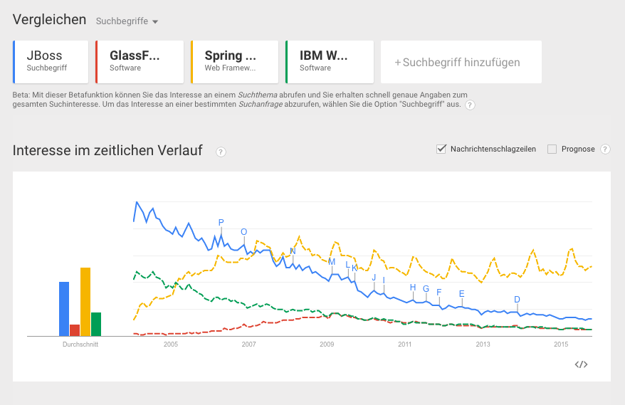
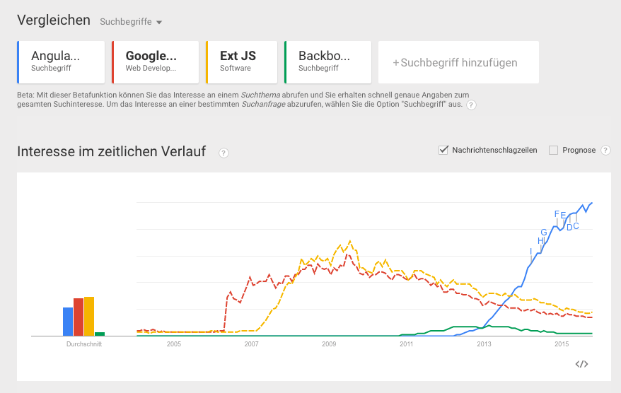

In den letzten Jahren durfte ich viele Erfahrungen mit Web-Anwendungen für den Einsatz im Unternehmen sammeln. Im folgenden Post fasse ich zusammen, wie ich mir eine Web-UI-Strategie vorstelle.

<h2>Was ist denn falsch an unseren GUIs?</h2>

Im Vergleich zu heutigen Web-GUI-Technologien wie z.B. AngularJS, React, Thymeleaf oder Rythm haben die alten Frameworks oft die folgenden Mängel:

<ul>
	<li>Für einfache Dinge oft zu komplex</li>
	<li>Features, die heute von Web-GUIs erwartet werden, lassen sich oft nicht umsetzen.</li>
	<li>Erweiterungen an den GUIs dauern zu lange.</li>
	<li>Mobile-fähige UIs sind nicht möglich.</li>
</ul>

Viele arbeiten sogar mit Frameworks, die sie selbst entwickelt haben, weil vor ein paar  Jahren vieles einfach noch nicht vorhanden war. Die damals gute Entscheidung fühlt sich heute wie Ballast an. Wir müssen nicht nur damit arbeiten - wir müssen es auch noch pflegen und warten.

<h2>Wir brauchen also ein neues Framework?</h2>

Was ist naheliegender als ein neues Framework zu evaluieren? Wir haben in der Zwischenzeit viele Erfahrungen gesammelt und wissen genau, welche Features wir erwarten. Gleichzeitig fügen wir noch einige Helferlein hinzu für Login, Errorhandling, eigene Controls und Standarddesigns. Wir stellen eine fertig IDE zum Download zusammen, die alles schon enthält was es braucht.

<h2>Warum soll es besser werden?</h2>

Im Grunde ist das die gleiche Vorgehensweise, wie wir sie vor vielleicht zehn Jahren schon gewählt haben. Dieses mal einfach richtig. Aus damaliger Sicht haben wir uns aber auch schon für das perfekte Framework entschieden. Ich glaube, dass wir gerade an dieser Vorgehensweise etwas ändern müssen, wollen wir innert Kürze nicht wieder an diesem Punkt sein:

<ul>
	<li>Wir können aktuellen GUI-Trends nicht folgen.</li>
	<li>Wir haben kaum Mitarbeiter, welche fit für neue UIs sind.</li>
	<li>Hohe Investitionshürden hindern uns daran “modern” zu werden.</li>
</ul>

Dieses Problem ist bei UI-Frameworks umso grösser. Die Halbwärtszeit ist verglichen zu den Server-Frameworks noch immer sehr kurz, was uns ein Blick auf Google Trend zeigt:

Die heutigen Player sind spätestens seit 2007 etabliert.

Ganz anders bei den GUI-Frameworks. Googles GWT war vor 4 Jahren noch top. Heute werden kaum mehr neue Projekte mit GWT gestartet. Dem Newcomer AngularJS könnte es gleich ergehen.

Wir brauchen mehr Flexibilität um auf neue Trends eingehen zu können. Ich sehe dabei die folgenden architektonischen Entscheidungen, die dem Rechnung tragen:

<h3>Eigenständige Apps</h3>

Mit dem Manifest der [Lean Enterprise App](http://www.lean-enterprise-app.com/) haben wir schon geschildert, wie wir uns dedizierte und benutzerzentrierte Apps vorstellen. Über die Zeit entstehen mit dieser Strategie viele relativ eigenständige Apps mit ihren eigenen Releasezyklen. Wir schaffen uns damit die Grundlage zu sehr viel Flexibilität. Wir können gerade im UI-Bereich einer App Änderungen vornehmen und nur eine beschränkte Anwendergruppe damit konfrontieren.

<h3>Freiheit bei der Wahl des UI-Frameworks</h3>

Diese oben erlangte Freiheit müssen wir auch nutzen. Geben Sie so wenig Vorgaben in der Wahl des UI-Frameworks vor wie möglich. Erlauben Sie Ihren Teams, sich ihr Framework selber auszusuchen.

<h3>Keine Anreize für den Statusquo schaffen</h3>

Es kann sinnvoll sein, Frameworkspezifische Hilfsprojekte zu erstellen. Sie könnten vielleicht AngularJS-Direktiven erstellen, die dann von allen Teams verwendet werden. Seien Sie sich aber bewusst, dass jede gut gemeinte Direktive einem Team die Entscheidung schwerer macht, sich für ein neues Framework zu entscheiden. Je mehr Frameworkspezifische Tools sie zur Verfügung stellen, desto mehr “Haftung” erhält das Framework.

<h3>Designprinzipien erstellen</h3>

Stellen Sie mit allen Stakeholdern ihre eigenen Designprinzipien für ihr System auf. Diese Prinzipien sind langlebiger als Frameworks. Richtig aufgesetzt geben sie viele Antworten in der täglichen Arbeit mit UIs. Wir können Ihnen übrigens helfen, zu den eigenen Prinzipien zu gelangen.

<h2>Kontext dieses Textes</h2>

Natürlich lässt sich diese Aussage nicht verallgemeinern. Es gibt sicher gute Gründe, ein eigenes Framework aufzuziehen. Sie sollten sich aber den Folgen und Effekten eines eigenen Frameworks bzw. strikten Technologievorgaben bewusst sein.

<h2>Referenzen und passende Links:</h2>

<ul>
	<li>[Vortrag von Stefan Tilkov über Self Contained Systems](https://speakerdeck.com/stilkov/sustainable-architecture)</li>
	<li>[Otto Development-Blog über Monolithen und Microservices](http://dev.otto.de/2015/09/30/on-monoliths-and-microservices/)</li>
	<li>[Template engines im Überblick](http://www.todaysoftmag.com/article/907/template-engines-for-java-web-development)</li>
	<li>[JS-Framweork-Tweet](https://twitter.com/ModernWebUI/status/636940299801989120)</li>
	<li>[Über Designprinzipien](http://www.usercentered.de/design/ueber-designprinzipien/)</li>
</ul>
