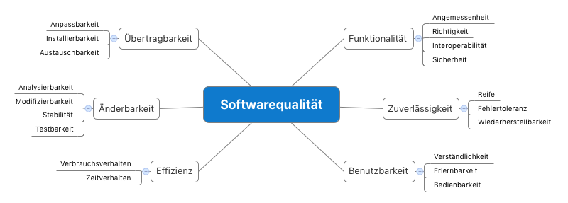

# Motivation

Üblicherweise werden Anforderungen an ein System in Form von User Stories oder Anwendungsfällen beschrieben. Diese definieren, was das System fachlich können soll. Es gibt aber auch Anforderungen die über eine reine Funktionalität hinausgehen. Sie werden als nicht-funktionale Anforderungen oder immer öfter auch als Qualitätsmerkmale bezeichnet. In diesem “Apptiva kompakt” zeigen wir, wie Qualitätsziele helfen, die wichtigsten Qualitätsmerkmale bei Architekturentscheidungen in der <a href="/">Softwareentwicklung</a> zu berücksichtigen.

# Qualitätsmerkmale

Es gibt eine grosse Menge an möglichen Qualitätsmerkmalen. Die Norm ISO/IEC 92126 listet die oft verwendeten auf und verfeinert sie mittels beispielhaften Teilmerkmalen:

Dieser Überblick ist ein gutes Hilfsmittel beim Finden der für Ihre Softwarelösung relevanten Qualitätsmerkmale.

> Schauen Sie die Qualitätsmerkmale in einem Workshop mit den Stakeholdern an und identifizieren Sie die für Sie wichtigsten drei bis maximal fünf.

# Qualitätsziele

Jetzt wo Sie die für Ihr Vorhaben wichtigsten Qualitätsmerkmale kennen, geht es darum diese etwas genauer zu beschreiben und als Qualitätsziele zu formulieren. Was ist zum Beispiel konkret mit Benutzbarkeit gemeint? Warum ist dies so wichtig und wo kommt die Anforderung her? Überlegen Sie sich auch was passieren könnte, wenn dieses Ziel verfehlt wird.

Leider ist es so, dass sich einzelne Qualitätsziele konkurrenzieren können (z.B. Anpassbarkeit und Performance). Legen Sie eine klare Priorisierung Ihrer Qualitätsziele fest, um im Zweifelsfall einfacher entscheiden zu können. Es hilft auch, die Priorisierung der Ziele zu begründen. Warum ist z.B. die Benutzbarkeit so wichtig und warum ist die Zuverlässigkeit weniger wichtig?

> Erläutern Sie Ihre topp Qualitätsmerkmale und formulieren Sie diese als Qualitätsziele. Priorisieren Sie diese und begründen Sie die Reihenfolge.

### Beispiel

Hohe Verfügbarkeit (Prio 1)
Die Mitarbeiter der Notfallabteilung sind auf eine ständige Verfügbarkeit der Patientendaten angewiesen um jederzeit alle relevanten Informationen im Zugriff zu haben. Fällt das System aus, entsteht durch die Informationslücke eine direkte Gefahr für den Patienten.

# Qualitätsszenarien

Um Architekturentscheide treffen oder eine bestehende Architektur bewerten zu können, reichen die Qualitätsziele alleine noch nicht aus. Diese müssen weiter konkretisiert und mit Messwerten versehen werden. Bei einigen Qualitätszielen geht dies einfacher (z.B. Antwortzeiten), bei anderen ist es schwieriger (z.B. Benutzbarkeit). Qualitätsszenarien helfen dieses Problem zu lösen. Sie beschreiben z.B. exemplarisch die Verwendung des Systems, sodass ein Qualitätsziel die Hauptrolle spielt. Eine grosse Stärke von Qualitätsszenarien ist, dass sie eine gute Basis bieten, worüber sich Stakeholder und Softwareentwickler austauschen können, denn oftmals sind bei solchen Diskussionen auch fachliche Entscheidungen betroffen.

> Definieren Sie für jedes Qualitätsziel mindestens ein bis maximal fünf Szenarien. Denken Sie neben Verwendungsszenerien auch an Änderungsszenarien (z.B. mehr Benutzer) und an Fehlerszenarien (z.B. Systemausfall).

### Szenario zu Benutzbarkeit

<ul>
 <li>Eine Pflegefachfrau ruft das Patientendossier eines Patienten auf. Das System zeigt alle relevanten Daten unter einer Sekunde an.</li>
</ul>

### Szenario zu Verfügbarkeit

<ul>
 <li>Das Netzwerk fällt komplett aus. Die Mitarbeiter der Notfallabteilung können auf speziell definierten Arbeitsstationen alle Funktionen des Dashboards für bereits angemeldete Patienten aufrufen und zusätzlich neue Patienten voranmelden.</li>
</ul>

# Fazit

Qualitätsziele und -szenarien helfen beim Fällen von Architekturentscheide und machen Softwarearchitektur nachvollziehbar. Wir nehmen sie bei all unseren Entwicklungsprojekten zur Hilfe und haben damit durchwegs gute Erfahrungen gemacht.

- [PDF herunterladen](/assets/blog/attachment/qualitaetsziele-a4.pdf)

<h2 class="p1">Weitere Infos</h2>

- [http://www.swadok.de](http://www.swadok.de) - das Buch über Architekturdokumentation, von Stefan Zörner
- [http://www.arc42.de](http://www.arc42.de) - ein praktisches Template zur Dokumentation von Softwarearchitekturen
- [https://de.wikipedia.org/wiki/ISO/IEC_9126](https://de.wikipedia.org/wiki/ISO/IEC_9126) - Beschreibung der Norm sowie der Teilmerkmale
