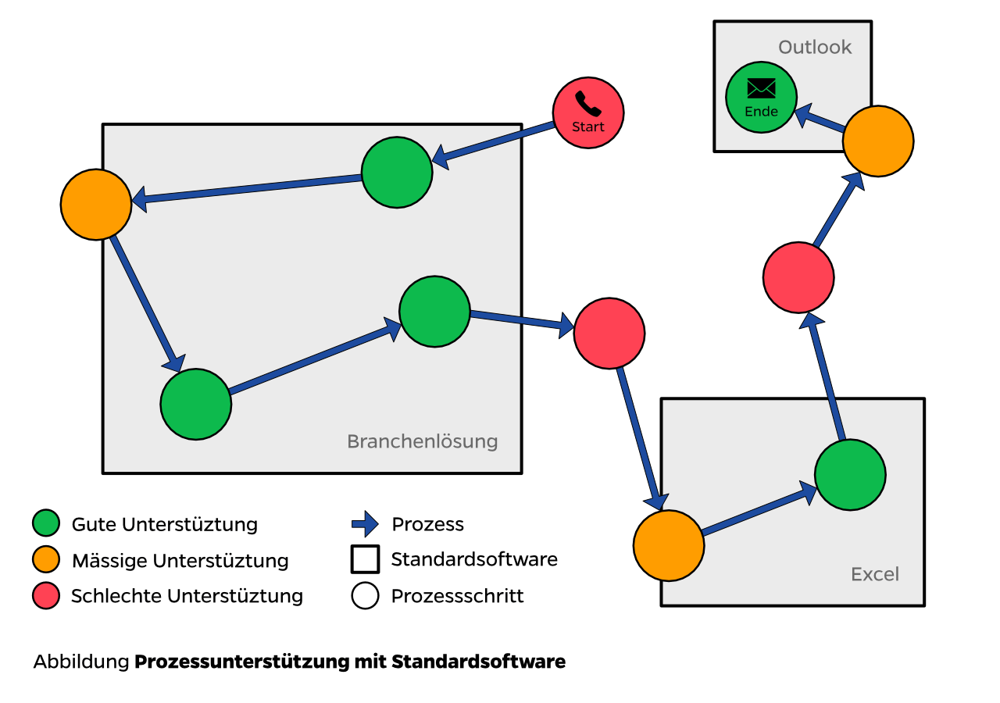
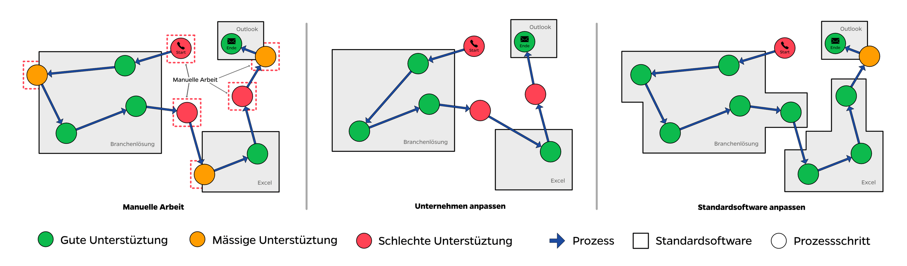
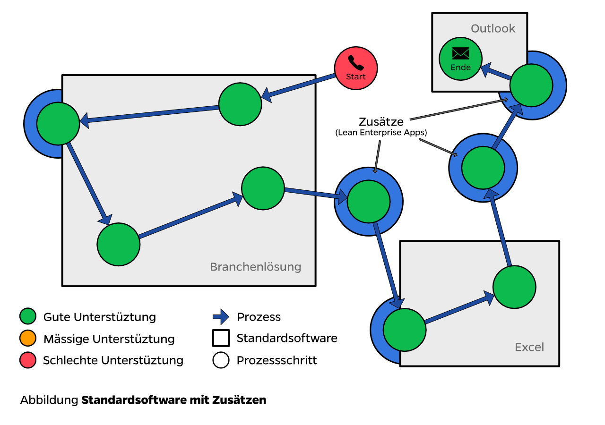

<h2>Nachteile von Standardsoftware</h2>

In meiner persönlichen Wahrnehmung setzen heute die meisten Unternehmen Standardsoftware (SAP, Branchenlösungen, Excel, Word, …) ein, um die Geschäftsprozesse abzubilden. Diese Standardlösungen enthalten eine Vielzahl an Funktionen, welche viele Prozessschritte eines Unternehmens unterstützen. Die angebotenen Funktionen passen aber in den meisten Fällen nicht genau zu den Schritten eines spezifischen Unternehmens oder einzelne Schritt werden überhaupt nicht unterstützt. Dies muss so sein, sonst hätten diese Unternehmen keine Alleinstellungsmerkmale (USP). Nur wenn alle Unternehmen gleich wären, könnte Standardsoftware genau passen. Wer seine Geschäftsprozesse mit Standardsoftware beschleunigen oder gar digitalisieren möchte steht vor einer Herausforderung.

[[left]]
|

Eine Möglichkeit um unpassenden Funktionen zu begegnen ist, Teile eines Schrittes oder ganze Schritte mit manueller Arbeit zu kompensieren. Dieses Verhalten habe ich in vielen Unternehmen gesehen. Dies spart Initial Kosten (die Mitarbeiter müssen “nur” ausgebildet werden), führt aber im Geschäftsprozess zu Zeitverlust und Fehlern. Zudem werden damit Mitarbeiter mit Arbeit gebunden, welche eigentlich automatisiert werden könnte. Dies verursacht auf längere Sicht grosse und vor allem unnötige Kosten.

Eine zweite Möglichkeit ist, das Unternehmen an die Standardsoftware anzupassen. Dies hat aber zur Folge, dass gewisse Dienstleistungen nicht wie gewohnt oder überhaupt nicht mehr erbracht werden können. Das Unternehmen verliert sein Alleinstellungsmerkmal (USP).

Eine dritte Möglichkeit ist, die Standardsoftware selber an das Unternehmen anzupassen. Je nach Standardsoftware bietet diese mehr oder weniger Anpassungsmöglichkeiten an. Aus meiner Erfahrung ist es um so aufwändiger und komplizierter Standardsoftware anzupassen, je tiefgreifender die Anpassungsmöglichkeiten sind. Teilweise ist es zudem überhaupt nicht möglich die eingesetzte Standardsoftware anzupassen. Die Geschäftsprozesse mit Anpassungen direkt an der Standardsoftware zu beschleunigen ist somit entweder gar nicht möglich oder mit grossen Kosten verbunden.

<h2>Geschäftsprozesse beschleunigen trotz Standardsoftware</h2>

Alle drei beschriebenen Möglichkeiten haben gewisse Nachteile.

Es gibt noch eine vierte Möglichkeit die bestehende Lösung an die Geschäftsprozesse anzupassen und die Kosten dabei im Griff zu behalten:

[[left]]
|

Verwenden Sie wie bisher Standardsoftware um die grössten Teil der Prozessschritte abzubilden. Genau bei den Schritten, wo die Standardsoftware nicht passt, setzen Sie dann individuell entwickelte Zusätze ein, welche sich in die bestehende Lösung integrieren. Diese Zusätze - wir nennen diese "[Lean Enterprise Apps](http://lean-enterprise-app.com)" - sind sehr kostengünstig, schnell und genau passend für einen Anwendungsfall entwickelt. So haben Sie den Vorteil einer relativ kostengünstigen, passenden Gesamtlösung, welche die Geschäftsprozesse beschleunigt.
