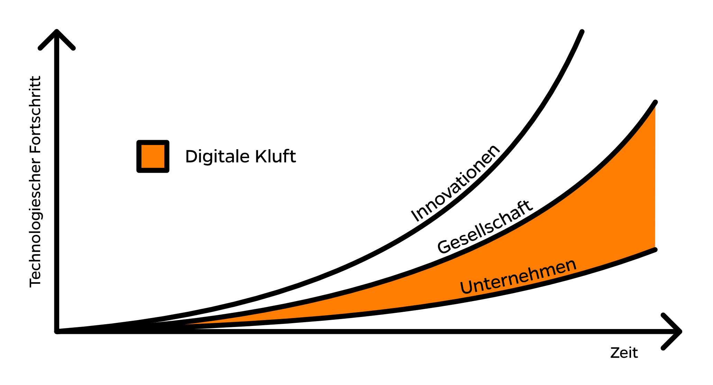

<h2>Verluste in der Kommunikation</h2>

Der technologische Fortschritt bringt immer neue Innovationen hervor. Viele dieser Innovationen wie beispielsweise mobile Geräte, Socialmedia oder neue Kommunikations-Apps werden von der Gesellschaft gut angenommen. Da die meisten Unternehmen Innovationen weniger schnell annehmen als dies die Gesellschaft tut, entsteht eine Digitale Kluft, welche zu Kommunikationsverlusten zwischen Unternehmen und der Gesellschaft führt.

<h2>Alle sind betroffen</h2>

Die Digitale Transformationen ist ein Vorgehen, welches die Digitale Kluft schliesst. Verluste in der Kommunikation und Prozessen werden damit auf ein Minimum reduziert. Dabei geht es nicht bloss um die Kunden, sondern um jegliche Stakeholder in der Gesellschaft wie beispielsweise Lieferanten, Partner und Mitarbeiter.

Ja, sogar die eigenen Mitarbeiter. Technische Innovationen sind bei den Mitarbeitern, genau wie bei den Kunden, Teil des täglichen Lebens geworden. Eine Digitale Kluft innerhalb eines Unternehmens bedeutet immer ein Verlust von Effizienz. Gegen aussen bedeutet es nicht bloss ein Effizienzverlust, sondern zustätzlich der Verlust von Kunden. Man braucht sich dafür bloss vorzustellen, ein Unternehmen würde heute noch per Telegramm mit seinen Kunden kommunizieren.

<h2>Digitale Transformation</h2>

Die Digitale Kluft kann oft bereits mit kleinen Anpassungen geschlossen werden. Dazu muss nicht das gesamte System ersetzt werden. Stattdessen ist es besser an den betroffenen Stellen kleine Zusätze (Apps) in das bestehende System zu integrieren. So wird das betroffene System schnell und mit überschaubarem Aufwand evolutionär transformiert.
