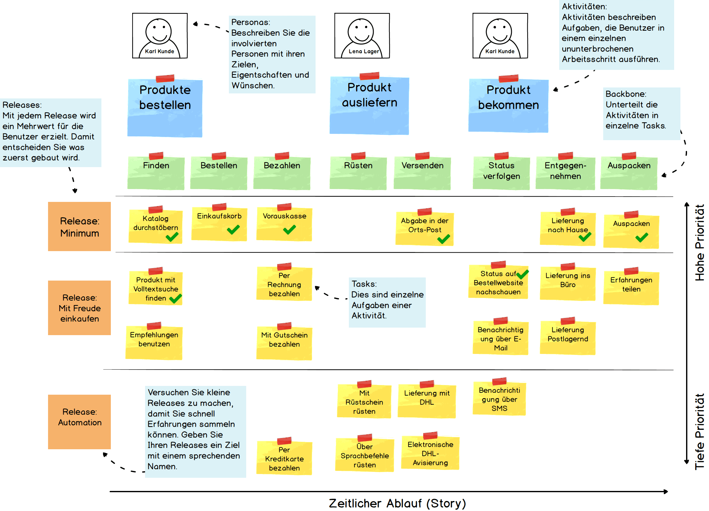

Haben Sie es schon erlebt, dass ein Projekt in unzähligen Anforderungen untergeht? Von allen Seiten kommen neue Wünsche. Es ist schwer, die Prioritäten richtig zu setzen. Es wird auch zunehmend schwieriger, zu erklären warum eine Anforderung nun nicht in der gewünschten Zeit geliefert werden kann. Überall befinden sich offene Baustellen. Um diese Situation zu verhindern, benutzen wir bei der Apptiva Storymaps. Mit einer Storymap erhalten Sie eine grafische Darstellung aller Anforderungen und Ideen und können damit wichtige Fragen wieder beantworten:

* Wie gross ist der Umfang des ganzen Vorhabens?
* Wie priorisieren wir die Anforderungen?
* Wann kann die erste Version produktiv eingesetzt werden?

Die Darstellung legt den Fokus auf den Prozess (die Story) der Anwender und den Nutzen der mit dem Produkt generiert wird. Die Storymap hilft Ihnen zudem ein gemeinsames Verständnis aufzubauen. Sie können damit die Konsequenzen von neuen Prioritäten und neuen Anforderungen visuell kommunizieren.

## Wie sieht eine Storymap aus?

In der folgenden Skizze ist eine Storymap für einen Webshop abgebildet. Sie sehen, es braucht dazu keine speziellen Tools. Post-Its oder Karteikarten reichen aus.

Die Storymap erzählt die Geschichte der Benutzer, welche mit Ihrem Produkt arbeiten. Von links nach rechts ist der grobe Ablauf dargestellt. Die Aktivitäten (blau) zeigen, wie der Prozess grob vorsichgeht. Der Backbone (grün) zerlegt die Aktivitäten in einzelne Schritte. So besteht die Aktivität “Produkt bestellen” grob aus den Schritten “Produkt finden”, “Bestellen” und “Bezahlen”.

Von oben nach unten sieht man die Priorität. Diese schlägt sich zugleich in Releases nieder. Im Verlauf des Projekts können Sie die erledigten Tasks auch entsprechend markieren. Sie sehen dann auf einen Blick, wie weit sie schon fortgeschritten sind und was noch fehlt.

Die Storymap hilft Ihnen im Gespräch mit allen beteiligten Personen den ganzen Umfang eines Produktes zu erfassen. Mit dem Schneiden in Releases können Sie gleichzeitig die Prioritäten so setzen, dass sie auch bei vielen Anforderungen schnell eine erste Version und damit Mehrwert liefern können.

Konsultieren Sie mit Ihren Stakeholdern die Storymap regelmässig. Nehmen Sie gemeinsam Anpassungen vor. Setzen Sie neue Prioritäten. Die Storymap soll leben.

## Woher stammt die Storymap?

Ursprünglich hat [Jeff Patton](http://jpattonassociates.com/) die Technik des User Story Mappings entwickelt. Von ihm stammt auch ein hervorragendes [Buch](http://www.amazon.de/User-Story-Mapping-Discover-Product/dp/1491904909) darüber (leider nur in Englisch). Auf seiner Website sind zudem auch Vorträge und Slides rund um das Thema verfügbar.

## Wie erstelle ich eine Storymap?

Damit die Map von Anfang an zum Erfolg wird, gibt es einiges zu beachten. Dazu berichten wir in einem späteren Blogpost mehr.
