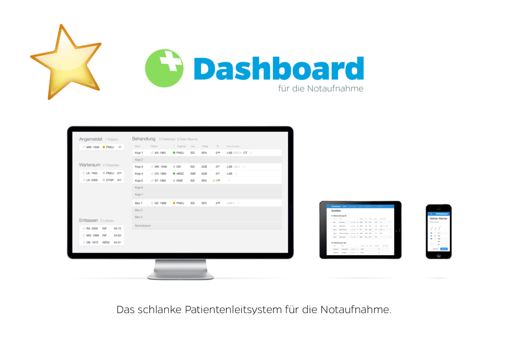

## Wir feiern unsere Highlights

Wir hatten das Glück bereits im ersten Jahr an vielen spannenden Projekten mitarbeiten zu dürfen.

<ul className="pl-8 indent-8 [&>li]:text-left">
  <li>⭐  SUVA Schneesport-Check</li>
  <li>⭐  Dashboard für den Kindernotfall des Inselspital Bern</li>
  <li>⭐  Digitalisierungsworkshop mit der SUVA</li>
  <li>⭐  Mitarbeit am SUVA RESTretto-Framework</li>
  <li>⭐  eGo - Landing Page</li>
  <li>⭐ Yamaha Promotion Page</li>
  <li>⭐ Lean Enterprise App - Manifest</li>
</ul>
<h2 className="text-left">Kommt und feiert mit uns</h2>

Wir feiern den ersten Geburtstag der Apptiva. Feiert mit uns.

[[right]]
|

Datum
<strong>Donnerstag, 25. August 2016</strong>

Ort
<strong>Büro Apptiva
</strong><strong>Industriestr. 9, 6210 Sursee</strong>

<h3 dir="ltr" className="text-left">Tag der Offenen Tür ab 9:00</h3>

Kommt zu uns in die App-Werkstatt. Nehmt aktiv Einfluss auf die aktuelle Entwicklung. Seht live wie eine Applikation entsteht.

<h3 dir="ltr" className="text-left">Abend Apero 16:00 bis 22:00</h3>

Stosst mit uns auf das einjährige Bestehen der Apptiva an. Wir schauen auf ein tolles Jahr zurück und wollen diesen Moment mit euch teilen.

<h2 className="text-left">Danke an unsere Kunden</h2>

&nbsp;
