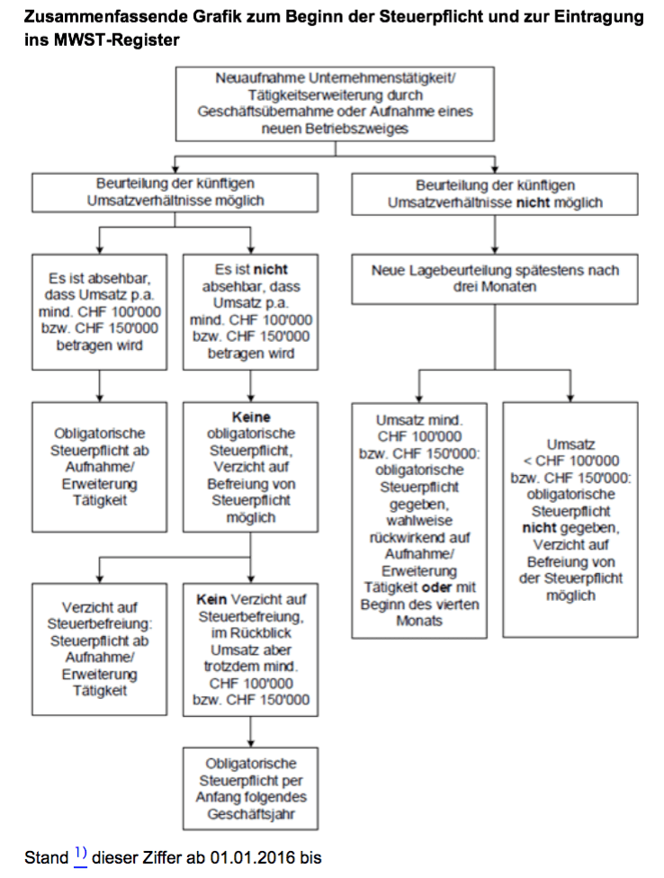

<h2>"Ab wann soll/muss ich als Startup die Mehrwertsteuer bezahlen?"</h2>

<h3>Kurze Antwort</h3>

Von Beginn weg.

<h3>Längere Antwort</h3>

Wir sind nun über ein Jahr mit der Apptiva unterwegs und haben auch im Bereich der Mehrwertsteuer unsere Erfahrung machen dürfen. Wir haben viele Personen gefragt, wann MwSt bezahlt werden muss. Der Tenor war, dass man im ersten Jahr als neues Unternehmen keine MwSt bezahlen muss. Leider stimmt dies nicht. Dies gilt nur für Unternehmen, welche die künftigen Umsatzverhältnisse beurteilen können (z.B. bestehende Unternehmen, welche jahrelang unter 100’000.- CHF Umsatz erzielt haben).

Für Unternehmen welche die künftigen Umsatzverhältnisse nicht beurteilen können (wie z.B. Startups) ist es etwas komplizierter. Für diese gilt, dass sie MwSt bezahlen müssen, sobald extrapoliert werden kann, dass der Jahresumsatz über 100’000.- sein wird. Puh! Ist dies bei der Gründung noch nicht beurteilbar, so ist das Unternehmen von der Steuerpflicht vorläufig befreit (wenn man will).

Nun ist es aber nicht so, dass sich damit das Thema für ein Jahr erledigt hätte. Spätestens nach drei Monaten muss wieder geprüft werden, ob der Jahresumsatz über 100’000.- sein könnte. Dies berechnet die Dame vom Steueramt so:

> Umsatz der ersten drei Monate \* 4 >= 100’000.- CHF?

Wenn ja, so muss spätestens ab diesem Zeitpunkt bezahlt werden. Punkt. Wer nicht sicher ist, sollte sich lieber zu früh als zu spät mit dem Steueramt in Verbindung setzen.

<h3>Quelle</h3>
<a href="https://www.gate.estv.admin.ch/mwst-webpublikationen/public/pages/taxInfos/cipherDisplay.xhtml?publicationId=1010164&amp;componentId=1010314&amp;winid=701377">https://www.gate.estv.admin.ch/mwst-webpublikationen/public/pages/taxInfos/cipherDisplay.xhtml?publicationId=1010164&amp;componentId=1010314&amp;winid=701377</a>

[https://www.gate.estv.admin.ch/mwst-webpublikationen/public/pages/taxInfos/cipherDisplay.xhtml?publicationId=1010164&amp;componentId=1010319&amp;winid=701377](https://www.gate.estv.admin.ch/mwst-webpublikationen/public/pages/taxInfos/cipherDisplay.xhtml?publicationId=1010164&componentId=1010319&winid=701377)
