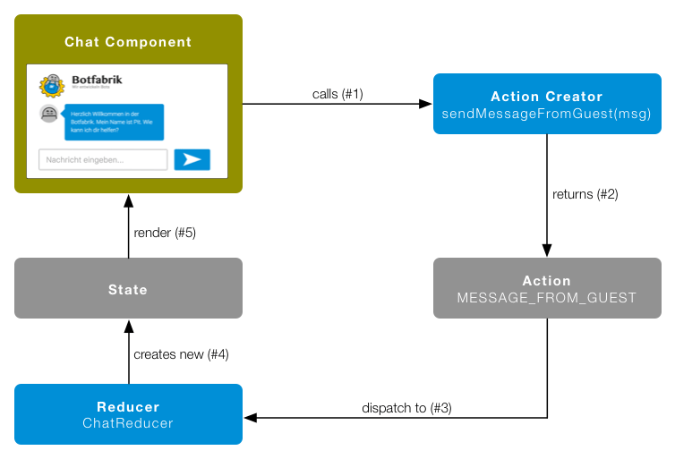
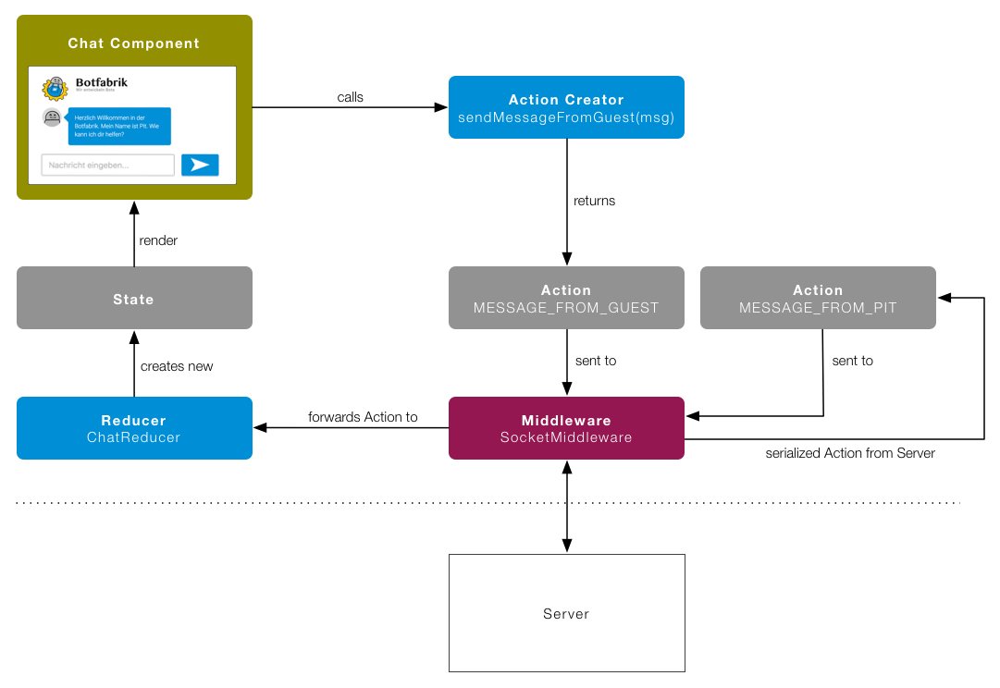

In unserem letzten Blogpost hat Philip über die [Lancierung der Botfabrik](/bot-entwicklung/) berichtet. Ich möchte in diesem Post etwas technischer werden und dir zeigen, wie wir unseren Chatbot Pit entwickelt haben. Pits Fähigkeiten kannst du übrigens hier ausprobieren: [www.botfabrik.ch](http://www.botfabrik.ch)

## Über Pit

Pit ist ein Chatbot. Von Chatbots spricht man, wenn ein Bot, also ein Computerprogramm dass eine Aufgabe automatisiert und selbständig erledigt, mit einem Menschen eine Konversation führt. Chatbots laufen oft innerhalb von Webseiten oder Messaging-Anwendungen wie z.B. Facebook Chat oder Slack und vermitteln einem das Gefühl, mit einem richtigen Menschen zu chatten. Pit läuft innerhalb einer Webseite und hat die Aufgabe, Webseitenbesucher das Thema Bot näher zu bringen und sie bei Interesse ans Botfabrik Team weiterzuleiten; also ein Mischung von [FAQ](http://www.botfabrik.ch/bots/faq)- und [Akquise](http://www.botfabrik.ch/bots/akquise)-Bot.

## Der Client

Wenn immer möglich versuchen wir, unsere Lösungen als Webapplikationen zu implementieren. Im Falle eines Chatbots setzen wir auf Single-page Applikationen (SPA), da wir damit dem Anwender das Gefühl einer nativen Chatapplikation vermitteln können.
Wenn wir freie Wahl haben, bevorzugen wir [React](https://facebook.github.io/react/) als JavaScript Framework zur Erstellung von SPAs.

Damit dir das Lesen dieses Beitrags einfacher fällt, hilft es, wenn du React und ES6 bereits etwas kennst. Als Einführung in React empfehle ich das Buch [React: Die praktische Einführung in React, React Router und Redux](https://www.amazon.de/dp/3864903270) und natürlich die offizielle Dokumentation von Facebook [https://facebook.github.io/react/](https://facebook.github.io/react/).

Um eine übersichtliche und wartbare Applikation zu erstellen, hilft eine einheitliche Architektur. Im React Umfeld kommt dafür vermehrt Redux zum Einsatz. Redux übernimmt den Zustand der Applikation sowie die Funktionalität die z.B. bei Benutzerinteraktionen ausgelöst wird.

### Redux: Action-Creators, Actions und Reducers

Sehen wir uns dies am Beispiel an, wenn ein Benutzer eine neue Chat-Meldung sendet:



<ul>
  <li>Die Chat Komponente erzeugt mittels Action-Creator <i>sendMessageFromGuest(msg)</i> (#1) eine neue Action ‘MESSAGE_FROM_GUEST’ (#2).</li>
  <li>Die Action wird via Redux an alle Reducer weitergegeben (#3). In unserem Beispiel interessiert sich nur der ChatReducer für die Action vom Typ ‘MESSAGE_FROM_GUEST’.</li>
  <li>Jeder Reducer verwaltete einen bestimmten Teil des gesamten State. Unser ChatReducer ist für den Teilzustand <i>/chat</i> verantwortlich. Unter diesem Teilzustand sind z.B. alle Chat-Nachrichten abgelegt.
Der Reducer verarbeitet nun die Action und gibt einen neuen Teilzustand als Ergebnis der Verarbeitung zurück. Konkret fügt er die vom Benutzer erstellte Meldung in die Liste aller Chat-Nachrichten ein. Redux legt diesen im State ab (#4).</li>
  <li>Der neue Gesamtzustand wird nun an die Komponente übergeben, wodurch sich diese neu rendert und die neu Nachricht zuunterst in der Nachrichtenliste anzeigt (#5).</li>
</ul>

Übersetzt in JavaScript Code sieht das dann in etwa so aus:

#### Chat Komponente

```javascript
import React from 'react/react'

import { bindActionCreators } from 'redux'
import { connect } from 'react-redux'

import MessageContainer from './MessageContainer'
import UserInput from './UserInput'

class Chat extends React.Component {
  render() {
    const { messages, sendMessageFromUser } = this.props
    return (
      <div>
        <MessageContainer messages={messages} />
        <UserInput onInputEntered={sendMessageFromGuest} />
      </div>
    )
  }
}

Chat.propTypes = {
  messages: React.PropTypes.array.isRequired,
  connect: React.PropTypes.func.isRequired,
  sendMessageFromGuest: React.PropTypes.func.isRequired,
}
```

```javascript
//
// Komponente mit Redux verbinden
//
import * as Actions from '../../actions'

function mapStateToProps(state) {
  let { messages } = state.chat
  return {
    messages: messages,
  }
}

function mapDispatchToProps(dispatch) {
  return bindActionCreators(Actions, dispatch)
}

const wrappedComponent = connect(mapStateToProps, mapDispatchToProps)(Chat)
export default wrappedComponent
```

#### UserInput Komponente

```javascript
import React from 'react/react';

export default class TextInput extends React.Component {

    handleClickSubmitButton(event) {
        event.preventDefault();
        if (this.userTextInput !== null &amp;&amp; this.userTextInput.value.length > 1) {
            // Input an übergeordnete Komponente weitergeben
            this.props.onInputEntered(this.userTextInput.value);
            this.userTextInput.value = '';
        }
    }

    render() {
        return (
            <form onSubmit={ this.handleClickSubmitButton.bind(this) }>
                <input placeholder="Nachricht eingeben..." ref={(ref) => this.userTextInput = ref} />
                <button type="submit" onClick={this.handleClickSubmitButton.bind(this)}>
                    
                </button>
            </form>
        );
    };

};

TextInput.propTypes = {
onInputEntered: React.PropTypes.func.isRequired,
};
```

#### Action Creator / Action

```javascript
export const MESSAGE_FROM_GUEST = 'MESSAGE_FROM_GUEST'
export const MESSAGE_FROM_PIT = 'MESSAGE_FROM_PIT'

/**

* Informiere den Store, dass der Benutzer eine neue Nachricht gesendet hat.
  */
export function sendMessageFromGuest(msg) {
  return {
    type: MESSAGE_FROM_GUEST,
    msg: msg,
  }
}

/**

* Informiert den Store, dass eine neue Meldung von Pit eingetroffen ist.
  */
export function sendMessageFromPit(msg) {
  return {
    type: MESSAGE_FROM_PIT,
    msg: msg,
  }
}
```

#### ChatReducer

```javascript
import * as Actions from '../actions'

export default function chat(state = initialState, action) {
  switch (action.type) {
    case Actions.MESSAGE_FROM_GUEST:
      return Object.assign({}, state, {
        messages: state.messages.concat([action.msg]),
      })

    case Actions.MESSAGE_FROM_PIT:
      return Object.assign({}, state, {
        messages: state.messages.concat([action.msg]),
      })

    default:
      return state
  }
}

const initialState = {
  messages: [],
}
```

Dank den Action-Creators, Actions und Reducers von Redux fliesst nun der Daten- und Kontrollfluss immer in eine Richtung. Direkte Interaktionen zwischen einzelnen Komponenten gibt es nicht. Was meiner Meinung nach die Applikation viel verständlicher und damit auch wartbarer macht.

Wie bereits oben erwähnt, verlieren mit Redux die Komponenten neben dem Zustand auch die Verantwortung über der Funktionalität. Damit werden sie einfacher, verständlicher und besser wiederverwendbar. Die Action-Creators übernehmen neu die Funktionalität. Dies ist auch die einzige Stelle, in der asynchrone Aktivitäten (z.B. Serverzugriffe) ausgeführt werden.

Nun kommen wir an den Punkt, wo wir die Benutzereingabe nicht nur in die Liste aller Chat-Nachrichten eintragen, und damit die Chat-Komponente neu rendern lassen, sondern wir möchten die Nachricht auch von unserem Chatbot Pit beantworten lassen. Dazu setzen wir Wit ein. Wit bietet eine API an, welches Texte in natürlicher Sprache in strukturierte Daten übersetzt. Unser Chatbot verwendet Wit um zu erkennen, was der Benutzer genau möchte und um die Steuerung von einfachen Abläufen inkl. Verzweigungen zu übernehmen. Antworten von Pit an den Besucher werden via Action ‘MESSAGE_FROM_PIT’ in den Store gestellt. Infos zu Wit findest du unter [wit.ai](http://wit.ai).

Wir erweitern also unseren Action-Creator sendMessageFromGuest(msg) mit dem Aufruf von Wit:

```javascript
export function sendMessageFromGuest(msg) {
  const WIT_TOKEN = 'abc123def456'
  return (dispatch) => {
    // Meldung dem Store übergeben, damit diese anschliessend via Reducer in den State kommt.
    dispatch({
      type: MESSAGE_FROM_GUEST,
      msg: msg,
    })

    // Text an Wit zur Analyse senden und von Wit erhaltenes Resultat als Meldung von Pit dem Store übergeben
    wit.call(WIT_TOKEN, msg).then((result) => {
      dispatch(sendMessageFromPit(result))
    })
  }
}
```

Wie du an diesem Beispiel siehst, kann ein Action-Creator mittels der dispatch-Methode auch mehrere Actions an Redux weitergeben. Der Aufruf von Wit ist hier nur als Pseudocode dargestellt. Wie man Wit innerhalb einer JavaScript Anwendung verwenden kannst, findest du unter [https://github.com/wit-ai/node-wit](https://github.com/wit-ai/node-wit).

&nbsp;

Cool. Wir konnten Wit integrieren, ohne dass wir Änderungen an einer unserer Komponenten hätten vornehmen müssen. Was mir hier aber nicht passt ist, dass unser privates Wit Token im Client liegt und damit eigentlich für jedermann zugänglich ist. Mein Vorschlag ist, diese Logik vom Client wegzunehmen und stattdessen auf den Server zu verschieben. D.h. anstelle eines direkten Wit Aufrufs innerhalb des Action-Creators rufen wir unser eigenes Backend auf, welches den Aufruf dann an Wit delegiert.

Zusätzlich zur Anbindung an Wit möchten wir auch eine Slack Integration haben, damit wir uns in die Konversation zwischen unserem Webseitenbesucher und Pit einklinken können, und im Chat mitreden können. Um dies zu erreichen könnten wir nun wiederum einen Action-Creator erstellen, der die Kommunikation via unserem Backend mit Slack sicherstellt. Diese Kommunikation soll natürlich via WebSockets funktionieren.

Wir haben nun zwei Action-Creators welche mit unserem Backend kommunizieren und darüber die Anfrage entweder an Wit oder Slack weiterleiten. Wäre es nicht besser, die beiden Action-Creators müssten sich nicht ums Backend kümmern und könnten nur die Action ‘MESSAGE_FROM_GUEST’ (ausgehende Meldung) bzw. ‘MESSAGE_FROM_PIT’ (eintreffende Meldung) auslösen? Damit könnten wir den Chat für einfache Sachen auch ohne Backend laufen lassen und das Testen wird nochmals vereinfacht. Um dies zu bewerkstelligen erstellen wir eine eigene Redux Middleware.

### Redux: Middleware

Eine Middleware ermöglicht, in den Ablauf zwischen dem Dispatchen einer Action und dem Verteilen der Action an die Reducers einzugreifen. Dies wird oft verwendet, um z.B. asynchrone Actions auszuführen oder um Änderungen am Zustand der Applikation zu loggen. Eine gute Einführung in die Redux Middleware findest du hier: [http://redux.js.org/docs/advanced/Middleware.html](http://redux.js.org/docs/advanced/Middleware.html)

Wir schreiben eine eigene WebSocket Middleware fürs Senden und Empfangen von Chat-Nachrichten. Der Ablauf sieht danach wie folgt aus:



SocketMiddleware erstellt eine WebSocket Verbindung mit dem Backend und fängt alle Actions vom Typ ‘MESSAGE_FROM_GUEST’ ab und sendet diese zum Server. Der Server Verarbeitet die Action und sendet bei Bedarf als Antwort Actions vom Typ ‘MESSAGE_FROM_PIT’ zurück zur Middleware. Die Middleware leitet alle vom Server eingegangenen Actions weiter an Redux wodurch sich der Kreislauf schliesst.

#### SocketMiddleware

```javascript
import * as Actions from '../actions'
import io from 'socket.io-client'

const socketMiddleware = (store) => (next) => {
  let socket = null

  // Meldungen vom Server als Actions an Redux übergeben
  const onMessageFromServer = (socket, store) => (action) => {
    store.dispatch(action)
  }

  return (action) => {
    let result = next(action)

    switch (action.type) {
      // Erstelle eine neue Socket Verbindung
      case Actions.CONNECT:
        if (socket != null) {
          socket.disconnect()
        }
        socket = io(action.url)

        socket.on('message', onMessageFromServer(socket, store))

        break

      // Sende die Meldung vom Benutzer an den Server
      case Actions.MESSAGE_FROM_GUEST:
        socket.emit('message', JSON.stringify(action))
        break
    }

    return result
  }
}

export default socketMiddleware
```

Wir haben hier eine weitere Action vom Typ ‘CONNECT’ eingeführt. Diese wird innerhalb der componentDidMount() Methode der Chat Component aufgerufen, um die Verbindung mit dem Server herzustellen.

## Ausblick

Wir haben jetzt den Client soweit, dass dieser mittels WebSocket mit dem Backend kommunizieren kann. Meldungen die der Benutzer eingibt, werden via Redux in den State gestellt und via Middleware an den Server übermittelt. Der Server kann beliebige Actions an den Client senden und diese werden via Redux vom Client verarbeitet. Im zweiten Teil dieses Blogposts kannst du dann lesen, wie wir das Backend implementiert haben. Folge uns auf Twitter [@ApptivaTeam](http://twitter.com/ApptivaTeam) damit du nichts verpasst.

> Du möchtest auch einen Chatbot der für dich wichtige Arbeiten erledigt? Brauchst du Unterstützung bei der Implementation eines Bots bzw. Chatbots? Nimm mit uns Kontakt auf, wir helfen gerne.
