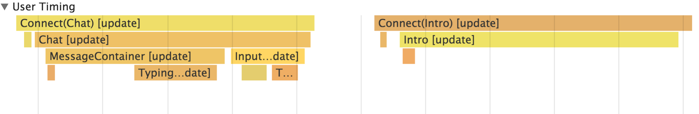

Heute ist Version 15.4.0 von React veröffentlicht worden. Mit der neuen Version können React Komponenten in der Chrome Timeline visualisiert werden. Damit lässt sich erkennen, welche Komponenten mounted, aktualisiert und unmounted werden und wie lange sie im Vergleich zu den anderen Komponenten brauchen.

Ich will prüfen, ob ich mithilfe dieser neuen Visualisierung in unserem Botfabrik-Projekt ([www.botfabrik.ch](http://www.botfabrik.ch)) etwas auffälliges erkennen kann. Dazu aktualisiere ich zuerst die beiden Node Module <em>react</em> und <em>react-dom</em> auf Version 15.4.0. und starte dann die Applikation.

Um nun die Timeline in Chrome anschauen zu können, muss ich folgendes machen:

<ol>
  <li>Applikation im Chrome Browser mit Query-String <strong>?react_perf</strong> aufrufen (bei mir http://localhost:3000/?react_perf)</li>
  <li>Chrome DevTools Öffnen und im Tab <strong>Timeline</strong> die Aufzeichnung starten</li>
  <li>Nun kann ich die aufzuzeichnenden Aktionen ausführen. Ich frage Pit nach seinem Alter ("wie alt bist du?") und erhalte von ihm die Antwort "Ich bin noch jung".</li>
  <li>Aufzeichnung stoppen</li>
  <li>React Aktionen werden innerhalb der Gruppe <strong>User Timing</strong> gruppiert und können nun analysiert werden:</li>
</ol>
&nbsp;

&nbsp;

Was mir auffällt ist, dass nach dem Eintreffen einer neuen Chat-Nachricht die <em>Intro</em> Komponente aktualisiert wird. Dies macht keinen Sinn, da diese Komponente nur statischen Text anzeigt. Es gilt jetzt herauszufinden, warum das so ist. Gut Nacht :smile:

Linus Hüsler
