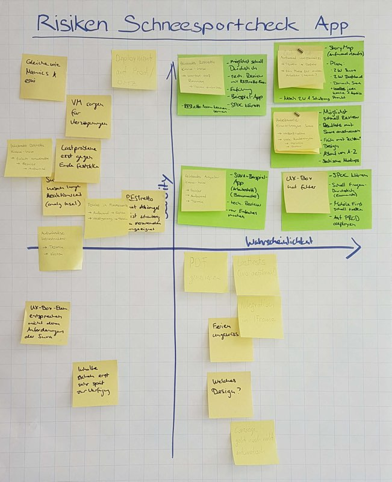
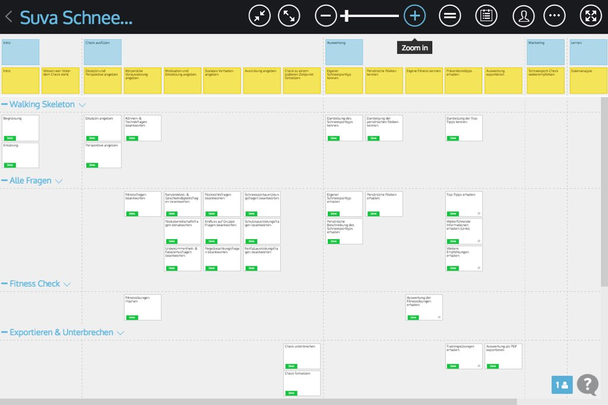
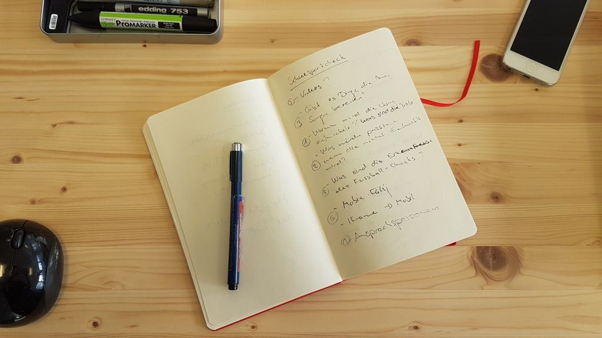
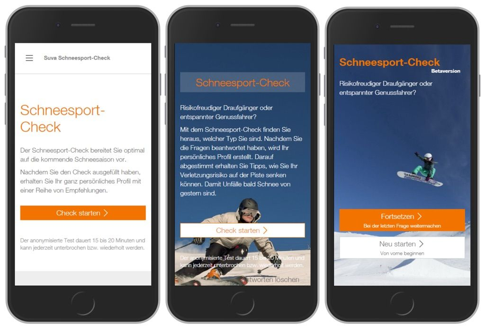
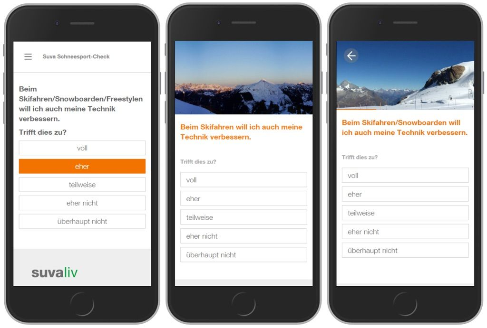
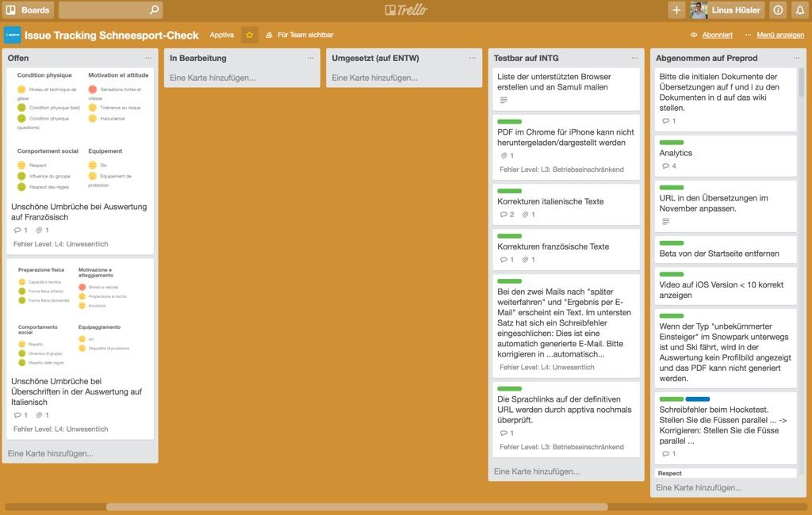

Anfang Mai 2016 haben wir von der Suva den Auftrag zur Umsetzung einer [Webapplikation](/angebot/development/webentwicklung) erhalten.

Ziel der Applikation ist Schneesportler für ihre Risiken zu sensibilisieren und persönliche Tipps anzubieten. Dazu werden ca. 50 Fragen gestellt und 5 Fitnessübungen durchgeführt. Am Ende erhält der Teilnehmer oder die Teilnehmerin ein persönliches Profil mit Tipps und Links zu weiterführenden Informationen.

<h2>Gute Ausgangslage schaffen</h2>

Uns wurde gleich zu Beginn ein grosses Konzept in die Hand gedrückt. Darin waren Ergebnisse von über einem Jahr Konzeptarbeit festgehalten. So waren alle Fragen und Antworten, die Berechnung der Schneesportprofile und -typen sowie die Fitnessübungen in Dokumenten detailliert beschrieben. Aus Erfahrung ist ein grosses Konzept nicht immer die beste Ausgangslage. Der Kunde hat sich bereits über eine lange Zeit mit einem Thema auseinandergesetzt und sieht vieles als selbstverständlich an, für uns von der Apptiva waren diese Informationen jedoch alle neu. Die Herausforderung bestand darin, in kurzer Zeit das Erarbeitete korrekt zu interpretieren, sodass der Transfer des Wissen verlustfrei vonstatten ging. Um dies zu erreichen haben wir drei Massnahmen ergriffen:

<ul>
  <li>Eine Risiko-Matrix erstellt</li>
  <li>Eine Storymap erstellt</li>
  <li>Alle zwei Wochen Release mit Review</li>
</ul>

<h2>Risiko-Matrix</h2>

In der Runde haben wir alle Risiken auf Post-it-Zetteln gesammelt. Diese haben wir dann auf den Achsen “Wahrscheinlichkeit” und “Schweregrad” auf einem Flipchart platziert. Für alle Zettel im Quadranten “Wahrscheinlich und Schwerwiegend” haben wir eine Mitigationsstrategie beschrieben und die nötigen Task dafür festgehalten.

Ein Risiko war fehlendes Suva-Framework Know-how. Unsere Strategie um dieses Risiko zu reduzieren war damals:

<ul>
  <li>Möglichste schnell ein [walking skeleton](http://alistair.cockburn.us/Walking+skeleton) zu haben</li>
  <li>Review durch das Suva-Framework-Team</li>
  <li>Einführung in das Framework erhalten</li>
  <li>Eine Beispielapplikation im Zugriff zu haben</li>
</ul>
Unsere festgehaltenen Risiken hatten wir jederzeit im Griff und sind glücklicherweise von unbekannten Risiken verschont geblieben.

<h2>Storymap</h2>

Die Storymap erlaubt es wie kein zweites Werkzeug ein gemeinsames Verständnis zwischen Personen zu schaffen. Zudem zeigt die Storymap eindrücklich den erwarteten Umfang auf und den geplanten Ablauf des Projekts in Bezug auf die Umsetzung. Eine Beschreibung des Werkzeuges “Storymaps” findet man in unserem [Blogbeitrag](/blog/mehr-ueberblick-mit-storymap)

Die horizontalen Striche, die mit einem Titel versehen sind, zeigen, dass die Funktionalität des Schneesport-Checks in sechs Phasen unterteilt ist. Eine der wichtigsten Phasen ist bestimmt die erste; hier “Walking Skeleton” genannt. Mit dem Walking Skeleton will man möglichst schnell die grössten Risiken angehen. In unserem Falls war dies die technische Herausforderung und die grobe grafische Darstellung. Zudem wollten wir bereits eine erste Auswertung haben, um sicher zu stellen, dass wir diese korrekt verstanden haben.

<h2>Release und Review</h2>

Um zu wissen, ob wir uns auf dem richtigen Weg befinden, haben wir bereits zu einem sehr frühen Zeitpunkt und dann alle zwei Wochen den aktuellen Stand den Fachverantwortlichen bei der Suva präsentiert. Diese Reviews waren meistens länger als angenommen. Zu unserer aller Überraschung kamen immer sehr viele Punkte zum Vorschein, die wir besprechen wollten. Wir waren echt froh um das konstruktive Feedback und die anschliessende Diskussion von möglichen Lösungen. So konnten wir alle nach jedem Review den Raum einiges schlauer verlassen als wir ihn betreten haben.

<h2>Evolutionäre Entwicklung</h2>

Nebst allem was bereits zu einem frühen Zeitpunkt erarbeitet und festgehalten wurde, waren einige Dinge noch nicht in Stein gemeisselt. So waren zwar die Design-Elemente wie Butttons und Schriften bereits definiert, aber das Layout auf Desktop und Mobile noch nicht. Um diesen Umstand gerecht zu werden, hätten wir unterschiedliche Strategien wählen können.

<ol>
  <li>Wasserfall: Design-Entwürfe erstellen, diese Absegnen lassen und danach so umsetzen.</li>
  <li>Evolutionäre Entwicklung: Frühzeitig am Beispiel von 2-3 Fragen eine einfache erste Lösung erstellen und präsentieren. Aufgrund des Feedbacks die Lösung verbessern und wieder präsentieren.</li>
</ol>

Da wir auf dem Framework der Suva aufsetzten, waren uns auch technische Aspekte noch unklar. Zudem wollten wir auch früh ein Gespür für die Benutzbarkeit erhalten. Wir haben uns deshalb für die Evolutionäre Entwicklung entschieden. Mit einem evolutionären Ansatz ist es möglich in kurzer Zeit eine Lösung nicht nur optisch, sondern auch technisch und von der Benutzbarkeit her zu validieren.

<h2>Iterativ nicht inkrementell</h2>

Häufig wird unter iterativer Entwicklung eigentlich inkrementelle Entwicklung verstanden. Am Beispiel eines Aufsatzes wird beim inkrementellen Vorgehen Satz für Satz perfekt geschrieben. Mit einem iterativen Vorgehen wird hingegen zuerst ein grober Entwurf geschrieben, welcher nach und nach verbessert wird.

Mit einem inkrementellen Vorgehen ist ein evolutionäres Vorgehen unmöglich. Dies heisst aber auch, dass ein fertiggestelltes Feature nicht wirklich fertig ist, sondern bloss eine Evolutionsstufe erreicht hat. Diese Evolutionsstufe eines Features wird beim Review bewertet und für eine weitere Evolution eingeplant oder als genügend eingestuft.

<h2>Beispiele für evolutionäre Entwicklung</h2>

<h3>Intro</h3>

Der erste Entwurf des Intros wurde ganz einfach zusammengestellt, um den TeilnehmerInnen zu vermitteln um was es geht. Dies hat zwar funktioniert, aber es war uns noch zu kalt und emotionslos.

In einer zweiten Evolution haben wir die Texte überarbeitet und ein Hintergrundbild eingefügt. Von der Idee her hat es uns gefallen, aber der Text war gerade auf mobilen Geräten zu lange und der Skifahrer auf dem Bild macht ein zu ernstes Gesicht. Zudem wollten wir alle SchneesportlerInnen ansprechen und nicht bloss die Skifahrer. Ganz unten ist ausserdem ein “technischer” Button sichtbar, um die Antworten zu löschen und den Check von vorne zu Beginnen. Auch dies war noch nicht akzeptable.

Mit der dritten und vierten Evolution haben wir je ein Hintergrundbild für Ski, Snowboard und Freeriding als Animation hinzugefügt, die Text auf Mobile kürzer gemacht und zusätzlich den “Neustart” eleganter gelöst. Auch bei dieser Evolutionsstufe gab es noch Dinge die wir gerne verbessert hätte, aber im Hinblick auf das Gesamtprojekt war dies ein Stand der seinen Zweck sehr gut erfüllt.

<h3>Fragen</h3>

Der Fragen-Screen ist das zentrale Elemente des Schneesport-Checks. Die erste Evolutionsstufe war noch sehr einfach gehalten. Beispielsweise wird die Schneesport-Disziplin in der Frage noch nicht berücksichtigt und die Buttons geben noch kein Feedback. Zudem störte uns bei dieser ersten Evolutionsstufe, dass der Screen noch sehr nüchtern war.

Mit der zweiten Evolutionsstufe haben wir nach Ideen gesucht, wie wir alle Fragen noch etwas aufpeppen und den Bezug zum Schneesport stärken können. Zudem wollten wir mehr Emotionen vermitteln. Da hatten wir die Idee eines Panoramas, welches mit jeder beantworteten Fragen etwas mehr Preis gibt. Dies hat uns allen gut gefallen. Gestört haben uns noch zwei Dinge: Der Fortschritt im Check war nicht ersichtlich und es war noch zu unklar wie man zur vorherigen Fragen gelangen kann.

Mit der dritten Evolutionsstufe haben wir einen Fortschrittsbalken im Panorama und einen expliziten “Zurück”-Button oben hinzugefügt. Diese Evolutionsstufe hat ihren Zweck erfüllt.

<h2>Feinschliff</h2>

Als wir das Beta-Stadium des Schneesport-Checks erreicht hatten, stellten wir von regelmässigen Reviews auf ein Trello-Board um. Da es sich nun um kleine Details und Korrekturen handelte, wollten wir diese tracken können, um den Überblick zu behalten. Alle die beim Schneesport-Check mitgearbeitet haben, hatten auf ein Trello-Board zugriff. Dort konnten sie sehr einfach und schnell ein Problem erfassen.

Nach der Korrektur eines Tasks, schoben wir diesen von “In Bearbeitung” über “Behoben” zu “Veröffentlicht”. Diejenige Person die den Task ursprünglich erfasste, schaute ob das Problem behoben war. Diese Vorgehensweise war sehr leichtgewichtig und hat perfekt funktioniert.

<h2>Abschluss</h2>

Zum Abschluss führten wir eine Retrospektive des gesamten Projektes durch. Alles in Allem wurde das Projekt von allen Beteiligten als grosser Erfolg bewertet. Alle waren der Meinung, dass die konstruktive Zusammenarbeit und das iterative Vorgehen massgebend waren. Die resultierende Lösung funktioniert sehr gut und die gesteckten Meilensteine wurden alle erreicht. Wir sind stolz auf die Entwicklung dieser [Applikation](/angebot/development/webentwicklung).

Der Schneesport-Check ist erreichbar unter: [http://www.suva.ch/schneesportcheck](http://www.suva.ch/schneesportcheck)
