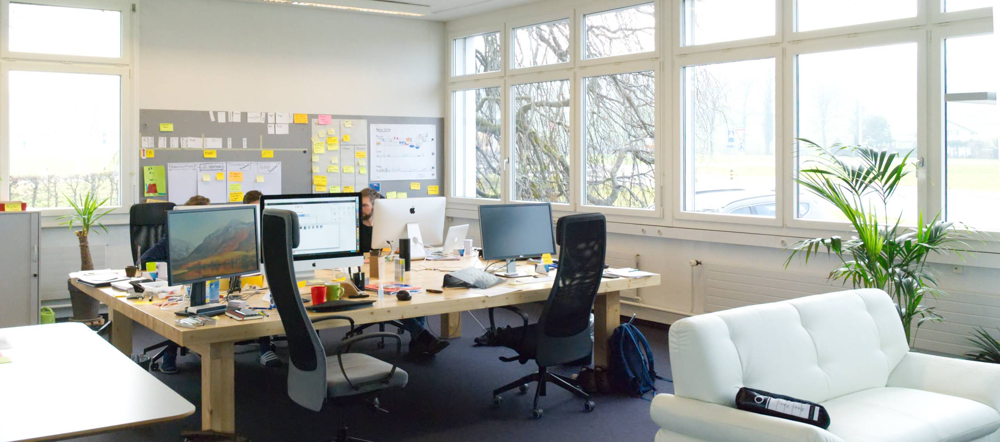

## Wir haben neue Büroräumlichkeiten bezogen

Neu findet man die Apptiva AG in Sempach Station in der Startup Station.

Die Startup Station bietet Startups flexible Räumlichkeiten zu interessanten Konditionen. Unsere Beweggründe waren aber weniger die interessanten Konditionen, sondern die Möglichkeit uns intensiver mit anderen Startups auszutauschen und Synergien zu nutzen.

Inzwischen haben sich mit Braincept, Pixels Kingdom, Digital Enterprise und ActiveSales schon einige coole Startups hier eingefunden. Entsprechend findet man auch immer ein offenes Ohr um neue Ideen zu besprechen oder um Erfahrungen auszutauschen. Auch das Afterwork-Bier am Freitag schmeckt in der Startup Station irgendwie besser. Es wird viel gelacht und ist ein guter Moment um Erlebnisse und Gedanken im lockeren Rahmen auszutauschen.

Inzwischen sind wir bereits einige Wochen hier und haben uns sehr gut eingelebt. Hier haben wir die perfekte Umgebung um unseren Kunden die besten Apps und Bots bieten zu können. Wer mal bei unserem neuen Büro vorbeischauen möchte, ist herzlich eingeladen. Wir würden uns über einen Besuch sehr freuen.

&nbsp;

figure]:basis-60 flex-wrap gap-2">

### Unsere neue Adresse lautet

Apptiva AG 
Neuenkirchstrasse 19 
Sempach Station 
