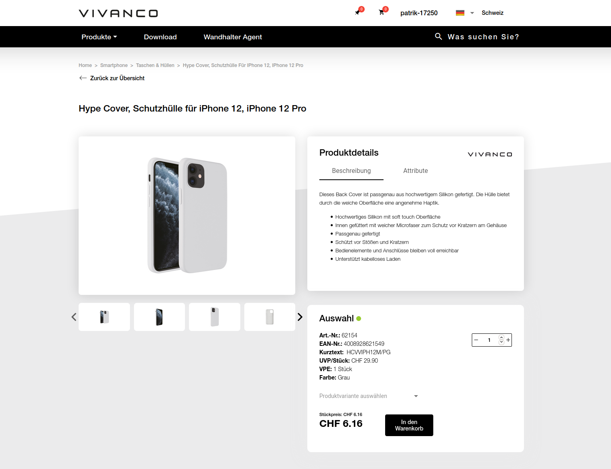

## Neuer Vivanco B2B Webshop

Vivanco ist einer der führenden B2B Anbieter für Geräte- und Verbindungszubehör in Europa. Immer häufiger
werden auch im B2B Umfeld Bestellungen online getätigt. Doch der alte Webshop war inzwischen in die Jahre gekommen und ein Weiterbetrieb bald nicht mehr möglich. Aus diesem Grund hat sich Vivanco an uns gewandt, um [einen komplett neuen Shop](https://shop.vivanco.com) zu entwickeln.

### Spezifische Anforderungen

Nach ersten Gesprächen war schnell klar, dass die Anforderungen zu spezifisch waren, um diesen mit einer Shop-Software von der Stange gerecht zu werden. Vivanco ist ein sehr grosses Unternehmen, mit vielen Standorten weltweit. Die einzelnen Standorte verwenden zum Teil völlig unterschiedliche Software und Geschäftsprozesse sind anders strukturiert. Dennoch muss am Ende alles in einem Shop zusammenführen.

### Zusammenspiel mit Microsoft Dynamics

Der Webshop ist zum Start in der Schweiz, Deutschland und Österreich verfügbar. An allen drei Standorten ist Microsoft Dynamics (ehemals Navision) im Einsatz. Für das Abrufen der Preise, Warenbestände und zum Auslösen von Bestellungen muss der Webshop laufend mit Dynamics kommunizieren.

### Einführung einer PIM Software

Eine ganz spezielle Herausforderung war, dass bei Vivanco noch keine zentrale & einheitliche Software zum Verwalten von Produktinfos im Einsatz war. Diese wurden vorher an unterschiedlichen Orten gepflegt. Anstelle einer Neu-Entwicklung haben wir uns hier für den Einsatz einer PIM-Software entschieden, die nun als Quelle für Produktinfos für den Webshop dient.

### Ausblick

In den nächsten Jahren plant Vivanco den neuen Webshop in weiteren Ländern anzbieten. Dazu gehören auch Standorte, die andere Systeme als Microsoft Dynamics verwenden. Der Webshop ist darauf bereits vorbereitet. Für Vivanco bedeutet das eine Vereinheitlichung des Webauftritts und eine Reduzierung der Kosten durch ein zentrales System.

 

### Unterstützung durch Braincept

Das Projekt war eine Zusammenarbeit mit [Braincept](https://braincept.com/). Dabei übernahm Braincept die Entwicklung der gesamten Benutzeroberfläche des Shops, während wir uns um das Backend, das "Gehirn" des Shops gekümmert haben, welches die Daten aus vielen verschiedenen Systemen an einem Ort zusammenführt.
