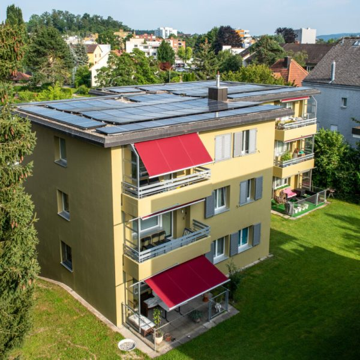

# Auch wir übernehmen Verantwortung

Auch als Apptiva AG sind wir in der Verantwortung, die Klimakrise zu stoppen. Wir sind es dieser und den zukünftigen Generationen schuldig. Gibt man sich dem Thema mal hin, ist man schnell überwältigt: Wo soll man beginnen? Es ist einfach, sich von der Komplexität des Themas abschrecken zu lassen und dann in der Untätigkeit zu verharren. Stattdessen haben wir einen Schritt gewagt und etwas unternommen:

> Wir haben für den Stromkonsum unserer Notebooks Solarpanels gekauft.

Wir verfügen zwar über kein eigenes Dach, aber dank [Solarify](https://solarify.ch/) ist das gar nicht nötig. Es gibt noch genügend Dächer in der Schweiz, die keine Panels installiert haben. Gründe dafür gibt es viele. Oftmals ist es einfach mangelndes Interesse oder fehlendes Kapital. Solarify bringt Investoren und Hausdächer zusammen. Die Anlagen werden von vielen Parteien finanziert. Der Hauseigentümer erhält den Strom zu einem Vorzugspreis. Der erwirtschaftete Gewinn wird wieder an die Investoren verteilt.

Unsere Panels wurden in Opfikon auf folgendem Dach montiert:

# Was könnte man sonst noch tun?

Um noch gezielter Massnahmen zu ergreifen, müssten wir den effektiven CO2-Ausstoss der Apptiva genau kennen. Das tun wir leider nicht. Bereiche, die man analysieren könnte wären zum Beispiel:

- Büroräumlichkeiten
- Geschäftsreisen
- Gesamte IT-Infrastruktur
- Finanzanlagen (inkl. Pensionskassen)

Die Tatsache, dass wir seit März 2020 fast ausschliesslich im Homeoffice arbeiten, ist wohl unser grösster Beitrag. Auch unsere Geschäftsreisen sind durch den intensiven Einsatz von Video-Konferenzen massiv gesunken. Wir sind aber sicher noch nicht beim Ziel Netto-Null angelangt.

# Was denken Sie?

Denken Sie auch über Massnahmen in Ihrem Unternehmen nach? Gibt es bereits welche? Was denken Sie, was Unternehmen tun sollten? Schreiben Sie uns auf [info@­apptiva.ch](mailto:info@apptiva.ch).
