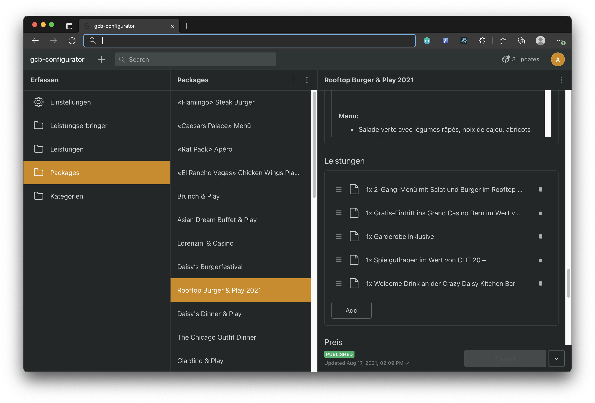
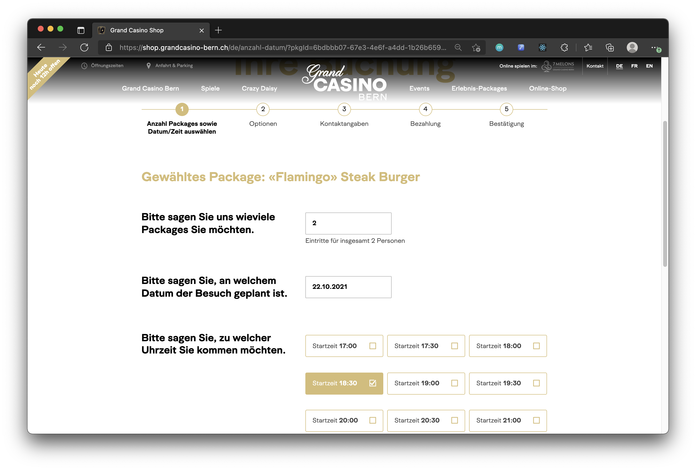
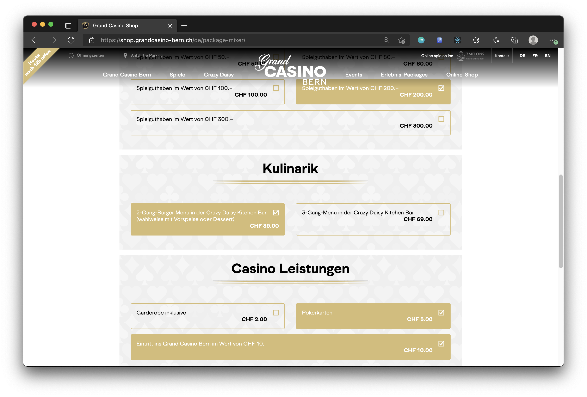
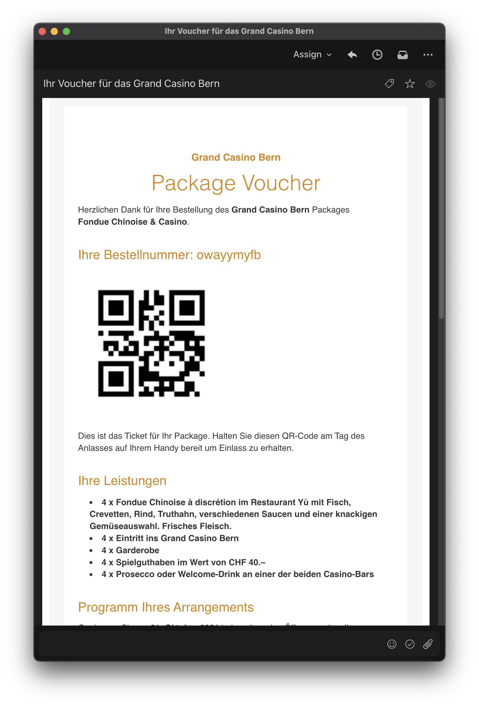
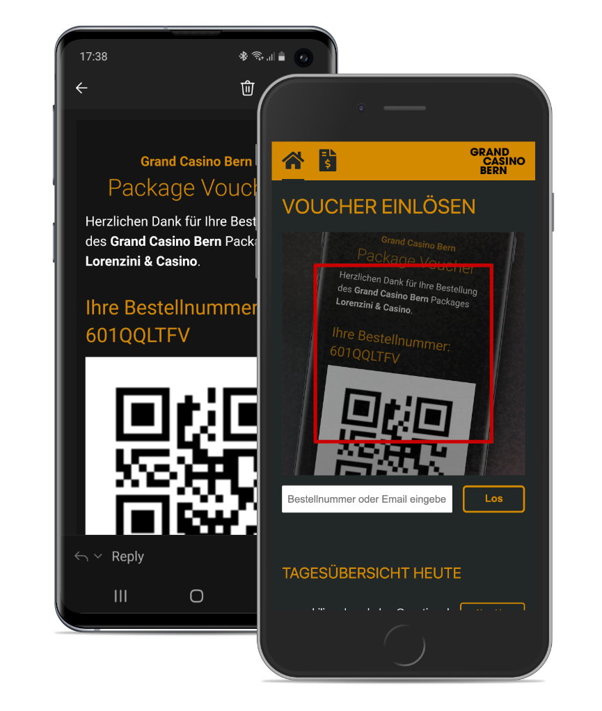

Schon seit mehreren Jahren bietet das Grand Casino Bern unterschiedliche Event-Packages (z.B. "Daisy’s Dinner & Play") online zum Verkauf an. Diese konnten aber nur telefonisch bestellt werden und die Zahlung fand vor Ort statt. Die Administration musste zudem für jede Bestellung bei den involvierten Leistungserbringern (meistens Restaurants) nachfragen, ob sie noch genügend Platz haben, und eine Reservation platzieren.

Als das Casino uns vor über zwei Jahren kontaktierte, war ihre Hoffnung mit weniger Aufwand mehr Umsatz über den Online-Shop zu machen. Dies wollten sie wie folgt erreichen:

- Die Kunden kaufen und bezahlen die Packages direkt im Onlineshop.
- Die Prüfung der Verfügbarkeit erfolgt automatisch.
- Bei der Buchung wird die Leistungen direkt beim Leistungserbringer reserviert.
- Die Gäste erhalten einen QR-Code, mit welchem alle Leistungen eingelöst werden können.
- Die Casino-Backoffice-Mitarbeiter:innen erfassen neue Angebote oder Angebotsanpassungen direkt im Konfigurator.
- Die Buchhaltung hat Zugriff auf Verkaufs- und Einlöse-Daten und sieht, welche Leistungen noch einlösbar sind.

## Der Angebots-Konfigurator

Kernstück der neuen Lösung ist der Angebots-Konfigurator, welcher im Rahmen des Projekts meistens "Package-Konfigurator" genannt wird. Dieser erlaubt es dem Casino selbstständig bestehende Angebote anzupassen oder auch neue zu erfassen.

Die Mitarbeiter:innen des Casinos können hier neue Leistungserbringer und deren Leistungen erfassen. Diese können sie dann als Packages kombinieren. Ein neuer Leistungserbringer (z.B. ein neues Restaurant) kann so innerhalb weniger Minuten ins Angebot aufgenommen werden.

## Schnittstelle zu den Leistungserbringern

Die Leistungserbringer werden z.Z. entweder per Email oder über die Restaurant-Reservations-Schnittstelle von Aleno über eine neue Reservation informiert. Die Kapazität der Leistungserbringer speichern wir entsprechend der vereinbarten Quota bei uns in der Software oder prüfen die Kapazität ebenfalls über Aleno. Mit Email haben wir eine sehr einfache "Anbindung" der Leistungserbringer, welche in jedem Fall funktioniert. Bei in Aleno erfassten Restaurants können wir die Kapazitätsprüfung und Reservation sehr genau vornehmen und entsprechend den administrativen Aufwand nochmals reduzieren.

## Kapazität prüfen

Damit die Gäste bei der Ankunft nicht vor einem ausgebuchten Restaurant stehen, muss beim Buchen für Events mit begrenzter Kapazität ein Timeslot ausgewählt werden. Nur Timeslots mit noch freier Kapazität werden angeboten. Nach der Buchung wird die Kapazität des entsprechenden Timeslots angepasst.

Falls für ein Event am gewünschten Tag keine Kapazität vorhanden ist, schlagen wir alternative Daten für das gewählte Package oder alternative Packages für das gewählte Datum vor.

## Eigenes Angebot konfigurieren

Falls das bestehende Angebot nicht genau den Geschmack einer Kundin oder eines Kunden trifft, ist es möglich, sich aus den angebotenen Leistungen ein eigenes Package zusammenzustellen.

Diese Leistungen stellen die Kunden und Kundinnen nach Belieben zusammen. Welche Leistungen hierfür in Frage kommen, kann das Casino ebenfalls konfigurieren.

## Zahlung

Die Zahlung der Leistungen erfolgt online direkt im Shop. Die Kundinnen und Kunden können in gewissen Situation aber auch erst "vor Ort" bezahlen. In diesem Fall sehen die Leistungserbringer beim Einscannen des QR-Codes (siehe unten), dass es noch offene Zahlungen gibt und diese entsprechend eingezogen werden müssen. Erst wenn dies der Fall ist, können Leistungen überhaupt eingelöst werden. So ist sichergestellt, dass ab der ersten Station des Events jegliche ausstehende Zahlungen beglichen sind.

Neben der Online-Zahlung und der Zahlung vor Ort gibt es für grössere Gruppen auch die Möglichkeit mit einer Rechnung zu bezahlen. Diese Rechnung wird ebenfalls im Admin-Panel des Angebots-Konfigurators erstellt. Bei der Rechnung gibt es noch die zusätzliche Herausforderung, dass die Zahlung des Spielgelds aufgrund der Gesetzeslage zwingend vor der Herausgabe stattfinden muss. In diesem Fall muss unsere Lösung den Leistungsbezug des Spielgelds verhindern, solange der betreffende Betrag nicht per Kreditkarte oder Bargeld beglichen worden ist.

## Tickets oder Gutscheine per Email erhalten

Beim Checkout wählen die Kundinnen und Kunden aus, ob sie direkt ein Ticket für das Event oder lieber einen Gutschein zum Verschenken erhalten wollen. Nach der Bezahlung erhalten die Gäste per Email einen Link zum Einlösen des Gutscheins, oder direkt einen QR-Code mit welchem die Leistungen bezogen werden können.

## Per QR-Code Leistungen einlösen

Um die Leistungen beziehen zu können, müssen die Besucher:innen bloss ihr Handy mit dem QR-Code im Email zücken. Die Leistungserbringer sind in der Lage über unsere Lösung den QR-Code zu scannen, um zu prüfen ob der QR-Code gültig ist und um Leistungen auch gleich einzulösen. Die QR-Codes können pro Person oder pro Gruppe erstellt und eingelöst werden, damit bei grösseren Gruppen nicht jeder einzelne Gast das Handy hervornehmen muss.

## Integrierte Buchhaltung

Jede verkaufte und eingelöste Leistung sowie alle Zahlungen werden bei uns im System für die Buchhaltung und das Management aufbereitet. So ist immer klar, wie sich der Umsatz entwickelt, welche Zahlungen wann eingegangen sind, wann welche Leistungen erbracht wurden und welche Leistungen noch offen sind.

Wer bereits einmal ein solches System umgesetzt hat, weiss, dass dies mit teils grösseren Herausforderungen verbunden ist. So ist es z.B. möglich, Teilzahlungen vorzunehmen, die Anzahl einer Buchung später anzupassen und entsprechend weitere Zahlungen vorzunehmen. Auch ist es möglich, vor dem Event noch die Postionen des Events anzupassen oder ganz neue Position hinzuzufügen. Da dies alles über die Monatsgrenze hinaus passieren kann, in einem abgeschlossenen Monat aber nie etwas angepasst werden darf, stellte uns dies vor ein paar Hürden, welche wir aber als gemeistert abhaken dürfen.

## Fazit

Mit dem neuen Konfigurator wurde der Verkauf vereinfacht und der administrative Aufwand deutlich reduziert. Zudem ist das Grand Casino Bern nun viel dynamischer in der Angebotserstellung. Gibt es ein temporäres, cooles Event in der Stadt, welches das Casino mit einem Besuch im Casino verknüpfen möchte, so können sie ein solches Angebot innerhalb von wenigen Minuten online schalten. Ob das Casino seine Umsatzziele erreicht hat, kann ich hingegen nicht beantworten.
