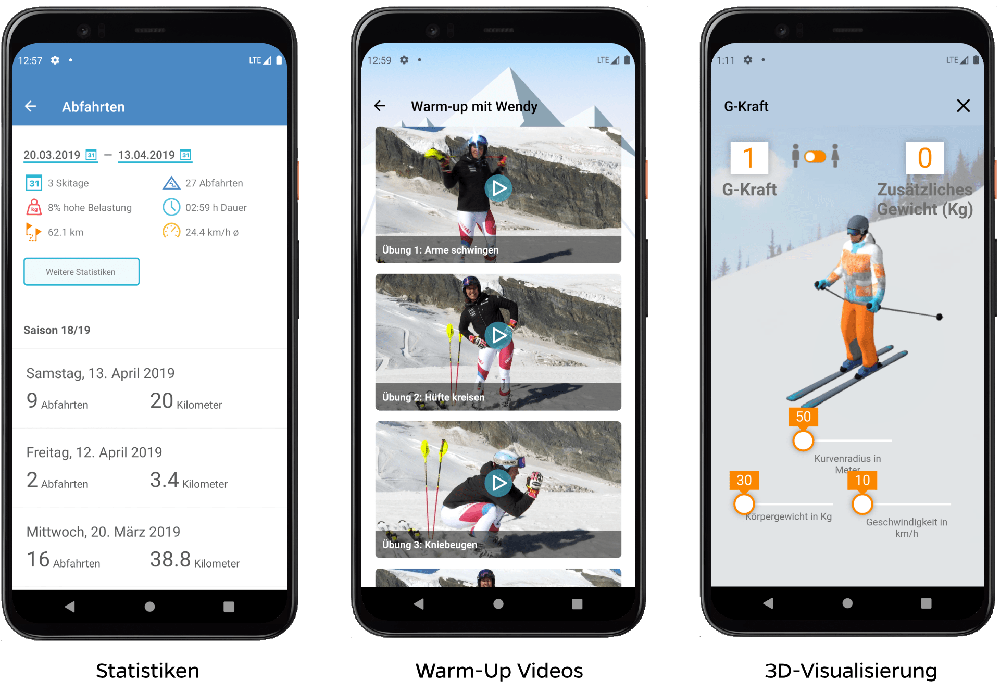

Mit dem Update für 2022 der [Slope Track App](/suva-slope-track-app/) für die Suva bieten wir einige interessante Neuerungen an:

- Einen Wettbewerb, um ein Skiweekend mit Wendy Holdener zu gewinnen
- Statistiken über alle Abfahrten wie z.B. zurückgelegte Kilometer, Durchschnittsgeschwindigkeit etc.
- Abfahrtstage gruppiert nach Saison
- Eine Beispielabfahrt von Marc Gisin
- Warm-up Videos von Wendy Holdener und Marc Gisin
- Video-Tipps von Schneesport-Experten
- 3D-Visualisierung von G-Kräften
- Bessere Navigation in der App

&nbsp;

## Gewinne ein Skiweekend mit Wendy Holdener

Alle Anwender:innen der Slope Track-App können direkt am Wettbewerb teilnehmen. Zu gewinnen gibt es ein Skiweekend mit Wendy Holdener und als Sofortpreis 100 Skimasken. Via Teilen-Button kann man Freunde und Familie über den Wettbewerb informieren. Die Gewinner werden per Email benachrichtigt.

## Statistik aller Abfahrten

Bisher wurden nur die Statistiken für einzelne Schneesporttage angezeigt. Neu sind die wichtigsten Werte über alle Abfahrten hinweg auf einen Blick sichtbar. Zu den Werten gehören:

- Anzahl Schneesporttage
- Anzahl Abfahrten
- Gesamte Abfahrtsdauer in Stunden
- Prozentualer Anteil von hoher Belastung
- Zurückgelegte Kilometer
- Durchschnittsgeschwindigkeit

Beim Öffnen der Abfahrtsübersicht werden die Werte für alle Abfahrten berechnet. Es ist zudem möglich, den Zeitraum einzuschränken und die entsprechenden Werte anzuzeigen. Zusätzlich können Werte pro Saison miteinander verglichen werden. Im Rahmen dieser Erweiterung werden die Schneesporttage nun ebenfalls pro Saison gruppiert. So findet man die gewünschten Abfahrten schneller.

## Warm-up- und Experten-Videos

Um sich vor der ersten Abfahrt aufzuwärmen, gibt es in der App eine Video-Serie mit Übungen. Die Übungen präsentieren Wendy Holdener und Marc Gisin.

Zusätzlich gibt es unter den Tipps nun Expertenvideos zu den unterschiedlichsten Themen rund um den Schneesport. Von guter Saisonvorbereitung bis zum Verhalten auf der Piste befinden sich in diesen kurzen Videos hilfreiche Tipps. Für die aktuelle Saison wird jede Woche ein neues Video veröffentlicht.

## 3D-Visualisierung von G-Kräften

Was G-Kräfte genau sind und wie diese auf unseren Körper beim Schneesport wirken, ist nicht so einfach zu verstehen. Mit der 3D-Visualisierung versuchen wir dies auf einfache Weise zu vermitteln. Damit sieht man, wie sich das Körpergewicht, die Geschwindigkeit und das Fahrverhalten direkt auf die G-Kräfte auswirken.

## Direkt ausprobieren

Die Slope Track-App ist auf Deutsch, Französisch und Italienisch verfügbar und kann kostenlos aus dem App-Store von Apple und dem Play-Store von Google heruntergeladen werden. Wir wünschen euch viel Spass und Hals- und Beinbruch.

