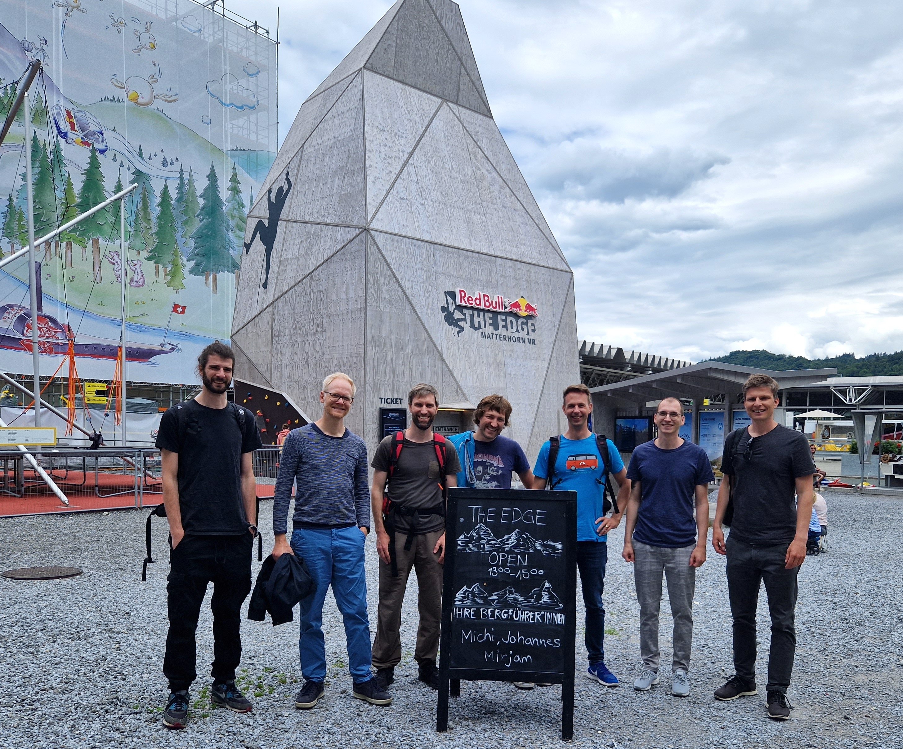

Aus den bekannten Gründen war es in den vergangenen Monaten eher schwierig, einen vernünftigen Team-Event durchzuführen. Wir treffen uns zwar regelmässig zum Mittagessen und trinken wöchentlich unser Feierabendbier virtuell. Doch die Zeit war reif für einen gemeinsamen Ausflug - und zwar nicht irgendwo hin, sondern auf den schönsten Berg der Welt!

## Ab aufs Matterhorn 🏔

Eine gewisse Nervosität war spürbar, als wir uns am 25. Mai nach dem Mittag im Verkehrshaus einfanden. Was würde uns wohl erwarten bei dieser virtuellen Klettertour aufs Matterhorn? [Red Bull The Edge](https://www.verkehrshaus.ch/besuchen/the-edge.html) nennt sich das Abenteuer, auf das wir uns eingelassen haben. Ziemlich bald hiess es "Rucksack und VR-Brille auf und ab an die Wand". Mitten im Matterhorn-Aufstieg gleich beim Solvay-Biwak fand man sich dann wieder. Und dann ging es auch gleich zur Sache. Eine witzige Kletterei bis zum Gipfel stand an. Alle haben erfreulicherweise den Gipfel erreicht und den Abstieg erfolgreich gemeistert.

## Apéros 🍻 und Libelle 🍽

Mit dem Gipfelglück in den Knochen spazierten wir anschliessend dem Quai entlang in Richtung Rebstock und Bourbaki Bar. Alleine waren wir am See allerdings nicht - unzählige Mücken begleiteten uns auf lästige Art und Weise. Um so grösser wurde der Durst. Daher gönnten wir uns zwei, drei wohlverdiente Erfrischungen und tauschten uns über die Erfahrung am Abgrund aus.

Später liessen wir uns von der Küche der Libelle verwöhnen. Und dann war der Team-Event auch bald schon wieder passé. Die nächste Ausgabe wird hoffentlich nicht mehr so lange auf sich warten lassen!
