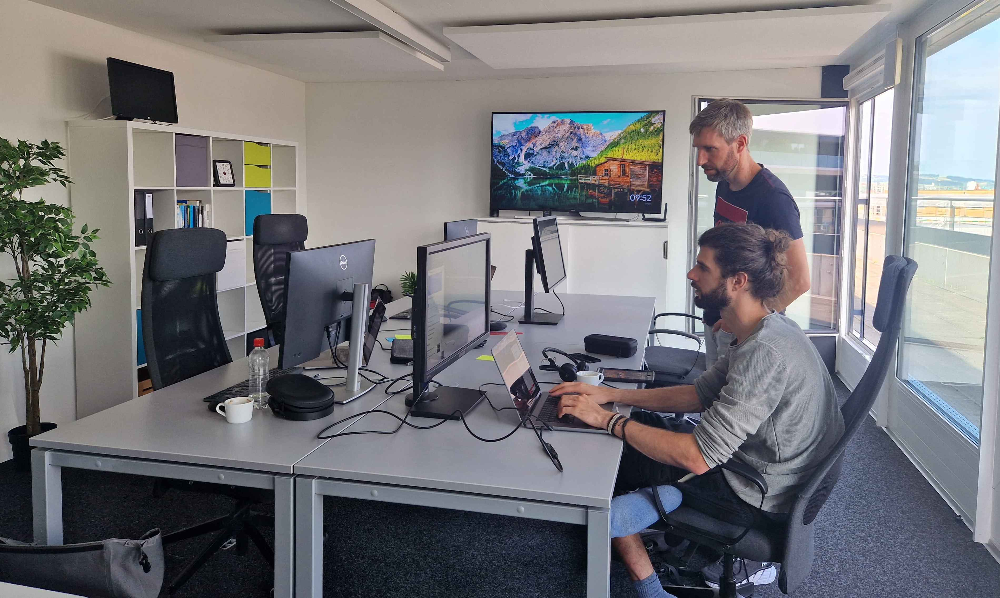

Zum zweiten Mal in der Geschichte der Apptiva haben wir unsere Sachen gepackt und sind in ein anderes Büro umgezogen. Allzu weit ging die Reise allerdings nicht. Unser Standort bleibt in Sempach Station und ist rund 200 Meter näher am Bahnhof, an der [Eichweid 1](https://www.google.com/maps?ll=47.115316,8.194063&z=10&t=m&hl=de&gl=US&mapclient=embed&cid=11748342181009380277).

## Weniger ist mehr

Unsere Arbeitsplätze haben sich in den vergangenen Monaten aus bekannten Gründen stark nach Hause verlagert. Die Hälfte von uns arbeitet fast ausschliesslich im Homeoffice. Das wird sich in absehbarer Zeit auch nicht mehr ändern. Auf acht oder mehr Arbeitsplätze sind wir definitiv nicht mehr angewiesen.

Die sehr grosszügigen Büroräumlichkeiten in der Startup Station an der Neuenkirchstrasse waren für uns zunehmend überdimensioniert. Wir haben daher ein Büro gesucht, in welchem wir zu viert arbeiten können. Bei dieser Suche sind wir überraschend schnell fündig geworden an der Eichweid 1. Sempach Station ist für uns sehr praktisch gelegen. Deswegen sind wir froh, dass wir die Gemeinde nicht verlassen mussten. Und nun sind wir sogar noch etwas besser an den ÖV angeschlossen.

## Gross genug

Wir haben jetzt etwas weniger Platz, aber immer noch locker genug, um grosse Projekte anpacken zu können. Es war uns wichtig, dass wir nebst den Arbeitsplätzen auch noch Raum haben, um Ideen an einem Whiteboard aushecken zu können. Es bleibt auch genug Platz, um mit unseren Kunden Storymaps zu erstellen.

Nebst dem haben wir direkten Zugang zur Terrasse, die sogar über Seeblick verfügt. Das ist natürlich optimal, wenn man zwischendurch den Kopf etwas durchlüften muss.

Du willst vorbeischauen? Kein Problem, sogar ☕️ können wir anbieten. 😀
