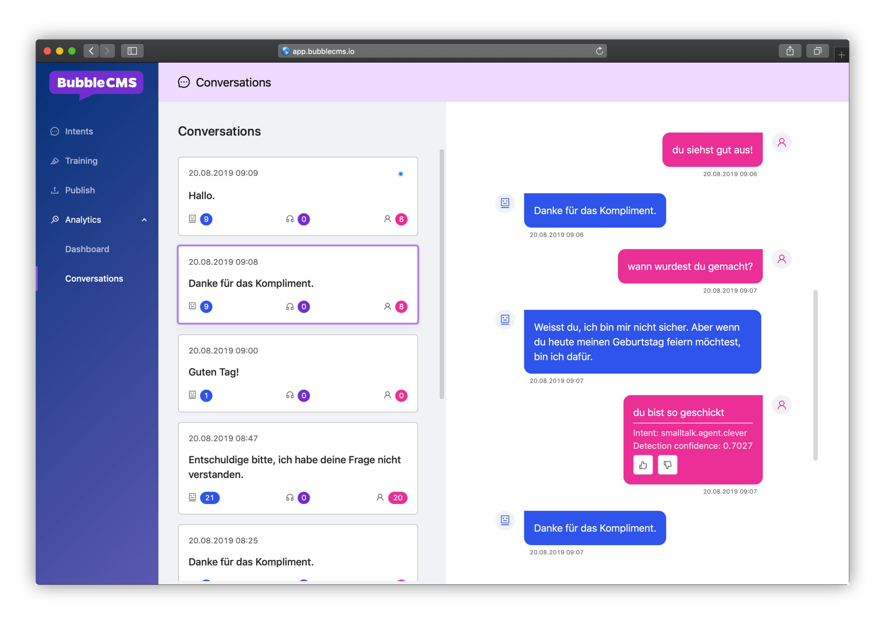

## Bubble was? 🤖

Während unseren Chatbot-Projekten erhalten wir tiefgreifenden Einblick in die Verwaltung von Inhalten bei unseren Kunden. Was zunächst simpel klingt, stellt sich im Verlauf eines Projektes immer wieder als grosse Challenge heraus. Wo sehe ich, was der Bot nicht verstanden hat? Wie kann ich den Bot testen, bevor ich die neuen Inhalte allen zugänglich mache? Diese und viele weitere Fragen stellen sich eigentlich immer. Die Tools, welche aktuell auf dem Markt erhältlich sind, konnten uns bis anhin nicht zufriedenstellen. Daher haben wir uns entschlossen, ein Content Management System zu entwickeln, welches den Bedürfnissen unserer Kunden endlich gerecht wird: Bubble Chat!

## Funktionsumfang

Es gibt viele Funktionen, welche wir als Muss einstufen. Wir haben diese priorisiert, und die wichtigsten umgesetzt. Dazu gehören:

- Intents erfassen und verwalten
- Nicht verstandene Äusserungen abhandeln
- Inhalte verifizieren
- Inhalte ausliefern
- Konversationen einsehen

## Alles nur eine Seifenblase?

Selbstverständlich nicht. Wir stehen erst am Anfang. Mit Bubble Chat wird das Verwalten von Chatbot-Content drastisch vereinfacht. Das Backlog ist prall gefüllt mit Bedürfnissen von unseren Kunden.
In den kommenden Wochen werden wir weitere Funktionalitäten umsetzen, und Bubble Chat bei möglichst vielen Gelegenheiten einsetzen.

## Einfach mal ausprobieren

Wer einen Blick auf Bubble Chat werfen möchte, dem stellen wir gerne ein Demosystem zur Verfügung.
Weitere Infos kriegt man hier: [www.bubble-chat.ch](https://bubble-chat.ch/)

Rufen Sie uns an

[041 322 26 26](tel:+41413222626)

oder schreiben Sie an

[info@­apptiva.ch](mailto:info@apptiva.ch)
