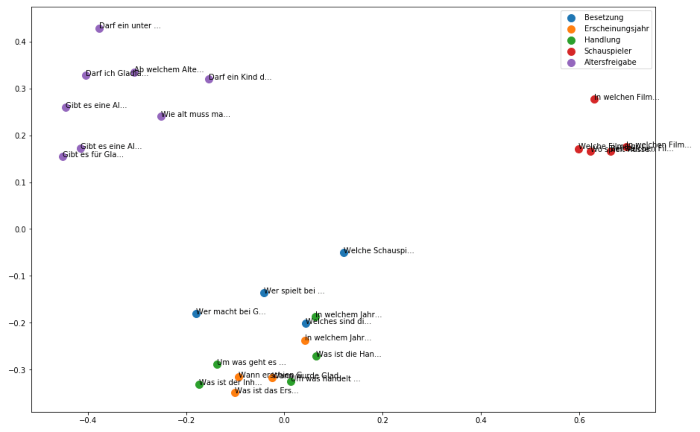
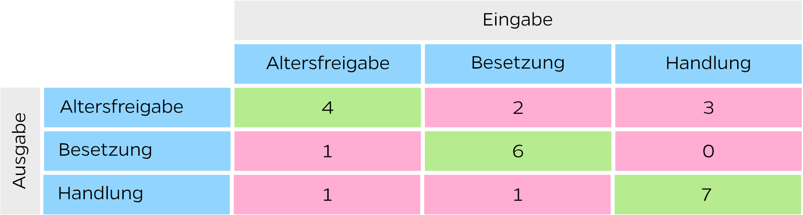
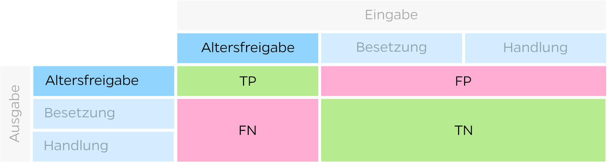
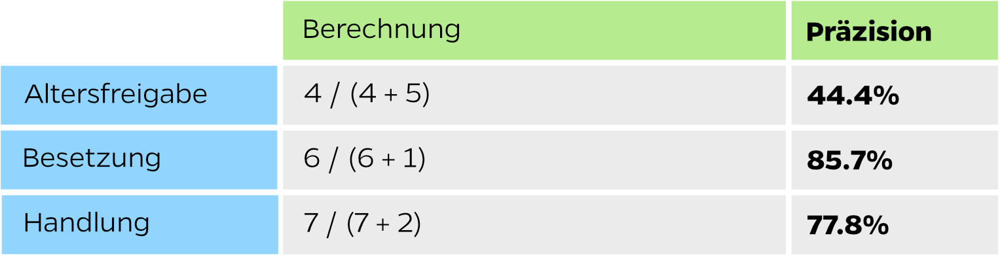
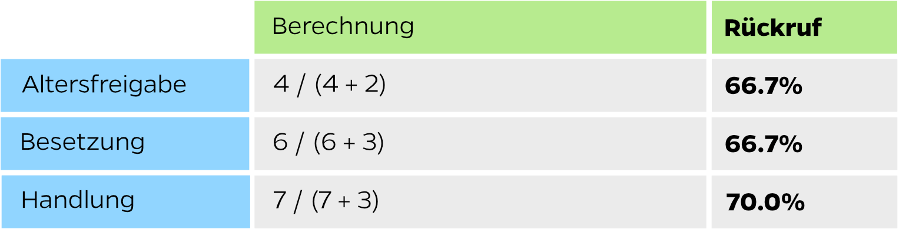

Moderne Chatbots basieren auf den Prinzipien der künstlichen Intelligenz (KI) und sind daher effektiver als regelbasierte Chatbots. Was akademisch tönt ist im Prinzip etwas Mathematik verbunden mit einem Softwaresystem - und wir wissen, dass Softwaresysteme getestet werden müssen. KI-Systeme erfordern jedoch andere Testansätze als regelbasierte Systeme. In diesem Blogpost möchte ich etwas detaillierter auf die Grundsätze beim Testen von Chatbot-Datenmodellen eingehen.

# Grundlagen

Chatbots nutzen im Hintergrund ein Datenmodell, welches für die Interpretation der Benutzereingabe verwendet wird. Dieses Datenmodell ist die Grundlage für die natürliche Sprachverarbeitung (NLP) und hat primär das Ziel, die Absicht einer Benutzeräusserung zu erkennen und Entitäten daraus zu extrahieren.

> - **Benutzeräusserung**  
>   "Welches sind die Hauptdarsteller bei The Mule?"
>
> - **Erkannte Absicht**  
>   Besetzung
>
> - **Extrahierte Entitäten**  
>   Film = The Mule

Anhand der erkannten Absicht und der Entitäten ist der Chatbot nun in der Lage, eine passende Antwort zu liefern: _“Im Film The Mule spielt Clint Eastwood die Hauptrolle.”_

# Qualität der Trainingssätze analysieren und bewerten

KI-basierte Chatbots werden mit einer Reihe von Beispielsätzen trainiert. Diese Beispielsätze (auch Trainingssätze genannt) sind einer Absicht (Intent) zugeordnet und darin enthaltene Entitäten sind markiert. Durch die Nutzung des Chatbots erhält man immer mehr konkrete Benutzeräusserungen, welche als Beispielsätze im Training verwendet werden können. So wird der Chatbot über die Zeit immer intelligenter.

Es besteht nun die Gefahr, dass der Chatbot durch zu ähnliche oder falsch zugeordnete Beispielsätze irregeführt wird und dadurch falsch reagiert. Diesem Umstand können wir entgegenwirken, indem wir die Qualität der Trainingssätze analysieren und bewerten. Der Ansatz besteht darin, die Ähnlichkeit zwischen zwei Trainingssätzen zu bestimmen und daraus eine Ähnlichkeitsmatrix zu berechnen. Mit dieser Matrix können dann die Kohäsion und die Trennung der einzelnen Trainingssätze bewertet werden.

Kohäsion: Je mehr sich die einzelnen Trainingssätze eines Intents ähneln, desto höher ist die Kohäsion. Je höher der Kohäsionswert, desto besser ist die Qualität der Trainingssätze.

Trennung: Die durchschnittliche Entfernung zwischen den Trainingssatzgruppen je Absicht sagt aus, wie fest sich die einzelnen Absichten voneinander unterscheiden. Je höher die Trennung, desto besser ist die Qualität der Trainingssätze.
Ich möchte die Analyse der Trainingssätze anhand eines fiktiven Beispiels aufzeigen. Dazu habe ich einen einfachen Film-Chatbot erstellt, der Informationen über Filme und Schauspieler geben kann. Der Chatbot wurde mit folgenden Absichten trainiert:

- Altersfreigabe
- Besetzung
- Erscheinungsjahr
- Handlung
- Schauspieler

Jeder Absicht wurden rund fünf Trainingssätze hinterlegt. Dies ist relativ wenig, sollte aber zum Veranschaulichen ausreichen. Weiter gibt es eine Entität “Movies” welche Filme beinhaltet, sowie eine Entität “Actors” welche aus bekannten Schauspielern besteht. Bevor die Analyse der Trainingssätze gestartet wird, ersetze ich alle Filme durch “Gladiator” und alle Schauspieler durch “Russell Crowe”. Dies aus dem Grund, weil NLP-Systeme Entitäten speziell behandeln können und unser Resultat der Analyse ansonsten verfälscht wäre.

Wenn wir nun die Ähnlichkeit der Trainingssätze visualisieren, sieht dies wie folgt aus:

Grundsätzlich sind die Trainingssätze sehr gut unterscheidbar. Auch scheinen die einzelnen Absichten eine gute Kohäsion zu haben. Eine Ausnahme bilden die Trainingssätze aus den Absichten “Erscheinungsjahr” (orange) und “Handlung” (grün).

| Absicht A        | Satz A                                      | Absicht B | Satz B                                     | Ähnlichkeit |
| ---------------- | ------------------------------------------- | --------- | ------------------------------------------ | ----------- |
| Erscheinungsjahr | In welchem Jahr wurde Gladiator gedreht?    | Handlung  | In welchem Jahr spielt der Film Gladiator? | 0.841625    |
| Besetzung        | Wer macht bei Gladiator mit?                | Handlung  | Worum geht es bei Gladiator?               | 0.827415    |
| Erscheinungsjahr | Was ist das Erscheinungsjahr von Gladiator? | Handlung  | Was ist der Inhalt von Gladiator?          | 0.817498    |
| Erscheinungsjahr | Was ist das Erscheinungsjahr von Gladiator? | Handlung  | Worum geht es bei Gladiator?               | 0.804769    |
| Besetzung        | Wer spielt bei Gladiator mit?               | Handlung  | Worum geht es bei Gladiator?               | 0.787003    |
|  ...             | ...                                         | ...       | ...                                        | ...         |

Dies bestätigt auch der Blick auf die Tabelle der paarweisen Trennung der Absichten:

| Absicht A        | Absicht B        | Trennung der beiden Absichten |
| ---------------- | ---------------- | ----------------------------- |
| Erscheinungsjahr | Handlung         | 0.263881                      |
| Besetzung        | Handlung         | 0.288190                      |
| Besetzung        | Erscheinungsjahr | 0.342563                      |
| Besetzung        | Altersfreigabe   | 0.425378                      |
| Handlung         | Altersfreigabe   | 0.436746                      |
| Erscheinungsjahr | Altersfreigabe   | 0.463378                      |
| Besetzung        | Schauspieler     | 0.500008                      |
| Handlung         | Schauspieler     | 0.520467                      |
| Erscheinungsjahr | Schauspieler     | 0.556497                      |
| Schauspieler     | Altersfreigabe   | 0.689458                      |

“Erscheinungsjahr” und “Handlung” sind einander tatsächlich recht ähnlich. Dies kann dazu führen, dass der Chatbot auf Fragen zum Thema “Erscheinungsjahr” mit einer Antwort zur “Handlung” antworten könnte.

Weiter ist aus der Ähnlichkeitsmatrix ersichtlich, dass die Trainingssätze der Absicht “Schauspieler” schön isoliert von den anderen Absicht sind. Entsprechend hat diese Absicht auch den besten Wert in der Kohäsionstabelle:

| Absicht          | Kohäsion |
| ---------------- | -------- |
| Altersfreigabe   | 0.722677 |
| Besetzung        | 0.765493 |
| Erscheinungsjahr | 0.767716 |
| Handlung         | 0.783967 |
| Schauspieler     | 0.828252 |

Um die Qualität des Chatbots zu verbessern, würde sich also ein genauerer Blick in die beiden Absichten “Erscheinungsjahr” und “Handlung” lohnen. Durch optimalere Trainingssätze kann es gelingen, diese besser zu separieren. Bei Absichten mit einer tiefen Kohäsion kann es sich zudem lohnen, weitere Trainingssätze hinzuzufügen.

# Precision, Recall und F1 Score

Nachdem wir eine statische Analyse der Trainingssätze vorgenommen haben, wollen wir nun die Qualität das Datenmodells überprüfen.

Als erstes wollen wir herausfinden, wie viele Sätze der Chatbot der korrekten Absicht zuordnen kann. Dazu trainieren wir ihn nur mit 80% der Trainingssätze und verwenden die anderen 20% als Testsätze. (Da unser Chatbot aktuell nur sehr wenige Trainingssätze hat, ist dieser Ansatz nicht optimal. Besser wäre hier eine _K-fold Cross Validation_ vorzunehmen, wobei der Test mehrfach mit einer unterschiedlichen Verteilung von Trainings- und Testsätzen ausgeführt wird. Der Einfachheits halber verzichte ich hier aber auf diese Methode.)

Bei diesem Test messen wir, wie viele Sätze der Chatbot der korrekten Absicht zuordnen kann. Um dies zu veranschaulichen, nehmen wir von unserem Film-Chatbot die drei Absichten “Altersfreigabe”, “Besetzung” und “Handlung”. Wie oben beschrieben verwenden wir von jeder Absicht 80% der Sätze fürs Training und prüfen mit den anderen 20% die Qualität. Pro Testsatz wissen wir nun, wo er hätte zugeordnet werden sollen und wo er tatsächlich zugeordnet wurde. Dies tragen wir in nachfolgender Tabelle ein (man nennt diese Tabelle _Confusion Matrix_):

&nbsp;

Aus der Confusion Matrix können pro Absicht die Werte für _True Positive_ (TP), _False Positive_ (FP), _False Negative_ (FN) und _True Negative_ (TN) ermitteln:

&nbsp;

Dies ergibt dann folgende Werte:

_True Positive_ und _True Negative_ sind also das, was wir eigentlich wollen. In diesen Fällen reagiert der Chatbot richtig. Bei _False Negative_ und _False Positive_ gibt der Chatbot jedoch eine falsche Antwort und hinterlässt ein schlechtes Zeugnis.

Mit diesen Daten können wir nun pro Absicht unten stehende Metriken ermitteln.

## Precision

Die Precision (Präzision) ist das Verhältnis von den korrekt zugeordneten Testsätzen gegenüber allen dieser Absicht zugeordneten Testsätzen (falsche und korrekte). Sie beantwortet also die Frage, bei wie vielen Sätzen die als “Altersfreigabe” eingestuft werden, es sich tatsächlich um dieses Thema handelt.

> Precision = TP / (TP + FP)

Eine Präzision von 44.4% sagt uns, dass der Chatbot bei allen Fragen die er mit “Altersfreigabe” beantwortet bei weniger als der Hälfte richtig lag. Bei 55% der Fragen hätte er eine andere Antwort geben müssen.

## Recall

Der Recall (Rückruf) ist das Verhältnis der korrekt zugeordneten Testsätze gegenüber allen Testsätzen. Sie beantwortet also die Frage, wie viele Sätze einer Absicht der Chatbot korrekt erkannt hat.

> Recall = TP / (TP + FN)

Ein Recall von 66.7% sagt uns, dass zwei Drittel aller Testsätze der Absicht “Altersfreigabe” korrekt erkannt wurden. Ein Drittel der Testsätze hätte er anderen Absichten zuordnen sollen.

## F1 Score

Um die Qualität eines Modells vollständig zu bewerten, sollten sowohl Precision als auch Recall überprüft werden. Leider ist es oftmals so, dass eine Verbesserung der Precision zu einem tieferen Recall Wert führt (und umgekehrt). Mit der Entwicklung des F1 Scores wurde diesem Umstand Rechnung getragen, denn er ist der gewichtete Durchschnitt aus Precision und Recall und berücksichtigt sowohl False Positives als auch False Negatives.

Der F1 Score beantwortet also die Frage, wie präzise der Chatbot ist (wie viele Sätze er korrekt erkennt) und wie robust er ist (er verpasst nicht eine grössere Anzahl von Sätzen).

> F1 Score = 2 \* (Recall \* Precision) / (Recall + Precision)

## Summary

Obige Metriken betrachteten jeweils die einzelnen Absichten isoliert voneinander. Um eine Aussage über alle Absichten machen zu können, addieren wir nun noch die Einzelwerte gewichtet anhand der Anzahl Testsätze der Absichten. Unser Film-Chatbot hat im Total 25 Testsätze: 6 Altersfreigabe, 9 Besetzung, and 10 Handlung.

Somit erhalten wir nun folgende finalen Werte:

| Metrik                 | Berechnung                                | Resultat  |
| ---------------------- | ----------------------------------------- | --------- |
| **Weighted Precision** | (6 x 44.4% + 9 x 85.7% + 10 x 77.8%) / 25 | **72.6%** |
| **Weighted Recall**    | (6 × 66.7% + 9 x 66.7% + 10 x 70.0%) / 25 | **68.0%** |
| **Weighted F1**        | (6 x 53.3% + 9 x 75.0% + 10 x 73.7%) / 25 | **69.3%** |

Diese Werte helfen, Veränderungen der Qualität des Chatbots festzustellen. Es lohnt sich, diese auf einer Zeitachse zu visualisieren und regelmässig zu interpretieren.

# Fazit

Wie man aus diesen Ausführungen sehen kann, erfordert das Testen von KI-Systemen andere Testansätze als dass es bei regelbasierten Systemen der Fall ist. Es ist nicht damit getan einen Test zu implementieren der von diesem Zeitpunkt an immer erfolgreich durchlaufen muss (“grün sein”).

Da ein Chatbot System ständig mit neuen Testsätzen gefüttert wird, ist es notwendig, die Veränderung der Qualität über die Zeit zu beobachten. Hier können System wie z.B. [Bubble Chat](https://bubble-chat.ch/) helfen, diese Veränderung zu visualisieren und mögliche Optimierungen vorzuschlagen.
