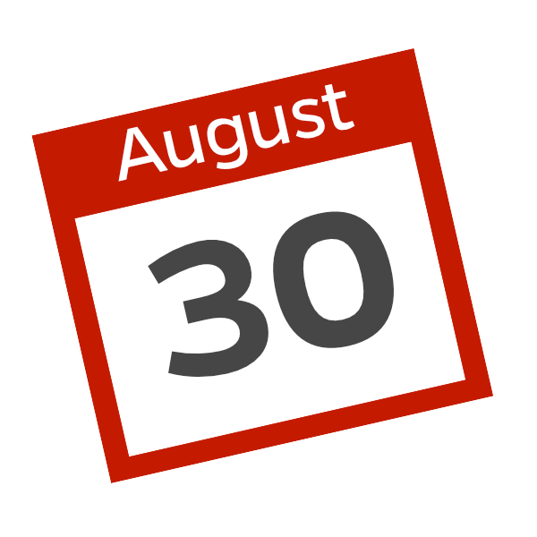

# Wir feiern unsere Highlights

Die letzten Jahre haben wir so einiges erlebt und arbeiteten an vielen spannenden Projekten.

⭐ Lancierung Botfabrik  
⭐ Energierechner für InnovationsTransfer Zentralschweiz  
⭐ sd Einsatzplanung  
⭐ Neuentwicklung Digital Signage Software  
⭐ Allianz Cinema Chatbot  
⭐ Chatbot für Sanagate - ein Unternehmen der CSS Gruppe
⭐ Partyplaner für Schürch Getränke AG  
⭐ Umzug nach Sempach Station  
⭐ Und natürlich die Verstärkung durch Markus Tanner

# Alle sind herzlich eingeladen

Wir feiern den dritten Geburtstag der Apptiva. Kommt und feiert mit uns!

[[right]]
|

## Datum

Donnerstag, 30. August 2018

## Ort

Büro Apptiva  
Neuenkirchstr. 19  
6203 Sempach Station

[Google Maps](https://goo.gl/maps/GzhMRqBnKyn)

## Apero von 16:00 bis 22:00

Stosst mit uns auf das dreijährige Bestehen der Apptiva an. Wir schauen auf tolle Jahre zurück und wollen dies mit euch teilen.
