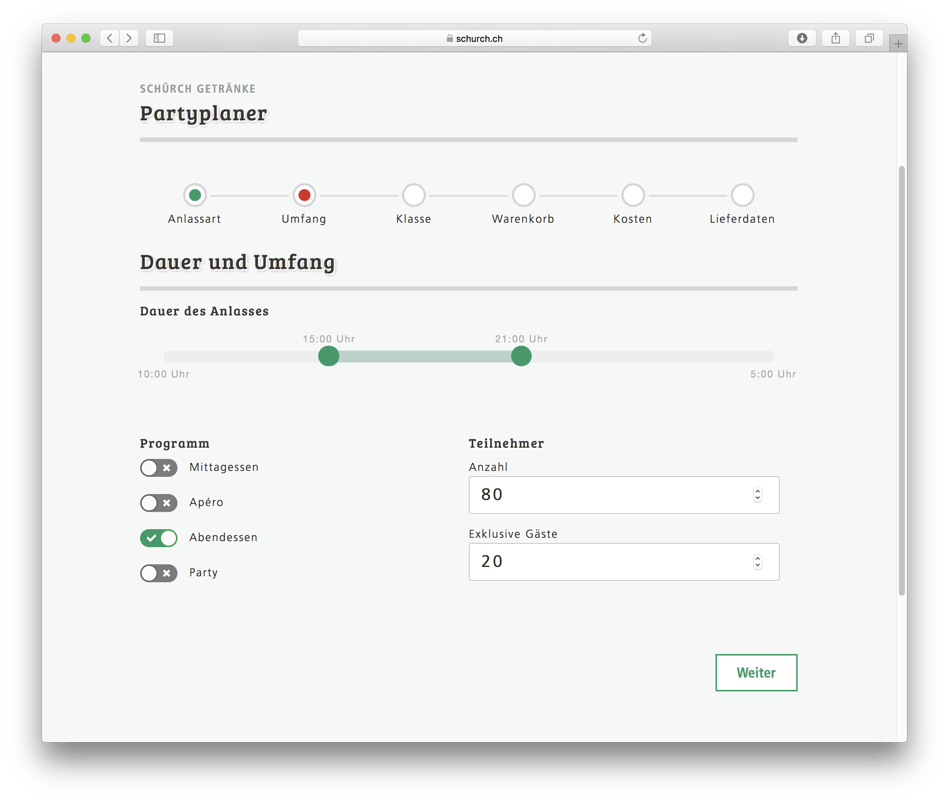

Das neuste Projekt der Apptiva ist live: Der Partyplaner von Schürch Getränke. Dieser hilft Privatpersonen den Getränkebedarf für Ihren Anlass zu berechnen – und die Getränke natürlich auch gleich zu bestellen. Bisher musste man sich dazu während den Geschäftszeiten an einen Mitarbeiter von Schürch wenden, welcher dann anhand seiner Erfahrungswerte die Mengen berechnete und die Bestellung entgegennahm.

# Für jeden Anlass das richtige Sortiment

Diese Erfahrungswerte der Mitarbeiter haben wir im Partyplaner zusammengefasst: Der Nutzer definiert Anzahl Personen, Aufteilung Männer/Frauen/Kinder, Art und Dauer – und schon rechnet der Partyplaner die benötigten Mengen an Mineral, Wein, Bier, etc. Über eine Schnittstelle zum Warenwirtschafts-System VinX bezieht der Partyplaner die Informationen zu den aktuell verfügbaren Artikeln, wobei auch Gebindegrössen für die Kalkulation berücksichtigt werden.

Braucht der Kunde noch Kühlschrank und Gläser? Oder wie wäre es mit ein paar Flaschen der selber hergestellten Amstutz Edelbrände? Der Partyplaner fördert durch die aktive Integration dieser Artikel auch Zusatzverkäufe.

Hat der Kunde seinen Warenkorb zusammengestellt, erhält er eine detaillierte Offerte und kann auch gleich bestellen. Die über den Partyplaner generierten Bestellungen werden via Schnittstelle ins VinX importiert und können so abgearbeitet werden, ohne dass die bisherigen Prozesse angepasst werden mussten.

# Digitalisierung der Festlieferung

Zu guter Letzt können auch die Mitarbeiter von Schürch Getränke den Partyplaner selber nutzen, um die Bestellungen von Kunden vor Ort oder per Telefon strukturiert zu erfassen. Vor allem für neue Mitarbeiter, denen die entsprechende Erfahrung noch fehlt, wird er Partyplaner so zum wertvollen Tool.

Mit dem Partyplaner konnten wir für die Schürch Getränke AG den Prozess der Festlieferungen digitalisieren. Dies erlaubt es Mitarbeitern, Bestellungen effizient und strukturiert zu erfassen, sowie Privatpersonen selber Festlieferungen zu konfigurieren. Durch Nutzung der Schnittstellen zum VinX konnten wir den Partyplaner in die bestehenden Prozesse integrieren, ohne dass dadurch hohe Kosten an dieser standardisierten Branchenlösung entstanden wären.

Jetzt ausprobieren: [schurch.ch/partyplaner/](https://www.schurch.ch/partyplaner/)
