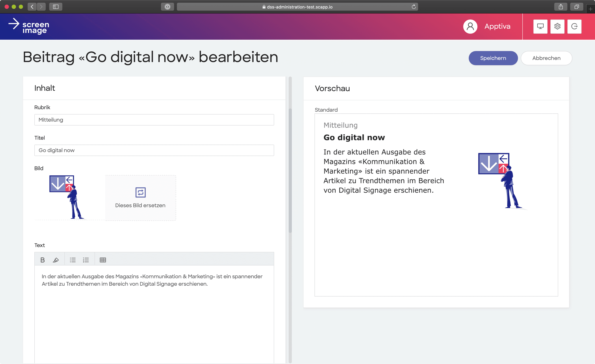

## Digital Signage Lösung

Seit 2003 entwickelt Screenimage Systems AG aus Root (Luzern) innovative und massgeschneiderte Digital Signage Lösungen mit Schwerpunkt in der internen Kommunikation. Bei der Entwicklung der neusten Version wurde zum ersten Mal auf „Co-Creation“ gesetzt. Wir von der Apptiva konnten dabei Screenimage von Anfang an mit unserem Know-how und zusätzlichem "Manpower" tatkräftig unterstützen.

### Fokus auf Benutzerfreundlichkeit

Die neue Lösung überzeugt nebst vielen zusätzlichen Funktionen vor allem durch ihre Benutzerfreundlichkeit. Das Hauptaugenmerk lag darauf, dass die Software noch besser auf die Anforderungen der Kunden abgestimmt werden kann. Dank der neuen für „Screenimage Pro“ entwickelten Logik wird für jeden Kunden eine individuelle Informationsstruktur erstellt, anhand der die einzelnen Beiträge den richtigen Screens zugewiesen werden. Das System ist so noch einfacher administrierbar, was sich vor allem bei grösseren Lösungen mit mehr als 20 Screens auszahlt.

### Persönliche Vorlagen

In der neuen Benutzeroberfläche können User eigene Vorlagen erstellen. Die dafür vorgesehen Templates können schnell und einfach formatiert werden. Die per Drag & Drop hochgeladenen Bilder werden direkt in der Software auf das gewünschte Format zugeschnitten. In der Livevorschau sehen die Redaktoren-/innen während dem sie den Beitrag erfassen, wie die Meldung später auf den Screens dargestellt wird.

 

### Automatisierte Inhalte

Dank dem Einsatz neuester Webtechnologien lassen sich automatisierte Inhalte ganz einfach als Daten-Feeds einbinden. So können beispielsweise News aus dem Intranet, Auswertungen aus Onlinetools (z.B. Klickraten, Tasklisten) oder Daten aus dem ERP, ganz einfach angezeigt werden. Für Daten von Drittanbieter (z.B. Socialmedia, Onlinenews, Fahrpläne) wurden Standardfeeds eingerichtet.

## Screenimage Systems AG

Mehr Informationen zur Software und zu Screenimage finden sie hier: [Screenimage](https://screenimage.ch)

[[right]]
|[[avatar]]
||

Marc Menz ist bei Screenimage Systems AG fürs Marketing und die Unternehmensentwicklung verantwortlich. Dank seiner grosse Erfahrung im Einsatz von Digital Signage Software konnte er viel zum guten Gelingen der neuen Software beitragen.

Über die Zusammenarbeit mit uns sagt Marc:

_"Vom ersten Meeting an war ich begeistert, von der Professionalität und der Zielstrebigkeit mit der Apptiva das Projekt anging. Dank ihrem User Centred Design Ansatz «zwingt» mich Apptiva immer wieder dazu, Bestehendes zu hinterfragen, um so die Lösung noch benutzerfreundlicher zu machen. Für mich ist die Zusammenarbeit ein absoluter Glücksfall sowohl technisch als auch menschlich."_
