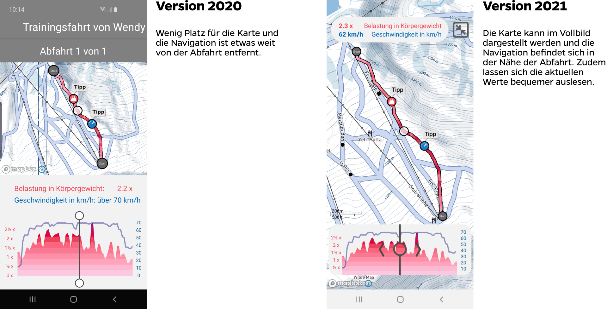

Mit dem Update für 2021 der [Slope Track App](/suva-slope-track-app/) für die Suva bieten wir einige interessante Optimierungen an. So verbessern wir unter anderem die Navigation und Darstellung der aufgezeichneten Abfahrten, erkennen die Abfahrten präzisier und bieten neue Tipps an.

## Bessere Navigation und Darstellung von Abfahrten

Die Abfahrten wurden bisher in einem begrenzten Bereich dargestellt. Zudem waren die Navigations-Elemente und die dargestellten Werte zum Track etwas weit auseinander. So ist die Navigation einfacher und das Auslesen der Werte bequemer.

Zudem kann die Karte nun auch im Vollbild dargestellt werden. In dieser Ansicht nutzen wir den gesamten Bildschirm, um den Track darzustellen. Ausserdem ist es in dieser Ansicht möglich, die Karte in eine beliebige Richtung zu ziehen, um den gewünschten Bereich anzuzeigen.

## Präzisere Erkennung von Abfahrten

Die Abfahrten wurden bisher nicht immer korrekt erkannt. Pausen und Liftfahrten sind zwar toll, aber für Slope Track eher uninteressant. Es konnte allerdings passieren, dass Teile der Liftfahrt als Abfahrt erkannt oder Teile der Abfahrt nicht erkannt wurden.

Mit diesem Update wurde die Abfahrtenerkennung stark verbessert. Falsche oder fehlende Abfahrten sollten damit (fast) der Vergangenheit angehören.

## Neue Tipps

Zusätzlich zu den bestehenden Tipps gesellen sich zwei neue:

- **Pausen**: Es ist bekannt, dass vor dem Mittagessen und ab 15:00 die meisten Unfälle im Schneesport passieren. Entsprechend zeigen wir zur gegebenen Zeit den Tipp "Pause machen" an.
- **Schneesport-Check**: Um die Risiken zu reduzieren, ist es hilfreich, die eigenen Risikopotentiale im Schneesport zu kennen. Entsprechend verweisen wir auf den Schneesport-Check von Suva, wo die Nutzer ihre persönlichen Risiken kennenlernen können.

## Direkt ausprobieren

Die Slope Track-App ist auf Deutsch, Französisch und Italienisch verfügbar und kann kostenlos aus dem App-Store von Apple und dem Play-Store von Google heruntergeladen werden. Wir wünschen euch viel Spass und Hals- und Beinbruch.

