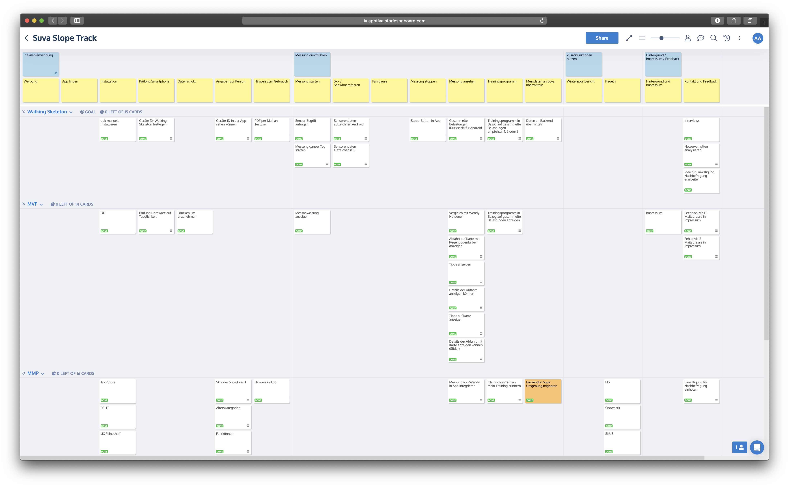
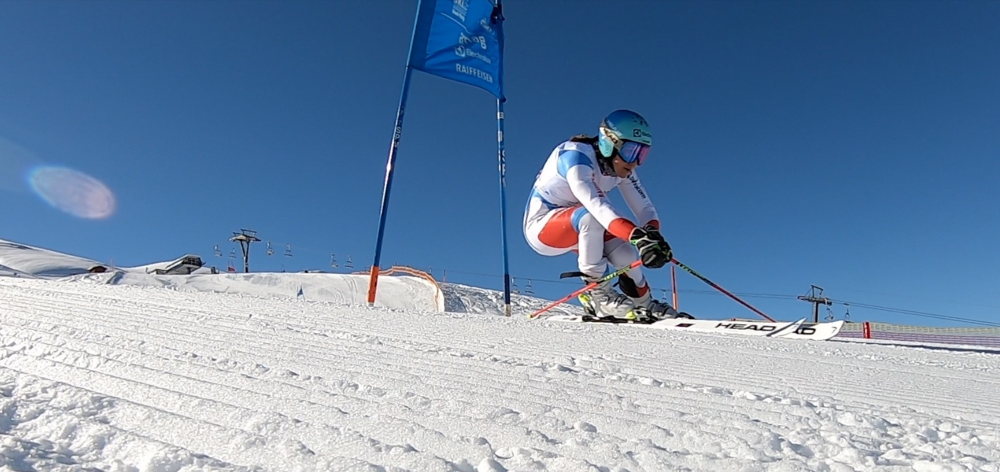
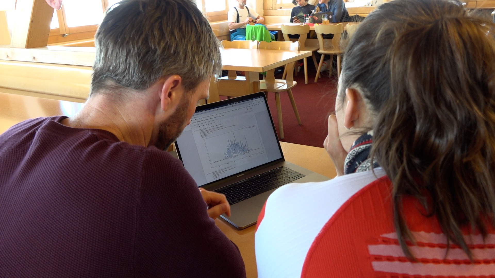

## Anforderungen

Das Ziel der Slope Track-App ist, die Sicherheit von Schneesportlern zu erhöhen und deren Eigenverantwortung zu stärken. Durch Messungen von Beschleunigungs- und Geschwindigkeitswerten und den daraus gewonnenen Erkenntnissen sollen Ski- und Snowboardfahrer ihrem eigenen Unfallrisiko entgegenwirken können.

Zur Zielgruppe der App gehören bei der Suva versicherte, Ski oder Snowboard fahrende Personen im Alter zwischen 15 und 65 Jahren. Unsere primäre Persona war "Jason". Er ist ein 30-jähriger, gesundheitsbewusster Lüftungstechniker, der seinen Fahrstil verbessern möchte und sich gerne mit anderen misst.

Eine konkrete Metrik für die App ist, dass jede(r) AnwenderIn die vorhandenen Tipps studiert. Zudem sollen möglichst viele Personen das angebotene Training regelmässig ausführen.

## Vorgehen

Wie üblich sind wir bei der [App Entwicklung](/mobile-apps-ios-android/) agil vorgegangen. Dies hatte in diesem Fall folgende Vorteile:

- Wir konnten bereits mit einem frühen Prototyp herausfinden, ob Beschleunigungsaufzeichnung und Abfahrtserkennung möglich sind und funktionieren.
- Bereits zu Beginn mit vielen unterschiedlichen Mobile-Geräten und Sensoren die Beschleunigungsaufzeichnung testen.
- Ideen beim Interaktionskonzept bereits in einer frühen Phase testen.
- Neue Erkenntnisse und Ideen während der Entwicklung in das Projekt einfliessen lassen.

Zu Beginn haben wir wie gewohnt eine [Story Map](/mehr-ueberblick-mit-storymap/) erstellt, um den Umfang und die Abfolge der Entwicklung zu visualisieren.

### Test-Tage

Die Logik, mit welcher wir Abfahrten erkennen, wollten wir möglichst früh bei echten Verhältnissen testen. Deshalb gingen wir bereits nach wenigen Wochen mit einem Prototypen der App in den Schnee. Es zeigte sich sehr schnell, dass unsere Ideen grundsätzlich funktionierten, aber noch einiges an Feinschliff nötig war.

Mit einer verfeinerten Version gingen wir später auch mit der Skirennfahrerin [Wendy Holdener](https://de.wikipedia.org/wiki/Wendy_Holdener) auf die Piste, um die App in Grenzbereichen zu testen. Auch hier haben wir wertvolles Feedback erhalten, welches in die weitere Entwicklung eingeflossen ist. Zudem haben wir eine Abfahrt von Wendy als Beispiel in der App hinterlegt. Diese zeigt eindrücklich auf, welche Kräfte bei Profis vorherrschen.

### Visuelles Design und Interaktionskonzept

Recht früh haben wir uns auch zum Aussehen und der Bedienung der App Gedanken gemacht. Dabei haben wir unterschiedliche Stile und Interaktionskonzepte in Betracht gezogen. Schliesslich entschieden wir uns für etwas spielerisches und freundliches. So entstand unter anderem auch "Helm", die Figur, die man herumzieht. _Helm_ fährt mit einem durch die App. Es ist bis heute undefiniert, ob _Helm_ ein Mann oder ein Frau ist und auch die bevorzugte Fortbewegungsart (Ski oder Snowboard) ist _Helm_ nicht zu entlocken. Beim Grafik-Stil kam noch hinzu, dass die visuellen Elementen auch im Schnee gut sichtbar sein sollten.

## Kernkomponenten

Die Slope Track-App besteht aus zwei Kernkomponenten. Dies sind zum einen das Aufzeichnen, zum anderen die Präsentation der Fahrt.

### Fahrten aufzeichnen

Um die Fahrt aufzuzeichnen, verwenden wir sowohl den Beschleunigungs- als auch den GPS-Sensor. Wir ermitteln mit einer Frequenz von 50 Hz die Beschleunigung, und jede Sekunde den GPS-Standort. Die rohen Beschleunigungsdaten verarbeiten wir mit einem Tiefpassfilter, um den "Lärm" aus den Messungen zu entfernen und klarere Resultate zu erhalten. Damit die Messung den ganzen Tag laufen kann, filtern wir zudem Liftfahrten und Pausen aus den Messungen heraus. So sind wir in der Lage, einzelne Abfahrten anzuzeigen. Zusätzlich berechnen wir Distanz, Höhenmeter, Dauer und Geschwindigkeit aus den gesammelten GPS-Daten.

### Fahrten präsentieren

Ein interaktives Diagramm mit zwei Kurven und eine Karte helfen uns, die aufgezeichneten Daten zu visualisieren. Die Abfahrten werden mit der Belastung auf der Karte eingezeichnet. Um die Abfahrt genauer zu studieren, können die Anwender die Karte stufenlos zoomen und scrollen, wie man es von Google Maps kennt. Das Kartenmaterial mit den eingezeichneten Pisten stellt uns der Kartendienst [Mapbox](https://www.mapbox.com) zur Verfügung. Auch die Darstellung der Karte in der App ist mittels einer Komponente von [Mapbox](https://www.mapbox.com) gelöst.

Das interaktive Diagramm unter der Karte visualisiert die Belastung und die Geschwindigkeit der einzelnen Abfahrten. Des Weiteren nutzen wir das Diagramm, um spezifische Punkte und Messwerte auf der Abfahrt anzuzeigen.

## Technologie

Bei der App haben wir so viel wie möglich mit [React Native](https://facebook.github.io/react-native/) umgesetzt. Dies ermöglicht uns, die Benutzeroberfläche für Android und iOS nur einmal implementieren zu müssen. Gleichzeitig bietet React Native die Möglichkeit, hardwarenahe Teile plattformspezifisch zu entwickeln.

Beim Verarbeiten der Sensordaten kommt es auf jede Millisekunde an. Deshalb programmierten wir diese Komponenten so nahe wie möglich an den Hardware-Plattformen. Mit [Kotlin Native](https://kotlinlang.org/docs/reference/native-overview.html) waren wir in der Lage auch dort den Code nur einmal zu schreiben und für Android sowie iOS hardwarespezifisch zu kompilieren.

## Einfach mal ausprobieren

Die Slope Track-App ist auf Deutsch, Französisch und Italienisch verfügbar und kann kostenlos aus dem App-Store von Apple und dem Play-Store von Google heruntergeladen werden. Wir wünschen euch viel Spass und Hals- und Beinbruch.

