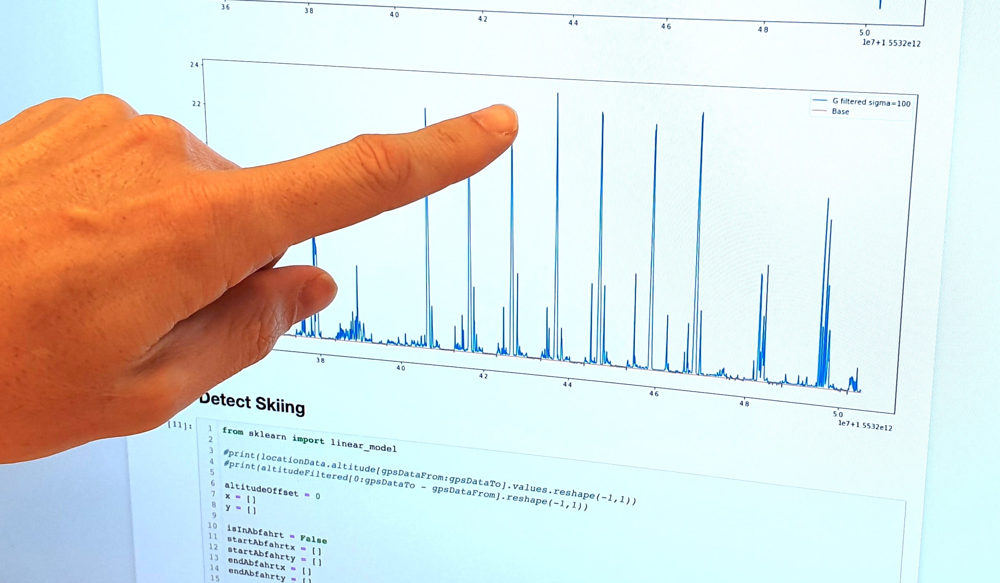

## Anforderungen

Die Anforderungen der Suva an die Slope Track-App waren vor allem die Sicherheit von Schneesportlern zu erhöhen und deren Eigenverantwortung zu stärken. Dies wollten wir mit konkreten Messungen von Beschleunigungs- und Geschwindigkeitswerten und den daraus gewonnen Erkenntnissen erreichen. Diese Erkenntnisse sollten Ski- und Snowboardfahrer helfen ihrem eigenen Unfallrisiko entgegenwirken.

Die Zielgruppe der App sind Suva-Kundinnen und Kunden. Dies sind bei der Suva versicherte Ski- und Snowboardfahrende Personen im Alter von 15 - 65 Jahren. Unser primäre Persona war "Jason". Er ist ein 30jähriger, gesundheitsbewusster Lüftungstechniker der seinen Fahrstil verbessern möchte und sich gerne mit anderen misst.

Eine konkrete Metrik für die App ist, dass jede(r) AnwenderIn die vorhandenen Tipps studiert. Zudem sollten möglichst viele Personen das angebotene Training regelmässig ausführt.

## Kernkomponenten

Die Slope Track-App besteht aus zwei Kernkomponenten. Dies sind zum einen das Aufzeichnen und zum anderen die Präsentation der Fahrt.

### Fahrten aufzeichnen

Um die Fahrt aufzuzeichnen verwenden wir den Beschleunigungs- und den GPS-Sensor. Wir messen mit 50 Hz die Beschleunigung und jede Sekunden den GPS-Standort. Die rohen Beschleunigungs-Daten verarbeiten wir mit einem Tiefpassfilter um den "Lärm" aus den Messungen zu entfernen und ein klarere Resultate zu erhalten. Damit die Messung den ganzen Tag laufen kann filtern wir zudem Liftfahrten und Pausen aus den Messungen heraus. So sind wir in der Lage einzelne Abfahrten anzuzeigen. Zudem berechnen wir Distanz, Höhenmeter, Dauer und Geschwindigkeit aus den gesammelten GPS-Daten.

### Fahrten präsentieren

Um die aufgezeichneten Daten zu visualisieren nutzen wir ein interaktives Diagramm (zwei Kurven) und eine Karte (Kartografie). Die Abfahrten werden mit der Belastung auf der Karte eingezeichnet. Um die Abfahrt genauer zu studieren, können die Anwender die Karte stufenlos zoomen und scrollen, wie man es von Google Maps kennt. Die Karte und die eingezeichneten Pisten stellt Mapbox zur Verfügung. Ich die Integration der Karte in die App ist mittels Mapbox gelöst.

Das interaktive Diagramm unter der Karte visualisiert zum einen die Belastung und die Geschwindigkeit der einzelne Abfahrten. Zum anderen nutzen wir das Diagramm auch um spezifische Punkte und Messwerte auf der Abfahrt anzuzeigen.

## Visuelles Design und Interaktionskonzept

Wir wollten der App eine ansprechendes und leicht verspieltes Gesicht geben. So entstand unter anderem "Helm", die Figur die man herumzieht. _Helm_ fährt mit einem durch die App. Es ist bis heute unklar ob _Helm_ eine Mann oder ein Frau ist und auch die bevorzugte Fortbewegungsart (Ski oder Snowboard) ist _Helm_ nicht zu entlocken. Beim Grafik-Stil wollten wir ebenfalls eine spielerische Note mit einfachen klaren visuellen Elementen, die auch im Schnee gut sichtbar sind.

## Einfach mal ausprobieren

Die Slope Track-App ist in Deutsch, Französisch und Italienisch verfügbar und kann kostenlos aus dem App-Store von Apple und dem Play-Store von Google heruntergeladen werden. Wir wünschen euch viel Spass und Hals- und Beinbruch.

