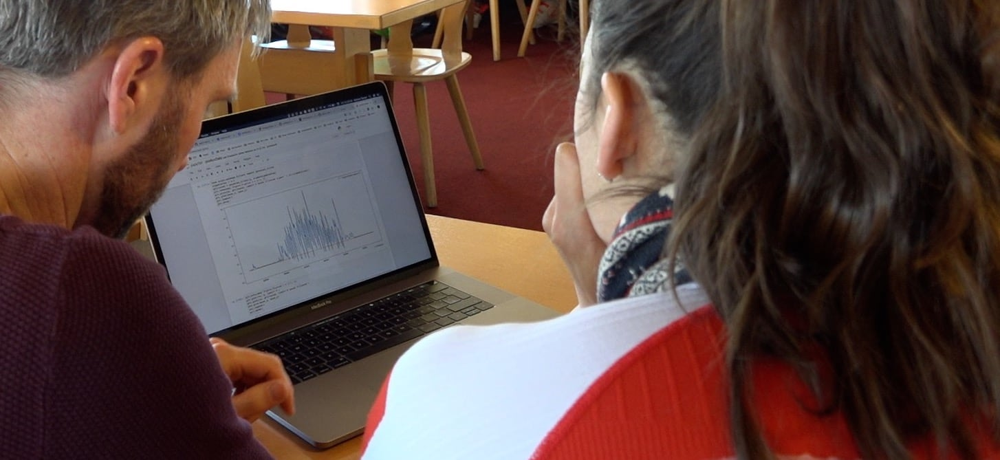

## Anforderungen

Die Anforderungen der Suva an die Slope Track-App waren vor allem die Sicherheit von Schneesportlern zu erhöhen und deren Eigenverantwortung zu stärken. Dies wollten wir mit konkreten Messungen von Beschleunigungs- und Geschwindigkeitswerten und den daraus gewonnen Erkenntnissen erreichen. Diese Erkenntnisse sollten Ski- und Snowboardfahrer helfen ihrem eigenen Unfallrisiko entgegenwirken.

Die Zielgruppe der App sind Suva-Kundinnen und Kunden. Dies sind bei der Suva versicherte Ski- und Snowboardfahrende Personen im Alter von 15 - 65 Jahren. Unser primäre Persona war "Jason". Er ist ein 30jähriger, gesundheitsbewusster Lüftungstechniker der seinen Fahrstil verbessern möchte und sich gerne mit anderen misst.

Eine konkrete Metrik für die App ist, dass jede(r) AnwenderIn die vorhandenen Tipps studiert. Zudem sollten möglichst viele Personen das angebotene Training regelmässig ausführen.

## Vorgehen

Wie üblich haben wir das Projekt agil umgesetzt. Dies hatte in diesem Fall folgende Vorteile:

- Wir konnten bereits mit einem frühen Prototyp herausfinden, ob die Beschleunigungsaufzeichnung und Abfahrtenerkennung möglich ist und funktioniert.
- Bereits zu Beginn mit vielen unterschiedlichen Mobile-Geräten und Sensoren die Beschleunigungsaufzeichnung testen.
- Ideen beim Interaktionskonzept bereits in einer frühen Phase testen.
- Neue Erkenntnisse und Ideen während der Entwicklung in das Projekt einfliessen lassen.

Ebenfalls wie üblich haben wir ganz zu Beginn eine [Story Map](https://apptiva.ch/mehr-ueberblick-mit-storymap/) erstellt um den Umfang und die Abfolge der Entwicklung zu visualisieren.

### Test-Tage

Die Logik, um die Beschleunigung und die Abfahrten zu erkennen, wollten wir möglichst früh in echten Verhältnissen testen. Deshalb gingen wir bereits nach wenigen Wochen mit einem frühen Prototyp der App in den Schnee. Da zeigte sich sehr schnell, dass unsere Ideen grundsätzlich funktionieren, aber noch einiges an Feinschliff bedürfen.

Mit einer verfeinerten Versionen gingen wir später auch mit der Skirennfahrerin [Wendy Holderen](https://de.wikipedia.org/wiki/Wendy_Holdener) auf die Piste um die App in Grenzbereichen zu testen. Auch hier haben wir wertvolles Feedback erhalten, welches in die weitere Entwicklung geflossen ist. Zudem haben wir eine Abfahrt von Wendy als Beispiel in der App hinterlegt. Diese zeigt eindrücklich auf, was für Kräfte bei Profis vorherrschen.

### Visuelles Design und Interaktionskonzept

Recht früh haben wir uns auch zum Aussehen und der Bedienung der App Gedanken gemacht. Dabei haben wir unterschiedliche Stile und Interaktionskonzepte in Betracht gezogen. Schlussendliche entschieden wir uns für etwas spielerisches und freundliches. So entstand unter anderem auch "Helm", die Figur die man herumzieht. _Helm_ fährt mit einem durch die App. Es ist bis heute unklar ob _Helm_ eine Mann oder ein Frau ist und auch die bevorzugte Fortbewegungsart (Ski oder Snowboard) ist _Helm_ nicht zu entlocken. Beim Grafik-Stil kam noch hinzu, dass die visuellen Elementen auch im Schnee gut sichtbar sein sollten.

## Kernkomponenten

Die Slope Track-App besteht aus zwei Kernkomponenten. Diese sind zum einen das Aufzeichnen und zum anderen die Präsentation der Fahrt.

### Fahrten aufzeichnen

Um die Fahrt aufzuzeichnen verwenden wir den Beschleunigungs- und den GPS-Sensor. Wir messen mit 50 Hz die Beschleunigung und jede Sekunden den GPS-Standort. Die rohen Beschleunigungs-Daten verarbeiten wir mit einem Tiefpassfilter um den "Lärm" aus den Messungen zu entfernen und ein klarere Resultate zu erhalten. Damit die Messung den ganzen Tag laufen kann filtern wir zudem Liftfahrten und Pausen aus den Messungen heraus. So sind wir in der Lage einzelne Abfahrten anzuzeigen. Zudem berechnen wir Distanz, Höhenmeter, Dauer und Geschwindigkeit aus den gesammelten GPS-Daten.

### Fahrten präsentieren

Um die aufgezeichneten Daten zu visualisieren nutzen wir ein interaktives Diagramm mit zwei Kurven und eine Karte. Die Abfahrten werden mit der Belastung auf der Karte eingezeichnet. Um die Abfahrt genauer zu studieren, können die Anwender die Karte stufenlos zoomen und scrollen, wie man es von Google Maps kennt. Das Kartenmaterial mit den eingezeichneten Pisten stellt uns der Karten-Dienst [Mapbox](https://www.mapbox.com) zur Verfügung. Auch die Darstellung der Karte in die App ist mittels einer Komponente von [Mapbox](https://www.mapbox.com) gelöst.

Das interaktive Diagramm unter der Karte visualisiert zum einen die Belastung und die Geschwindigkeit der einzelne Abfahrten. Zum anderen nutzen wir das Diagramm auch um spezifische Punkte und Messwerte auf der Abfahrt anzuzeigen.

## Technologie

React Native in Typescript.

## Einfach mal ausprobieren

Die Slope Track-App ist in Deutsch, Französisch und Italienisch verfügbar und kann kostenlos aus dem App-Store von Apple und dem Play-Store von Google heruntergeladen werden. Wir wünschen euch viel Spass und Hals- und Beinbruch.

