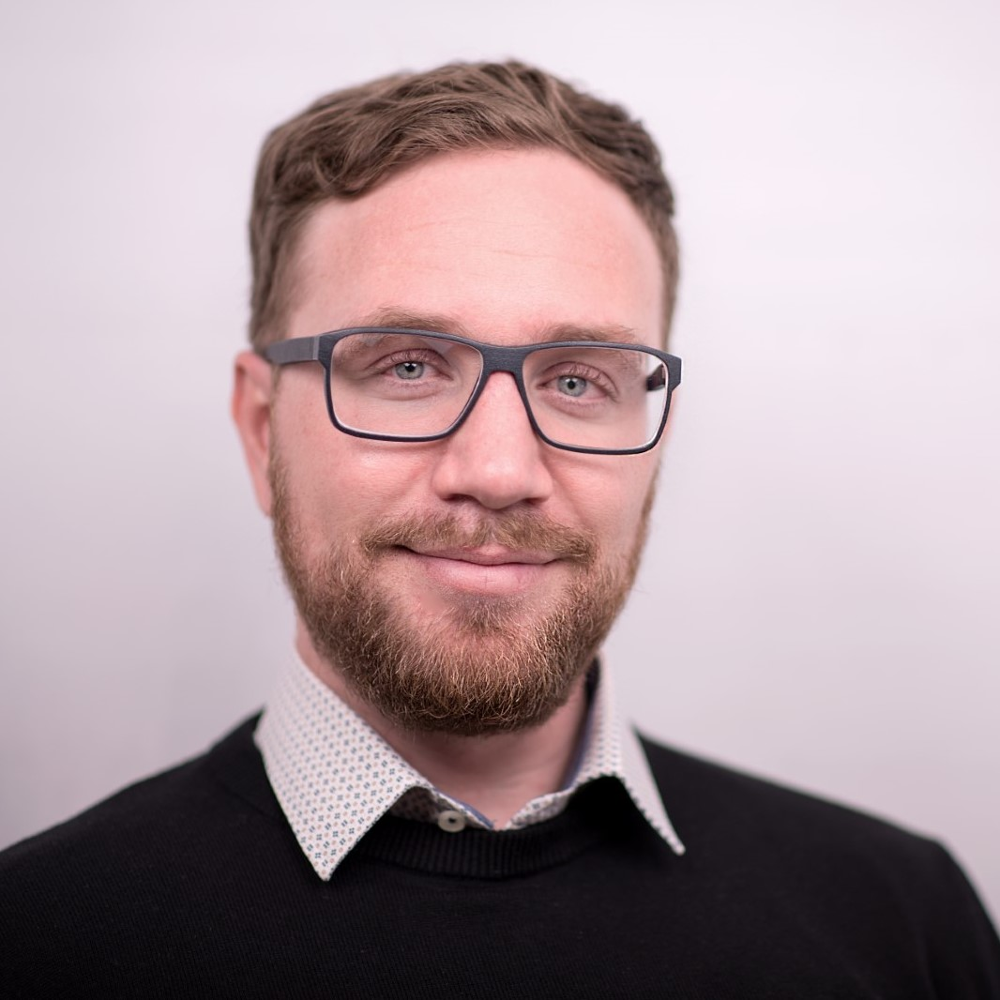

Die hervorragende Auftragslage vom 2018 geht nahtlos im 2019 weiter. Deshalb trafen wir die Entscheidung, uns zu verstärken. Zu unserem Glück haben wir zwei liebe Menschen getroffen, die uns unterstützen wollen.

[[right]]
|

## Renato

[Renato](/renato-wasescha) ist Software-Entwickler und nun bereits ein paar Wochen bei uns.

Er kommt ursprünglich aus dem Bündnerland. Entsprechend macht er uns regelmässig mit seinen Wochenend-Erlebnissen einversüchtig. Zudem haben wir nun einen richtigen Auto-Experten im Team, der alle erdenklichen Dinge interessante Dinge weiss. Ansonsten haben wir ihn als offenen und gesprächigen Kollegen kennengelernt, der immer positive Stimmung verbreitet.

## Patrik

Patrik ist ebenfalls Software-Entwickler und hat eben gerade bei uns begonnen.

Patrik hat uns mit seinem Tüftler-Entusiasmus und grossem Interesse an moderner Software-Entwicklung überzeugt. Bereits in der ersten Woche hat er uns interessante Dinge an seiner Entwicklungsumgebung zeigen können. Zudem hat er eine echt freundliche Art, die die Zusammenarbeit zur Freude macht.

## Ausblick

Mit der Verstärkung sind wir nun sechs Mitarbeiter in der Apptiva und damit eine echt schlagkräftige Truppe. Vorläufig möchten wir in dieser Zusammenstellung mal weitergehen, bevor wir uns weiter verstärken. Würde uns aber eine besondere Entwicklerin oder ein besonderer Entwickler über den Weg laufen, würden wir uns die Option sicher offen halten, noch jemand willkommen zu heissen.
