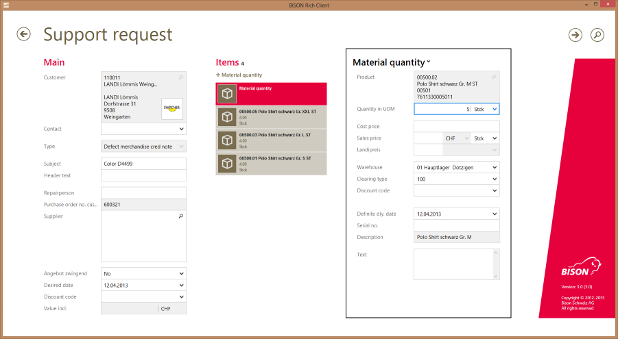

# Publikationen

## Nutzerorientiertes Design - Schnell zu stimmigen Lösungen

Viele Unternehmen setzen in der Softwareentwicklung auf agile Vorgehensweisen wie Scrum oder Kanban. Diese Ansätze legen einen starken Fokus auf die Effizienz der Produktentwicklung. Oft bleiben die Sicht der Benutzer und somit die Effektivität der Lösung auf der Strecke. Ist es möglich, stimmige Kundenlösungen zu bauen und dies schnell zu tun? Falls ja, was gilt es dabei zu beachten?

Quelle: <a href="http://www.sigs.de/publications/newsletter/2015/04/schoenholzer_zurkirchen_OS_03_15.pdf" target="_blank">Nutzerorientiertes Design - Schnell zu stimmigen Lösungen</a> im <a href="http://www.sigs-datacom.de/fachzeitschriften/objektspektrum/archiv/artikelansicht.html?tx_mwjournals_pi1%5Bpointer%5D=0&amp;tx_mwjournals_pi1%5Bmode%5D=1&amp;tx_mwjournals_pi1%5BshowUid%5D=7879" target="_blank">OBJEKTspektrum-Magazin</a>

# Meine Erfahrungen

## Ausschnitte aus früheren Projekten

Als Mitarbeiter der <a href="http://www.bison-group.com" target="_blank">Bison Schweiz AG</a>.

### ESL Store Manager Handheld

iOS App für Electronic Shelf Labels.

Verantwortlich für die Analyse, User Research, Anforderungen, Modellen, Design, visuelle Darstellung, Prototyp und Tests.

### ESL Store Manager Server

Desktop Webapp um die Electronic Shelf Labels zu managen.

Verantwortlich für die Analyse, User Research, Anforderungen, Modellen, Design, visuelle Darstellung, Prototyp.

<a href="http://www.bison-group.com/produkte/bison-esl/" target="_blank">Link</a>

### Ernte App

Mobile Webapp für die Meldung der Ernte an die fenaco Landesprodukte.

Verantwortlich für die Analyse, User Research, Anforderungen, Modellen, Design, visuelle Darstellung, Prototyp und Tests.

<a href="http://www.bison-group.com/produkte/bison-mobile-solutions/" target="_blank">Link</a>

### Telesales App

Desktop Webapp für den Telefonverkauf von Früchten und Gemüse.

Verantwortlich für die Analyse, User Research, Anforderungen, Modellen, Design, visuelle Darstellung, Prototyp und Tests.

### Safira Client

[[right]]
|

Moderner Desktop-Client für grosse ERP-Lösung.

Verantwortlich für das Produkt inkl. Analyse, User Research, Anforderungen, Modellen, Design, Prototyp und Tests.

# Mein Hacks

## Fragen

Fragen, fragen, fragen. Donald Rumsfeld nannte es die "unknown unkowns". Oft glauben wir alles zu wissen - vor allem, wenn wir wenig wissen. Dabei sind wir einem Trugschluss zum Opfer gefallen. Wir können oft nicht wissen, was wir nicht wissen. Erst wenn das Gefühl aufkommt "nichts zu wissen", sind wir auf dem richtigen Weg. Ab da wird es besser.

## Zeichnen

Sachverhalte aufzuzeichnen sorgt für Klarheit. Dies habe ich von <a href="https://twitter.com/martin_talamona">Martin Talamona</a> gelernt, mit dem ich über 10 Jahre zusammenarbeiten durfte. Beim Diskutieren und Erklären entstehen unweigerlich Missverständnisse. Viele davon können mit einer einfachen Zeichnung beseitigt werden. Zudem wird eine Zeichnung eher angeschaut, als dass ein Text gelesen wird.

## Probleme

Probleme sind wunderbar! In unserer Kultur spricht man nicht gerne über Probleme, sondern lieber über Herausforderungen. Dabei ist ein Problem etwas wunderbares. Erst wenn das Problem verstanden ist, kann eine gute Lösung entstehen. Lösungen ohne Probleme sind unbrauchbar und zum Scheitern verurteilt. Wer somit keine Probleme hat, hat ein Problem.

# Meine bevorzugten Werkzeuge

## Moleskine Notizbuch

Das Moleskine Notizbuch ist ein Klassiker. Handlich, schlicht und gutes Papier zeichnen es aus. Es ist immer in meiner Tasche um Gedanken festhalten zu können.

## Copic-Stifte

Die Copic-Stifte gibt es in unzähligen Farben und haben eine praktische Doppelspitze. Für schwarze Striche verwende ich ein Edding 1255.

## CamScanner

Mit CamScanner können Zeichnungen schnell und einfach digitalisiert werden. Gibt es für Android und iOS.

## Balsamiq Mockups

Um schnell ein Wireframe zu erstellen, eignet sich Balsamiq Mockups immer noch am Besten. Zudem lassen sich damit innert Minuten klickbare Prototypen erstellen.

## Sketch

Sketch ist das, was früher Adobe Fireworks war, nur für einen kleineren Preis und ausgelegt für UI-Mockups.

## Affinity Designer

Affinity Designer ist eine superhandliche Option statt Adobe InDesign. Kleiner Preis, äusserst Mächtig und einfach in der Bedienung.
