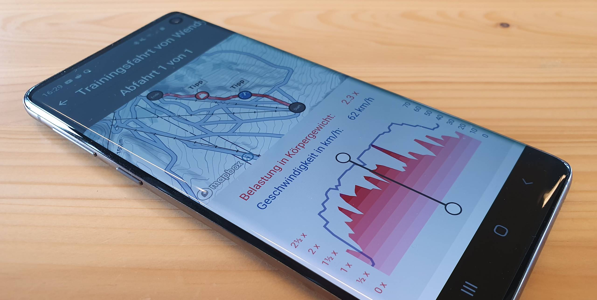

## Anforderungen

Ziel der Slope Track App ist es, die Sicherheit von Schneesportlern zu erhöhen und deren Eigenverantwortung zu stärken. Durch die Messung von Beschleunigungs- und Geschwindigkeitswerten und die daraus gewonnenen Erkenntnisse sollen Skifahrer und Snowboarder in die Lage versetzt werden, ihrem eigenen Unfallrisiko entgegenzuwirken.

Eine konkrete Metrik für die App ist, dass jeder Nutzer und jede Nutzerin die angebotenen Tipps studiert. Darüber hinaus sollen möglichst viele Personen das angebotene Training regelmässig durchführen.

## Vorgehen

Wie üblich haben wir das Projekt agil umgesetzt. Das hatte in diesem Fall folgende Vorteile:

- Wir konnten bereits mit einem frühen Prototyp herausfinden, ob Beschleunigungsaufzeichnung und Abfahrtserkennung möglich sind und funktionieren.
- Beschleunigungsmessung von Anfang an mit vielen verschiedenen mobilen Geräten und Sensoren testen.
- Ideen zum Interaktionskonzept frühzeitig testen.
- Neue Erkenntnisse und Ideen während der Entwicklung in das Projekt einfliessen lassen.

Zu Beginn haben wir wie üblich eine [Story Map](/mehr-ueberblick-mit-storymap/) erstellt, um den Umfang und den Ablauf der Entwicklung zu visualisieren.

## Die Technik

Für die App haben wir so viel wie möglich mit [React Native](https://facebook.github.io/react-native/) umgesetzt. Dies ermöglicht es uns, die Benutzeroberfläche für **Android** und **iOS** nur einmal implementieren zu müssen. Gleichzeitig bietet React Native die Möglichkeit, hardwarenahe Teile plattformspezifisch zu entwickeln.

Bei der Verarbeitung der Sensordaten zählt jede Millisekunde. Deshalb haben wir diese Komponenten so nah wie möglich an den Hardware-Plattformen programmiert. Mit [Kotlin Native](https://kotlinlang.org/docs/reference/native-overview.html) konnten wir auch hier den Code nur einmal schreiben und sowohl für **Android** als auch für **iOS** hardwarespezifisch kompilieren.

## Einfach mal ausprobieren

Mehr Informationen zu Slope Track findet man auf der Seite der Suva unter <https://suva.ch/slopetrack>. Viel Spass!
