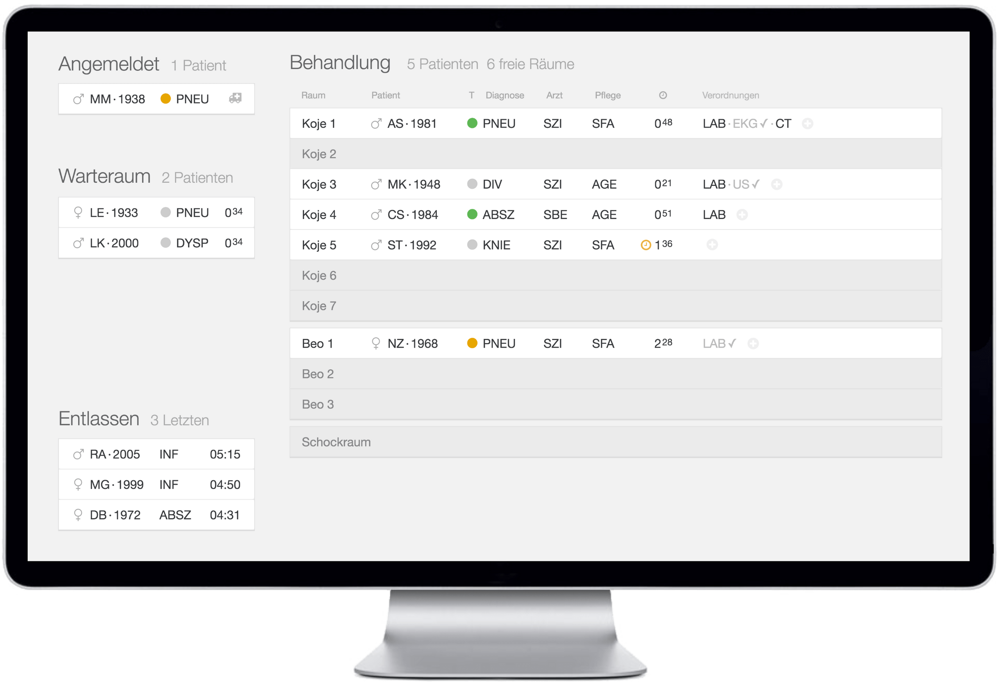
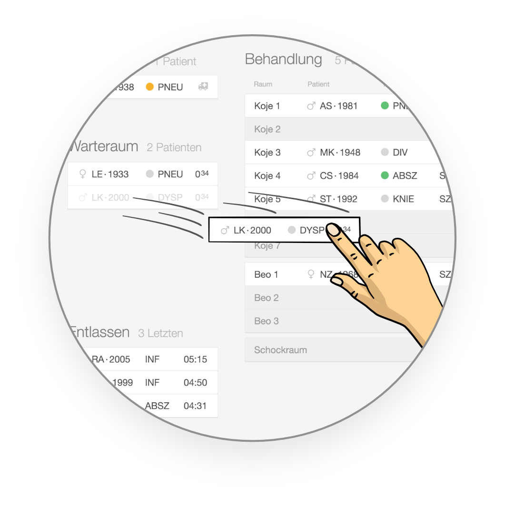
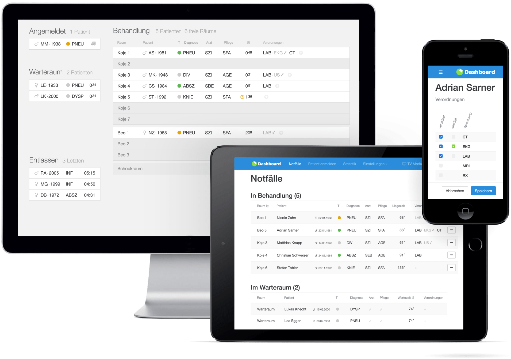
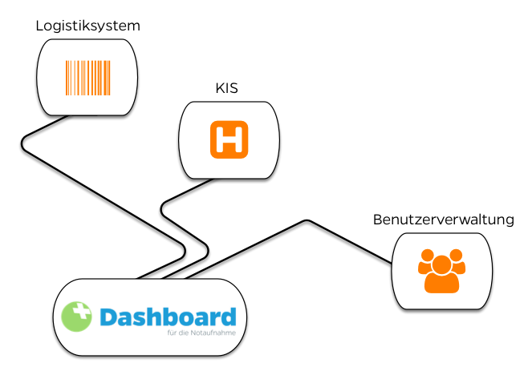

`youtube: https://www.youtube.com/embed/CIFltWCHlz0`

## Optimieren Sie mit dem Apptiva Dashboard Ihre Abläufe.

Das Apptiva Dashboard ist ein schlankes Patientenleitsystem das Pflegepersonal, Ärztinnen und Ärzte bei der Bewältigung medizinischer Notfälle unterstützt.

# TV Modus

## Für den Überblick auf der Notaufnahme

Das Apptiva Dashboard verschafft Pflegekräften, Ärztinnen und Ärzten der Notaufnahme jederzeit einen Überblick zur aktuellen Situation. Es wird üblicherweise auf einem oder mehreren grossen Monitoren auf der Notaufnahme angezeigt. So können sich Pflegekräfte, Ärztinnen und Ärzte jederzeit und rasch einen guten Überblick verschaffen. Das Dashboard lädt geänderte Daten im Hintergrund automatisch nach, so dass keine manuellen Interaktionen notwendig sind.

## Das Dashboard beantwortet folgende Fragen:

- Welche Patienten sind auf der Notaufnahme? Wie ist ihr Zustand und welche Personen sind für sie verantwortlich?
- Welche Patienten werden als nächstes behandelt? Sind Patienten im Warteraum oder werden demnächst im Notfall eintreffen?
- In welchem Raum befindet sich welcher Patient? Welche Räume sind noch frei?
- Welche Verordnungen wurden erlassen? Welche sind bereits umgesetzt?

## In Sekunden Informationen aktualisieren – mit Touch!

[[right]]
|

Tätigen Sie die wichtigsten Aktionen direkt am TV/Monitor mittels Touch. So können Sie Aktionen innert Sekunden erledigen, so wie Sie sich dies von einem physischen Whiteboard gewohnt sind. Dank „Drag and Drop“ sind alle Aktionen sehr einfach zu bedienen.

Folgende Aktionen können direkt im TV-Modus getätigt werden:

- Angemeldete und wartende Patienten in eine Koje ziehen.
- Ärztin oder Arzt zuweisen
- Pflegekraft zuweisen
- Verordnungen hinzufügen.
- Verordnungen abschliessen.
- Patienten entlassen

Weiter Aktionen werden laufend hinzugefügt.

`youtube: https://www.youtube.com/embed/QHazYYSCxsE`

# Desktop und Mobile

## Arbeiten Sie mit dem für Sie passenden Gerät

Egal ob Desktop-PC, Notebook, Tablet oder Smartphone. Das Apptiva Dashboard passt sich optimal an das jeweilige Gerät an – und dies ohne dass Sie eine spezielle Software auf Ihrem Gerät installieren müssen. Sie starten einfach Ihren Browser, verbinden mit dem Dashboard und schon können Sie arbeiten.

Bedienen Sie das Dashboard so wie Sie sich dies von anderen Web-Anwendungen gewohnt sind. Speichern Sie die oft verwendeten Seiten als Favoriten oder schicken Sie Ihrem Arbeitskollegen den Link zu einem Patientendossier per E-Mail.

## An den Ort des Geschehens

Nehmen Sie das Apptiva Dashboard mit an den Ort des Geschehens. Erfassen Sie die Informationen dort wo sie entstehen – direkt beim Patienten.

Sie verlegen einen Patienten von der Triage in eine Koje? Ändern Sie einfach den Aufenthaltsort des Patienten über Ihr Smartphone. Früher hätten Sie dafür an den Stations-PC gehen müssen. Heute machen Sie dies mit wenigen Klicks in kurzer Zeit. Die Datenqualität und -aktualität wird stark ansteigen.

# Schnittstellen zu bestehenden Systemen

Das Apptiva Dashboard lässt sich einfach mit Ihren bestehenden Systemen verbinden. Synchronisieren Sie zum Beispiel das Patientendossier von Ihrem KIS oder übernehmen Sie administrative Daten vom ERP. Dazu setzen wir auf HL7 – dem internationalen Standard für den elektronischen Austausch von medizinischen Daten. Die Schnittstellen lassen sich nach Belieben an Ihre Anforderungen anpassen.

Änderungen, die im Dashboard gemacht werden (z.B. Aufenthaltsort ändern) können natürlich auch wieder in Ihr Zentralsystem zurückgeschrieben werden. Dadurch verhindern Sie doppelte Arbeiten und erhöhen die Transparenz.

Mit dem Apptiva Dashboard erhalten Sie einen flexiblen Zusatz zu Ihrem bestehenden KIS und können damit einen Teil Ihres Geschäftsprozesses gezielt optimieren. Aufgrund der Synchronisierung von Datenänderungen in beide Richtungen ist in Ihrem bestehenden System weiterhin alles Notwendige verfügbar.

# Anfrage

Gerne geben wir Ihnen weitere Informationen zu unserem Dashboard. Wir freuen uns über Ihre Anfrage.

Rufen Sie uns an [041 322 26 26](tel:+41413222626) oder schreiben Sie an [info@­apptiva.ch](mailto:info@apptiva.ch)
