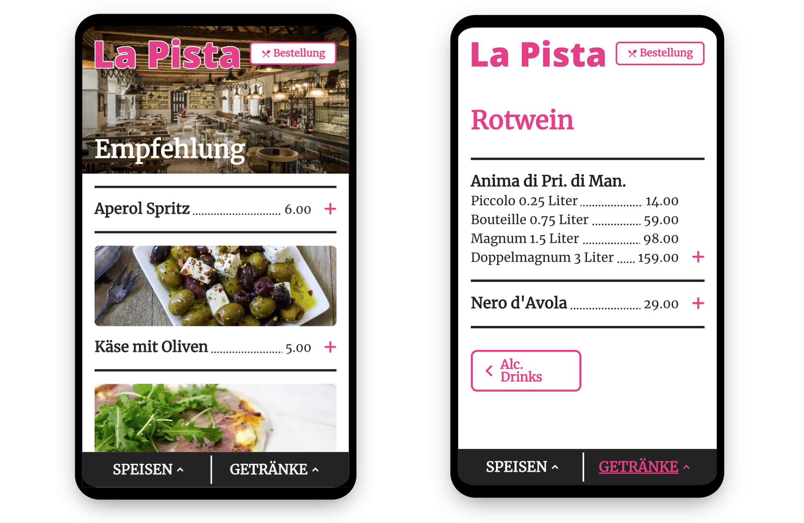
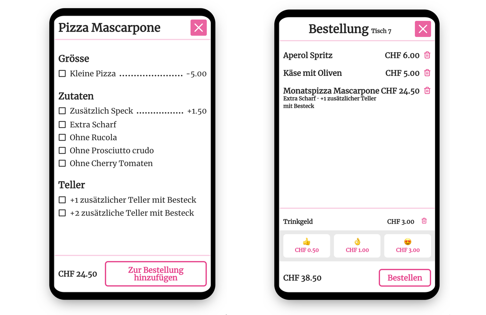

## Digitale Speisekarte

Unsere digitale Speisekarte präsentiert Ihr Angebot im besten Licht. Zudem ist Ihr Angebot mit Gaston auf Ihrer Webseite und dem Handy Ihrer Gäste verfügbar. Ganz egal ob über einen QR-Code bei Ihnen im Betrieb oder zu Hause über die Webseite, die Gäste haben einen aktuellen Einblick in Ihre Köstlichkeiten.

Über unser CMS pflegen Sie den Inhalt Ihres Angebots und das Design der Speisekarte selber. Schliesslich soll die Speisekarte Ihren Betrieb repräsentieren.

Auf der Webseite von Gaston erfahren Sie mehr über unsere [digitale Speisekarte](https://gastonsolution.com/digitale-speisekarte/). 

## Bestell App Gastronomie

Je nach Wunsch können Sie Gaston nur als Speisekarte oder auch zum Bestellen und Bezahlen nutzen. Setzen Sie Gaston auch als Bestell App ein, so sind Ihre Gäste in der Lage, jederzeit und ohne Wartezeit Speisen und Getränke bequem vom Tisch aus zu bestellen und zu bezahlen. Dies entlastet Ihr Personal und freut Ihre Gäste. Noch nie war es so einfach, noch ein Getränk zu bestellen! Oder auch gleich ein ganzes Gericht.

Unsere Bestell App Gastronomie ist äusserst flexible. Für jeden Artikel lassen Sie mehrere Variation und Optionen definieren. Zudem ist es möglich, das Angebot abhängig vom Ort und Zeit der Bestellung unterschiedliche zu gestalten. So sind spezielle Preise zur Happy-Hour oder für Take-Away kein Problem.

Auf der Webseite von Gaston erfahren Sie mehr über unsere [Bestell App für Gastronomie](https://gastonsolution.com/restaurant-bestell-app/).

## Gaston

Mehr Informationen zu Gaston finden Sie auf [gastonsolution.com](https://gastonsolution.com)

## Ihr Kontakt

[[right]]
|[[avatar]]
||

Nehmen Sie jetzt Kontakt mit unserem Produktleiter auf.
Er steht Ihnen gerne für Fragen zur Verfügung.

[[no-margin]]
| Produktleiter
|
|### Philip Schönholzer
|
|#### 041 322 26 26
|
|#### [philip.schoenholzer@apptiva.ch](mailto:philip.schoenholzer@apptiva.ch)
