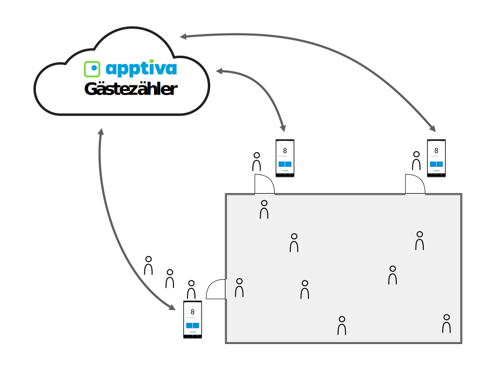

## Mehrbenutzer-Synchronisation

Wenn der Event oder die Lokalität etwas grösser ist, gibt es normalerweise mehrere Ein- und Ausgänge. Dank der Mehrbenutzer-Synchronisation kann die Anzahl Gäste von mehreren Anwendern gleichzeitig aktualisiert werden. Die Daten werden via Cloud untereinander synchronisiert.

## Legen Sie los

Jetzt unkompliziert und kostenlos Ihre Gäste zählen.
[[button]]
| [Zum Gästezähler](https://guestcounter.ch)
