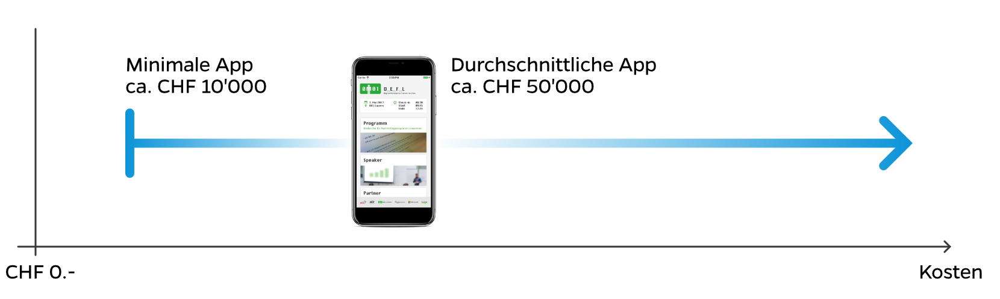

## Optimale App Entwicklung für mobile Apps auf Basis von iOS und Android

Wir entwickeln optimierte Apps für alle Geräte (Smartphones & Tablets) für iOS wie auch Android, ohne die Apps zweimal entwickeln zu müssen. Dies erreichen wir, in dem wir nur wenige Performance-kritische Komponenten plattformabhängig (also zweimal) entwickeln. Die restlichen Komponenten implementieren wir plattformunabhängig. So haben wir das Beste aus zwei Welten: Wiederverwendbarkeit und hohe Leistung. Dies heisst nicht bloss tiefere Kosten bei der App Entwicklung, sondern auch schneller Resultate erhalten.

## Apps im Apple App Store, Google Play Store oder per MDM publizieren

Wir publizieren Apps im Apple App Store, Google Play Store oder per Mobile Device Management für ihr Unternehmen. Falls sie wünschen, publizieren wir die Apps im Namen ihres Unternehmens, damit ihre Kunden die Sicherheit haben, die richtige App zu nutzen.

## Wir sind besonders effektiv beim App Programmieren

Dank unserem agilem Vorgehen sind erste nutzbare Resultate Ihrer Wunsch-App bereits nach zwei Wochen vorhanden.

Mit der Apptiva haben Sie einen Partner, welcher unkompliziert und erfolgreich mit Ihnen zusammenarbeitet und Ihre App erstellen kann. Wir konnten bis jetzt jedes Projekt gemeinsam mit unseren Kunden erfolgreich lancieren und betreiben. Unsere Projekte sind aber nicht bloss zeitgerecht und im Budget, sondern kommen auch bei den Anwendern sehr gut an. Wir achten von Beginn an auf eine gute Usability.

Für Sie heisst dies mehr Freude, weniger Stress und die Zuversicht, die gesteckten Ziele erreichen zu können.

## Kosten für eine iOS- und Android-App

Die Kosten für eine iOS- und Android-App hängen stark von der Komplexität, dem Umfang, den Features und der gewünschten Finesse ab.

Aus unserer Erfahrung können wir sagen, dass auch die einfachste App einen 5-stelligen Betrag voraussetzt. Dies ist der Mindestbetrag, um eine Version für iOS und Android zu erstellen und diese in den jeweiligen Stores zu veröffentlichen. Die Kosten für eine durchschnittlich App Programmierung, in Bezug auf Komplexität, Umfang, Features und Finesse, liegen bei ungefähr 50'000 CHF. Eine Obergrenze der Kosten für die Entwicklung einer App gibt es hingegen nicht. Je nach Anforderungen kann eine App so auch durchaus im 6-stelligen Bereich liegen. Sie können uns gerne kontaktieren, um einen ungefähren Rahmen der Kosten für Ihre App zu erhalten. Wir beraten Sie gerne.
