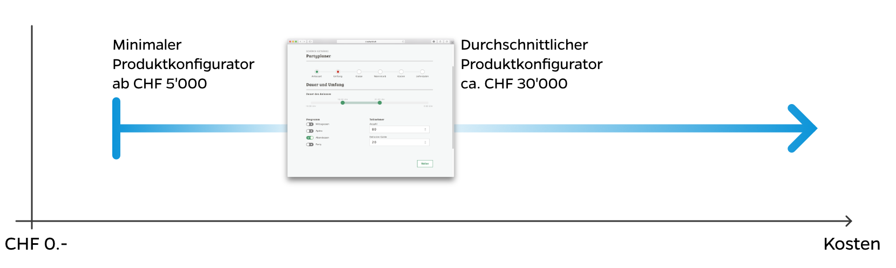

## Kosten für einen individuellen Produktkonfigurator

Die Kosten für einen individuellen Produktkonfigurator hängen stark von der Komplexität, dem Umfang, den Features und der gewünschten Finesse ab.

Aus unserer Erfahrung können wir sagen, dass auch der einfachste Produktkonfigurator einen mittleren 4-stelligen Betrag voraussetzt. Dies ist der Mindestbetrag, um einen produktiven Produktkonfigurator bereitstellen zu können. Die Kosten für einen durchschnittlich Produktkonfigurator - in Bezug auf Komplexität, Umfang, Features und Finesse - liegen bei ungefähr 30'000 CHF. Eine Obergrenze der Kosten für die Entwicklung eines Produktkonfigurators gibt es hingegen nicht. Je nach Anforderungen kann ein Produktkonfigurator so auch durchaus im 6-stelligen Bereich liegen.

Sie können uns gerne kontaktieren, um einen ungefähren Rahmen der Kosten zu erhalten, wenn Sie bei uns einen Produktkonfigurator oder eine [Web App erstellen lassen](/web-apps/).

## Kontakt

[[right]]
|[[avatar]]
||

Nehmen Sie jetzt Kontakt mit unserem Projektleiter auf.
Er steht Ihnen gerne für Fragen zur Verfügung.

[[no-margin]]
|Projektleiter
|
|### Philip Schönholzer
|
|#### 041 322 26 26
|
|#### [philip.schoenholzer@apptiva.ch](mailto:philip.schoenholzer@apptiva.ch)
