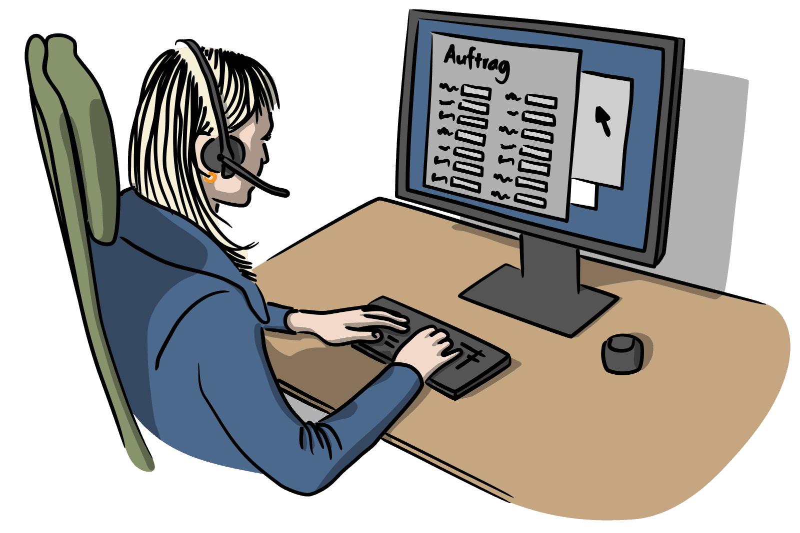
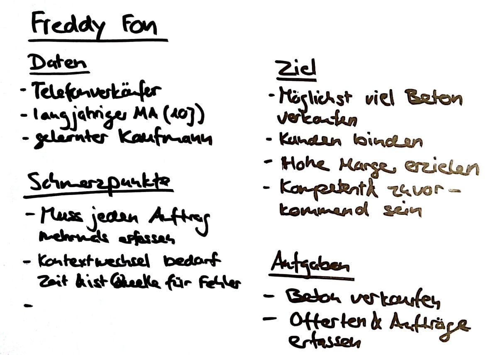
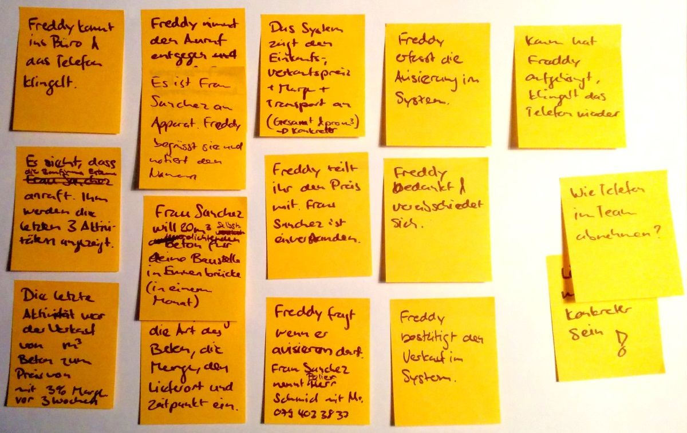
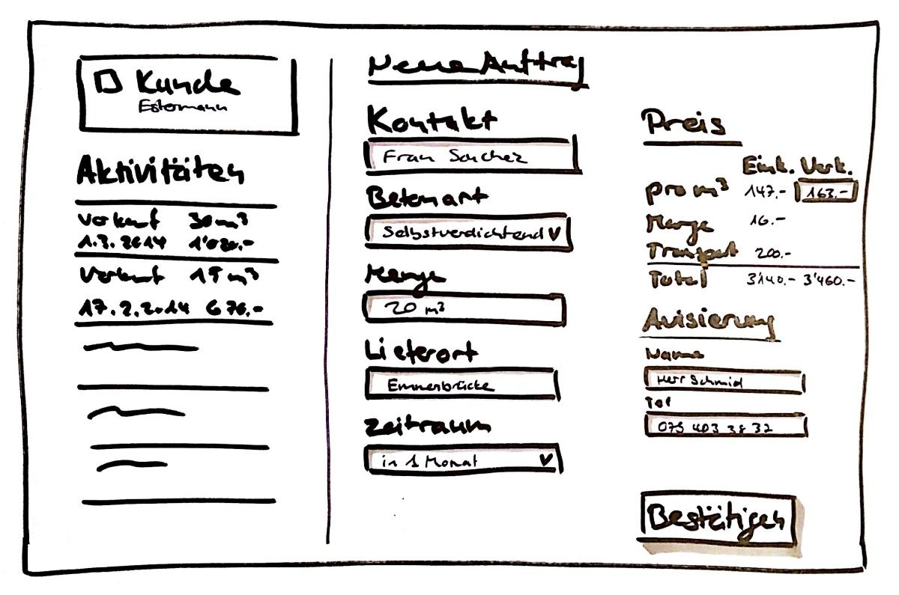
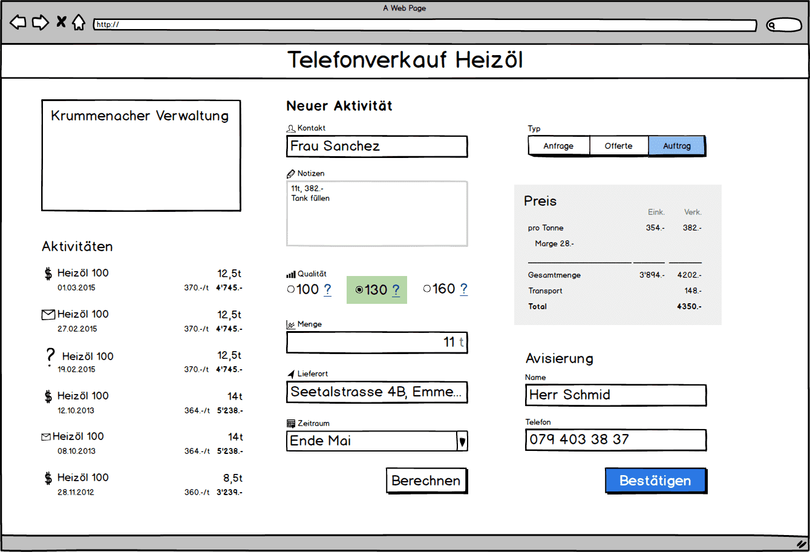
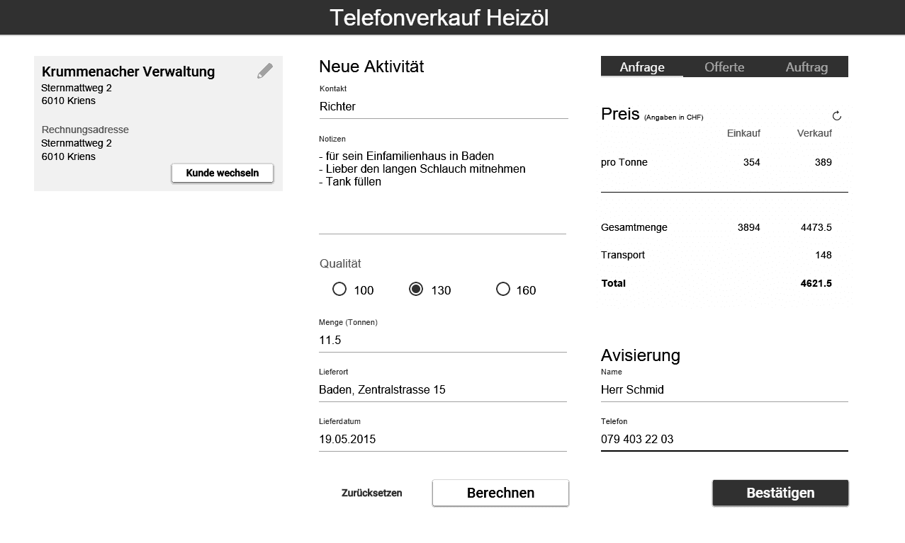
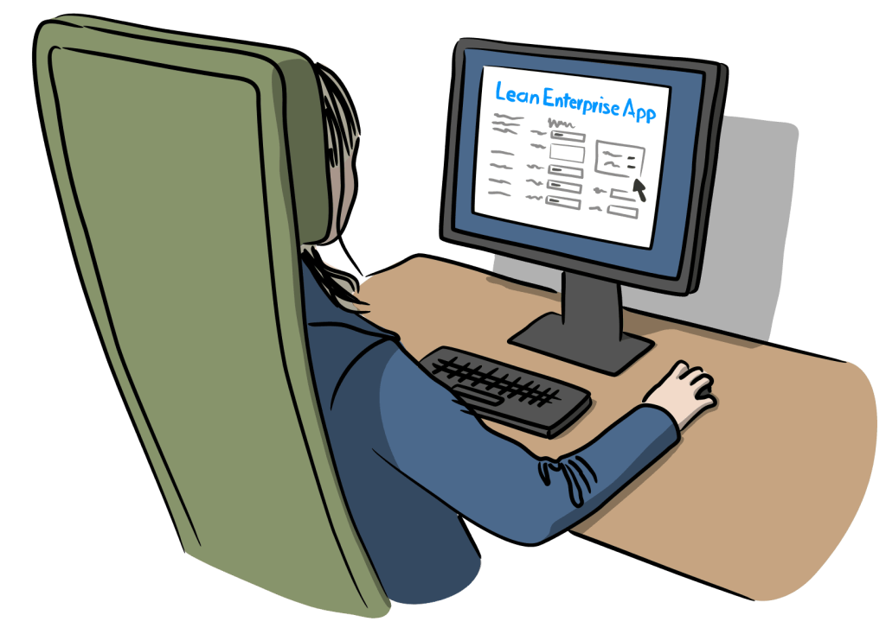
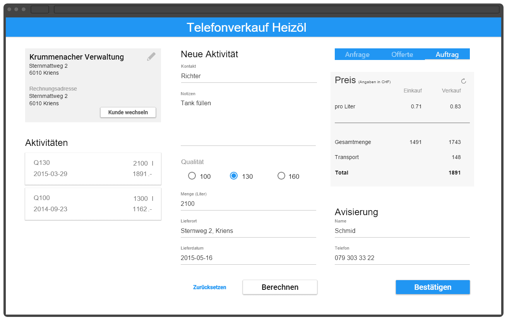

# User Centered Design

Darum wenden wir UCD (User Centered Design auf Deutsch: Benutzerzentriertes Design) an. Diese Methode hilft uns, die benötigte Funktionalität umzusetzen. Und zwar genau so, wie Sie es erwarten. Sehen Sie sich an folgendem Beispiel an, wie UCD funktioniert:

[[left]]
|

## Tag 1

### Tätigkeit der Benutzer kennenlernen

Um eine Lean Enterprise [App entwickeln](/mobile-apps-ios-android/) zu können, müssen wir die Tätigkeiten der Benutzer und die Interessen der Stakeholder verstehen.

Um dies herauszufinden, beobachten wir den Benutzer während seiner Arbeit und führen Interviews mit den Stakeholder durch. Wir wollen die Wirkung der Arbeit verstehen. Dafür eignet sich ein Contextual Inquiry wie es Whiteside, Bennet und Holtzblatt entwickelt haben.

[Ansehen](/telefonverkauf-showcase/)

[[right]]
|
|

## Tag 2

### Erkenntnisse modellieren

Aus den gewonnenen Erkenntnissen klären sich für uns die Ziele der Benutzer. Dafür eigenen sich Personas nach Cooper.

Um die Tätigkeiten der Benutzer optimal zu unterstützen, entwickeln wir den künftigen Arbeitsablauf. Hier bewährt sich ein Kontextszenario nach Cooper.

[[left]]
|
|

## Tag 3

### Skizzieren & Zeichnen

Mit Stift und Papier entwickeln wir sehr schnell Ideen für eine Benutzeroberfläche.

Hier sieht man bereits, wie die Heizöl-App entsteht.

Sobald sich eine Idee herauskristallisiert, verfeinern wir diese mit speziellen Programmen am PC. Damit ist es bereits möglich, Feedback von den künftigen Anwendern zu erhalten.

[[right]]
|

## Tag 4

### Prototyp

Mit spezieller Software entwickeln wir sehr schnell Prototypen einer App.

[[left]]
|

## Tag 5

### Test

Mit diesem Prototyp testen wir eine Idee direkt am Arbeitsplatz der Benutzer. So wissen wir bereits nach wenigen Tagen, ob der eingeschlagene Weg richtig ist.

[[right]]
|

## Iteratives Umsetzen

Nach diesen Schritten ist klar, was die optimale Lösung für den Benutzer und die Stakeholder ist. So kann die Umsetzung fokussiert und effizient starten.

> Dank dem richtigen Vorgehen sparen Sie Geld, weil wir passgenau das entwickeln, was Sie benötigen.
