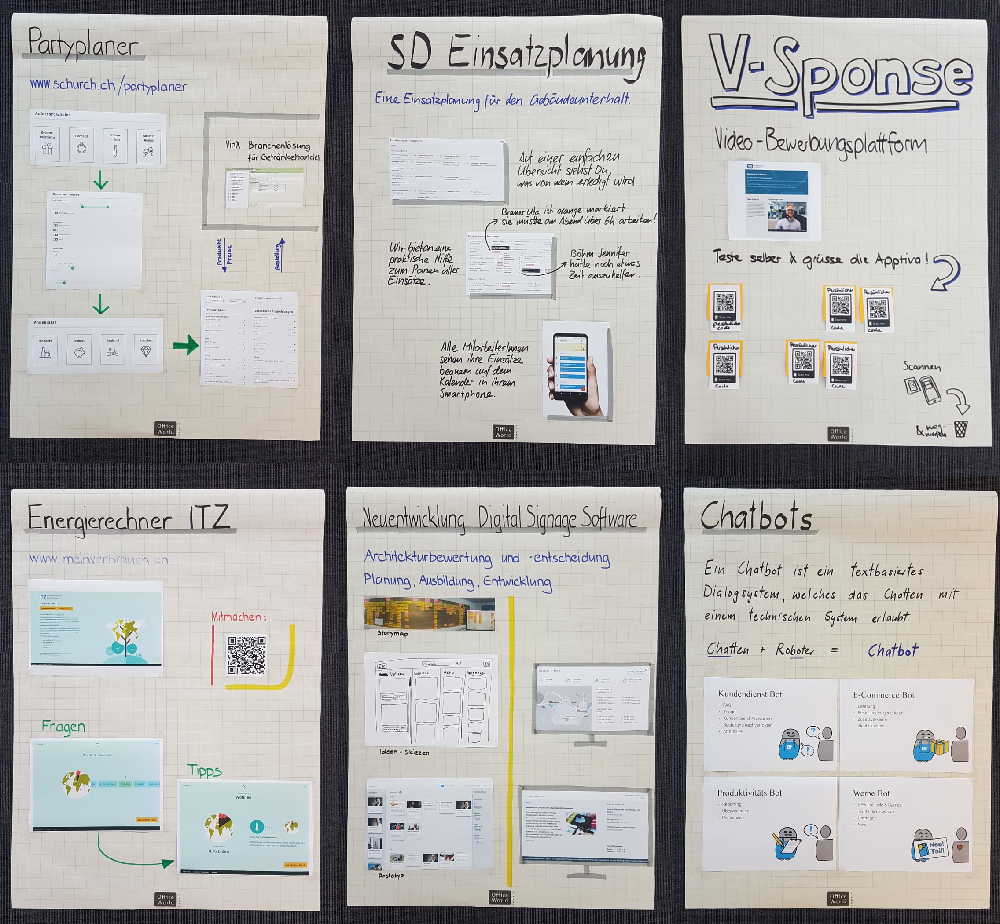

Erstmals herzlichen Dank an alle Gäste unserer Geburtstagsparty! Euer erscheinen hat uns geehrt.

Alle die es nicht an unsere Geburtstagsparty schafften, erhalten hier eine Eindruck unserer kleinen "Werkausstellung". Diese vermittelt wunderbar einen Ausschnitt unseres Schaffens und lässt uns die letzen Jahre nochmals Revue passieren. Wir durften an einigen coolen Dinge mitarbeiten!

Ausgestellt wurden folgende Projekte:

* [Partyplaner](https://www.schurch.ch/partyplaner/) für Schürch Getränke
* Einsatzplanung für sd Gebäudeunterhalt
* V-Sponse für R-Squared
* [Energierechner](http://meinverbrauch.ch) für ITZ
* Neuentwicklung der Digital Signage Software
* [Alex Chatbot](https://geschaeftsberichte.vorwerk.de/2017/fuehlen/) für Vorwerk
* Generelle Infos zu [Chatbots](https://www.botfabrik.ch)

Die QR-Codes für die V-Sponse können wir hier online leider nicht mehr anbieten. Die anderen dürft ihr auch weiterhin gerne nutzen.

