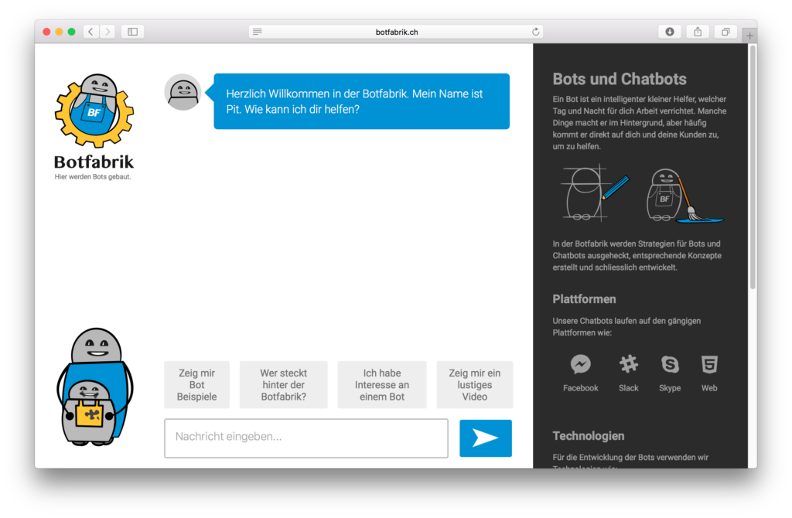

Das Thema Bots ist in aller Munde. Interessanterweise gibt es aber kaum Angebote für die Bot Entwicklung. Wir haben uns die letzten Monate verschiedentlich mit Bots auseinandergesetzt und denken dies sollte sich dringend ändern. Deshalb haben wir bei der Apptiva den Entschluss gefasst, die Entwicklung von Bots in der Schweiz voranzutreiben.

Den ersten Schritt haben wir diese Woche mit der Lancierung der [Botfabrik](https://www.botfabrik.ch) getan. Die Botfabrik soll Interessierten die Thematik der Bots und die Bot Entwicklung näher bringen. So werden in der Botfabrik die Möglichkeiten von Bots ausgelotet und veranschaulicht. Nun ist die Botfabrik nicht bloss eine klassische Webseite, sondern selber ein Bot namens Pit. Pit ist sozusagen ein Bot, welcher Bots erklärt.

Nun kann selbst Pit nicht alle Fragen beantworten. Deshalb gibt es eine Slack-Integration, die uns ermöglicht für Pit einzuspringen. Ab diesem Zeitpunkt übernehmen wir und können direkt mit den Besuchern der Botfabrik kommunizieren.

Im Fall der Botfabrik kommuniziert der Bot über eine Webseite. Genau so gut wäre eine Kommunikation über den Facebook-Messenger, Skype, Telegram oder direkt in Slack möglich. Schaut kurz in der [Botfabrik](https://www.botfabrik.ch) vorbei. Wir sind gespannt auf euer Feedback.

Interesse an Bots und deren Entwicklung? Wir sind immer offen für den Austausch.

Botfabrik: [www.botfabrik.ch](https://www.botfabrik.ch)
