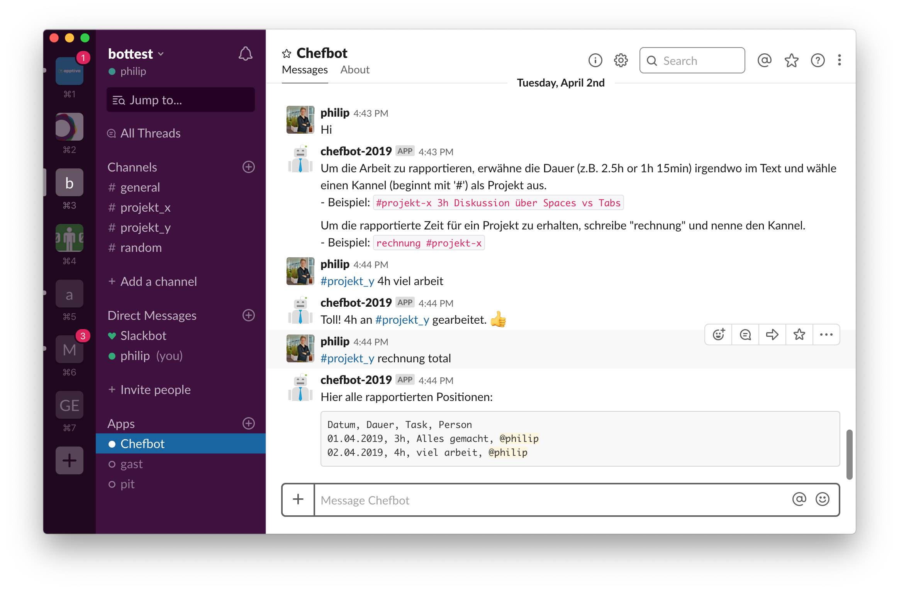

Als wir die Apptiva gründeten, haben wir noch gehofft, dass wir nie mehr rapportieren müssen. Vor drei Jahren kamen wir zur traurigen Erkenntnis, dass das Rapportieren von Stunden und Aufwänden doch sinnvoll sein kann. Wir wollten beispielsweise wissen wie lange die Entwicklung einzelner Projekte dauert. Zudem interessierte uns während eines Projektes wie viel Budget bereits verwendet wurde. Später hatten wir auch Projekte wo wir unsere Aufwände auf Stundenbasis verrechneten.

So entschieden wir uns schliesslich gewisse Arbeiten doch zu rapportieren. Wir wägten unterschiedliche Varianten wie Excel oder dedizierte Rapportierungslösungen ab. Da wir sowieso an Chatbots interessiert waren, zogen wir auch solche Lösungen in Betracht. Leider waren die vorhandenen Chatbot-Tools zu kompliziert in der Anwendung. Deshalb beschlossen wir, unsere eigene Lösung zu entwickeln: *Chefbot*.

## Rapportierungs-Chatbot "Chefbot"

Wenn wir schon rapportieren, dann soll es gefälligst einfach sein und täglich weniger als 30 Sekunden in Anspruch nehmen. Mit unserem Rapportierungs-Chatbot "Chefbot" schaffen wir dies locker. Ein Grund dafür ist, dass sich Chefbot täglich meldet und fragt an was wir gearbeitet haben. Wir brauchen bloss noch zu antworten. Eine Antwort könnte folgendermassen aussehen: `4h #projekt-x deployment umgesetzt`

Auch die Abfrage der erfassten Stunden ist einfach. Chefbot zeigt uns entweder alle rapportierten Stunden, oder bloss die des letzten Monats, um eine Rechnung erstellen zu können.

Als Plattform für Chefbot nutzen wir die Messaging-App "Slack". Damit kann uns Chefbot täglich notifizieren und wir können sehr schnell im Slack-Client antworten.

## Fazit

Insgesamt sind wir auch nach drei Jahren noch sehr zufrieden mit Chefbot. Er hat sich aber nicht immer kooperativ gezeigt, weshalb wir ihm jetzt ein Update verpasst haben. Chefbot läuft nun stabil und verhält sich gnädiger, wenn wir etwas falsch eingegeben haben. Wir hoffen damit, dass uns Chefbot noch lange beim schmerzhaften Rapportieren unterstützen wird.