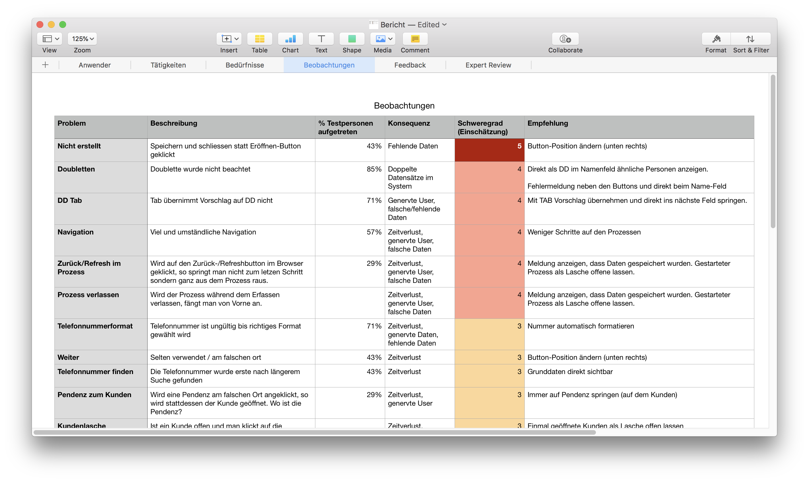

# Früh starten

Im Frühjahr 2018 durfte ich für einen grossen Softwarehersteller ein Usability-Audit durchführen. Im Gegensatz zu anderen Aufträgen wurde ich nicht erst angefragt, als es bereits zu spät war und die Benutzer bereits auf die Barrikaden gestiegen sind.

Je früher im Projekt die Bedürfnisse der Benutzer beachtet werden, umso einfach und kostengünstiger ist es, auf diese einzugehen. Obwohl dies bekannt ist und auch logisch scheint, ist es leider immer noch selten der Fall. Stattdessen wird oft erst vor dem Roll-out auf Usability geachtet oder wenn bereits die ersten negativen Feedbacks kommen. Umso schöner ist es, wenn ein Projekt bereits mit den Anwendern im Fokus startet, wie dies beim letzten Usability-Audit der Fall war.

# Fakten, nicht bloss Meinungen

Ein guter Usability-Audit schafft Fakten und nicht bloss eine weitere Meinung. Entsprechend gehört ein Usability-Test mit echten (zukünftigen) Anwendern zu jedem guten Audit dazu. Nur so erhält das Entwicklungsteam Fakten und nicht bloss Meinungen. Probleme die beim mehreren Anwender auftauchen sind echt und lassen sich nicht schön reden. Entsprechend ist ein Usability-Test ein mächtiges Werkzeug.

Ein guter Usability-Audit zeigt auf, wo der Schuh drückt. Dies bedingt, dass die Probleme nach Schweregrad priorisiert sind. Als guter Indikator erweist sich die Menge der Benutzer, die ein bestimmtes Problem hatten und wie gross die Auswirkungen des Problems sind. So weiss das Entwicklungsteam wo es als erstes ansetzen soll.

# Low hanging fruit

Beim Usability-Audit geht es nicht bloss darum "grosse" Problem aufzudecken. Häufig können kleine Anpassungen zu grossen Verbesserungen führen. Solche Probleme lassen sich auch mit einem Expert-Review finden. Ein Expert-Review ist schneller und wenig Aufwand durchgeführt. Entsprechend gerne werden diese durchgeführt.

# Bedürfnisse frühzeitig verstehen

Nur wer die Bedürfnisse der Benutzer versteht, kann effektive Software entwicklen. Wir helfen Ihnen gerne dabei.
