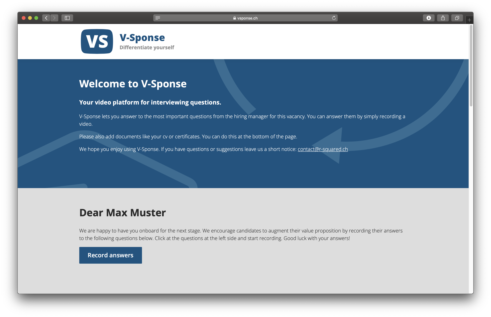

## Videos und Sicherheit

Mit der V-Sponse Plattform für Bewerbungsvideos kann R-Squared Video-Antworten von potentiellen Kandidaten ihren Auftraggebern anbieten. So können die Auftraggeber ein besseres Bild der Kandidaten erhalten und R-Squared kann mit besseren Leistungen brillieren.

Für uns war das Projekt auch sehr spannend. Zum Einen konnten wir unser Wissen in der Video-Aufnahme, -Verarbeitung und -Wiedergabe in einem Web-Client vertiefen. Zum Anderen forderte dieses Projekt hohe Ansprüche an die Sicherheit im Umgang mit persönlichen Daten.

## Cloudinary

Für V-Sponse nehmen wir die Videos direkt im Browser auf, sofern der Browser dazu in der Lage ist. Danach übermitteln wir die Videos an [Cloudinary](https://cloudinary.com). Dort werden die Videos verarbeitet und gespeichert. Cloudinary ist eine Plattform um Fotos und Videos abzulegen, zu verarbeiten und schliesslich wieder abzurufen. Dabei kann z.B. ein Thumbnail eines Videos in einer bestimmten Grösse angefragt werden, welche Cloudinary entsprechend liefert. Dies hat uns die Arbeit sehr erleichtert.

## Zwei-Faktor-Authentisierung

Um den Anforderungen an die Sicherheit im Umgang mit persönlichen Daten gerecht zu werden haben wir folgende Massnahmen ergriffen:

1.  Die HRM-Mitarbeiter müssen sich per Zwei-Faktor-Authentisierung (2FA) anmelden.
1.  Vidoes können nicht einfach heruntergeladen und gespeichert werden.
1.  Alle Videos werden nach einer weile automatisch gelöscht.

2FA verhindert nicht nur, dass sich jemand unerlaubt Zugriff mit einem schwachen oder gestohlenen Passwort ermöglicht, sondern auch das Kollegen ihr Konto weiterleiten. So erschweren wir die Verbreitung von persönlichen Daten.

Teilweise erlauben die Browser das Herunterladen von Videos. Dies konnten wir bei einigen Browsern verhindern, bei anderen hingegen nicht. Zudem könnte jemand das Video-URL im HTML-Code direkt lesen und so das Video herunterladen. Für diese Fälle haben wir den direkten Zugriff auf das Video verhindert.

Um der [DSGVO](https://de.wikipedia.org/wiki/Datenschutz-Grundverordnung) gerecht zu werden, löschen wir nicht mehr verwendete Videos.

## Fazit

Für uns war die Entwicklung sehr spannend und hat uns grosse Freude bereitet. Wir wünschen unserem Kunden, den HRM-Mitarbeitern und den Bewerbern viel Spass und Erfolg mit V-Sponse!

