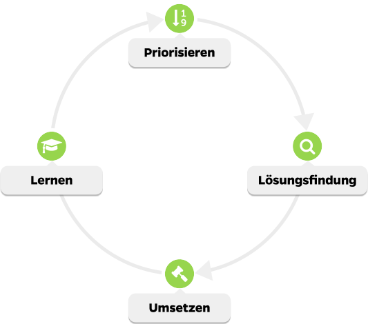

# Iterationen

Sobald klar ist, wohin die Reise führt, starten wir mit zweiwöchigen Iterationen. Sie sind als Kunde fester Bestandteil davon. Jede Iteration durchläuft folgende Phasen:

Danke dem richtigen Vorgehen sparen Sie Geld.
